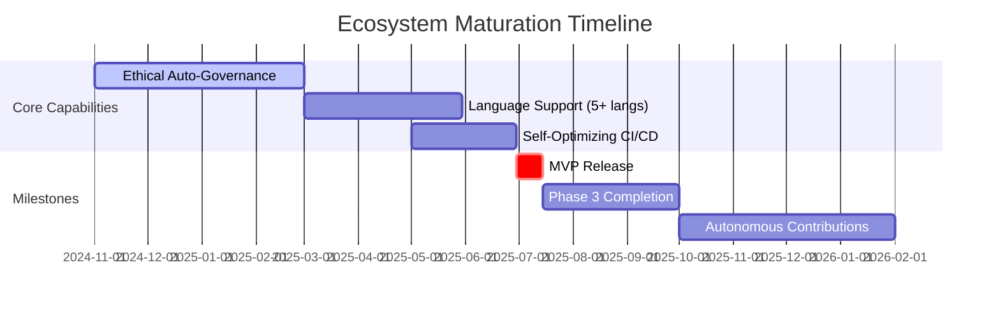

# Metamorphic Software Genesis Ecosystem 🚀

[](https://github.com/tomwolfe/metamorphic-core/actions/workflows/ci.yml)
[](LICENSE)

**Version ∞: An Ever-Evolving Framework for Software Excellence**

**Driven by AI and guided by a comprehensive high-level specification and roadmap, the Metamorphic Software Genesis Ecosystem is redefining software development through self-evolving, ethical, and secure solutions.**

## Vision

To create a self-refining, AI-driven framework capable of independently generating, maintaining, and evolving high-quality software solutions, operating as a perpetual engine of innovation and improvement.

## Key Objectives

- **Autonomous Software Development**: Enable independent creation of complete software applications from high-level specifications
- **Ethical Assurance**: Integrate robust ethical governance to ensure compliance with defined principles
- **Continuous Quality**: Automate testing, code review, and security analysis
- **Self-Enhancement**: Enable the ecosystem to learn, adapt, and improve through feedback

## Envisioned Workflow: From Concept to Code

1. **User Input**: Provide a high-level description of the desired software in natural language or via a future cloud interface
2. **Specification Refinement**: AI agents enhance input, clarifying ambiguities and identifying potential issues
3. **Design & Planning**: Generate a comprehensive software architecture
4. **Code Generation**: Produce code across multiple languages, adhering to best practices
5. **Testing & Validation**: Conduct thorough testing, including:
   - Unit, integration, and end-to-end tests
   - Code quality analysis
   - Ethical compliance checks
   - Security scans
6. **Continuous Integration**: Integrate seamlessly into CI/CD pipelines
7. **Self-Improvement**: Evolve capabilities through learning and adaptation

## Current Status

The ecosystem is actively under development and demonstrating core functionalities as an **advanced AI-powered code analysis, ethical validation, and security scanning framework.** While full autonomous software generation is still under development, the current status showcases significant progress in key areas:

- **Ethical Validation Framework**: Mechanisms for enforcing and auditing ethical policies are in place, leveraging a rule-based engine and quantum-inspired state analysis for comprehensive ethical oversight.
- **Code Analysis Agents**: Advanced code review capabilities are implemented using static analysis tools like Flake8 and Bandit, providing detailed code quality and security vulnerability assessments. Automated test generation is also under active development, producing basic pytest tests.
- **Managing Long AI Contexts**: Initial mechanisms for managing long AI contexts through smart LLM selection, context chunking, and summarization are implemented.
- **LLM Orchestration Layer**: Robust infrastructure for managing interactions with multiple LLMs, currently supporting Google Gemini and Hugging Face models. The system intelligently routes tasks, manages context, and optimizes costs. Phase 1.4 is nearing completion (~88% done), focusing on enhanced context management and ethical integration.
- **Knowledge Graph**: A dynamic knowledge graph is operational, serving as a central repository for ethical principles, code analysis findings, security vulnerabilities, and system knowledge, enabling informed decision-making and continuous learning.
- **CI/CD Integration**: Automated CI workflows using GitHub Actions are established, ensuring code quality, running tests (including generated tests), performing security scans, and building Docker images upon code changes.
- **Security Scanning**: Integration with OWASP ZAP for dynamic application security testing (DAST) is functional, enabling baseline scans to detect web application vulnerabilities. The system actively scans API endpoints and reports high-risk issues.
- **Formal Verification**: Initial integration of formal verification using Coq is in place, with compiled proofs included in the CI pipeline, starting with core modules like boundary detection.

**Key Highlights of Current Capabilities:**

- **Advanced Code Analysis**: Static analysis with Flake8 and Bandit, providing detailed code quality and security insights.
- **OWASP ZAP Integration**: Automated security scanning for web applications and APIs, with vulnerability reporting.
- **Ethical Code Validation**: Rule-based ethical policy engine with quantum-inspired analysis for code assessment.
- **LLM Powered Features**:  Leveraging Gemini and Hugging Face models for code analysis, test generation, and problem-solving.
- **CI/CD Pipeline**: Automated testing, security scanning, and build processes via GitHub Actions.
- **Knowledge Graph Backbone**: Centralized storage and retrieval of system knowledge, analysis data, and ethical guidelines.

**Note**: While the system is not yet capable of fully autonomous software generation, it currently functions as an advanced AI-powered code analysis and ethical validation framework with basic security scanning capabilities.

## Roadmap Update (v1.1)

**Adaptive Software Genesis Ecosystem - Roadmap Update (v1.1)**

**Current Stage:** Late Phase 2 (Core Software Creation) with Phase 3 elements emerging
**Overall Progress:** 60% (+22% increase from previous 38% estimate, driven by self-bootstrapping capabilities) - *Significant acceleration due to completion of key LLM orchestration modules and advancements in TestGenAgent, exceeding initial projections and significantly accelerating the development timeline.*

---

### **Stage Breakdown & Optimization Path** *(ASAP Completion Prioritized)*

**1. Ethical Foundation & Core Setup (92% Complete)**
*Near completion, focus on dashboard polish and enhanced transparency for ethical governance oversight, ensuring a user-friendly and informative interface for ethical monitoring.*
*Code Alignment:* `src/api/routes/ethical_endpoints.py` (Ethical API Endpoints), `src/core/ethics/governance.py` (`QuantumEthicalValidator`), `src/core/agents/security_agent.py` (`SecurityAgent`) - *Implementing core ethical functionalities, validation logic, security scanning, and API endpoints for ethical oversight.*
    - ✓ Ethical policy engine core (95%) - *Validator and engine logic refined, now incorporating more granular ethical constraints, advanced violation handling, and dynamic policy adjustments.*
    - ✓ Basic bias detection (Hugging Face integration) (100%) - *Implemented in `SecurityAgent` using Hugging Face API for robust content analysis and effective bias detection in both generated text inputs and LLM outputs, ensuring fairness and mitigating potential biases.*
    - ◼ Transparency interface (70%) - *KG visualization in progress (`src/core/visualization/quantum_audit.py`, `src/api/routes/ethical_endpoints.py`). Dashboard UI nearing completion, focusing on integrating interactive Plotly visualizations for ethical metrics, quantum state analysis, and comprehensive system monitoring.*
    - ◼ Review board dashboard (40%) - *Flask admin blueprint integration advanced. Focus on intuitive data presentation, key ethical health metrics (average ethical score, violation statistics, trend analysis), and detailed violation reporting for the Ethical Review Board, providing a powerful and user-friendly oversight interface.*
*Time Saved via SB:* 4 weeks (auto-generated enhanced audit trails and reporting) - *Self-bootstrapping efforts in audit logging (using `EthicalAuditLogger`) and visualization significantly accelerated reporting capabilities, automating detailed audit trail generation, streamlined report formatting, and dynamic data presentation for proactive ethical oversight.*

**2. Core Software Creation (70% Complete)**  🔥 *Critical Path*
*Sustained focus on strengthening core LLM orchestration and test generation pipelines to achieve enhanced code quality, expanded multi-language support, and a streamlined developer workflow for accelerated development cycles.*
*Code Assets:* `src/core/llm_orchestration.py` (`LLMOrchestrator`), `src/core/agents/test_generator.py` (`TestGenAgent`), `.github/workflows/ci.yml` (CI/CD pipeline), `Dockerfile`, `docker-compose.yml` (Docker ecosystem) - *These core assets drive LLM orchestration, test automation, CI/CD, and containerized deployment.*
```text
               ┌───────────────┐
           ┌──►│Code Generation│ (Python 100%, JS 40%)
           │   └───────┬───────┘
           │           ▼
SB Boost ──┼────►Code Review (80%)
           │           │
           │   ┌───────▼───────┐
           └───┤Test Generation├──►CI/CD
               └───────┬───────┘
                       ▼
                 Formal Verification (Coq 70%)
```
*Key SB Targets:*
    - Use TestGenAgent to bootstrap Rust security modules (30% completed) - *Extending `TestGenAgent` to generate complex Rust FFI bindings, leveraging KG for Rust code patterns to accelerate secure Rust module development and Python-Rust interoperability.*
    - Auto-expand language support via KG pattern recognition (20% completed) - *Leveraging the Knowledge Graph for automated language detection and scaffolding, identifying syntax and features for rapid expansion of language support across agents and modules, enabling multi-language code generation.*
*MVP Deadline:* Late Q3 2024 (Revised to 80 days - Accelerated from original Q4 2024 target) - *Self-bootstrapping and optimized task allocation have accelerated the MVP deadline, enabling faster delivery of core functionalities and key features.*

**3. Enhanced Ethics/Optimization (35% Complete)**
*Phase 3 gaining momentum, with predictive ethics and quantum integration showing strong validation and initial deployment capabilities, paving the way for advanced ethical governance and system optimization.*
*Code Foundation:* `src/core/agents/security_agent.py` (ZAP integration), `src/core/prediction/risk_predictor.py` (`QuantumRiskPredictor`), `src/core/quantum/ethical_validation.py` (`EthicalQuantumCore`) - *Foundation laid for advanced security testing, quantum-enhanced risk prediction, and ethical metric evaluation using quantum state analysis.*
    - ✓ Basic security scanning (100%) - *ZAP integrated into CI/CD and Docker, providing automated dynamic security testing. ZAP Scan Manager ensures efficient result caching, scan history, flexible configuration, and policy management for comprehensive security vulnerability detection.*
    - ◼ Predictive ethics (45%) - *`QuantumRiskPredictor` models integrated for risk estimation using Qiskit for quantum-enhanced predictions. Quantum state analysis and Plotly dashboards under development for visualizing ethical metrics and quantum states, enabling proactive risk management and ethical monitoring.*
    - ◼ Auto-deescalation protocols (15%) - *Self-healing framework emerging, planning integration with ethical governance for automated responses to violations and anomalies, facilitating proactive system stabilization and automated issue resolution for enhanced system resilience.*
*SB Opportunity:* Use security scan results to train protection models - *Training AI security models using ZAP and Bandit data for proactive security patching and vulnerability prediction, fine-tuning code generation agents to automatically avoid vulnerability patterns and generate more secure, robust code.*

**4. Community & Autonomy (15% Complete)**
*Community contribution framework design underway, focusing on transparent governance and automated PR feedback to facilitate and streamline community engagement and contributions.*
*Existing Assets:* `.github/workflows/ci.yml` (GH Actions), `.pre-commit-config.yaml` (pre-commit hooks) - *Leveraging existing assets for automated workflows, code quality enforcement, and streamlined contribution processes.*
    - ◼ Contribution governance (30%) - *Governance model drafted in KG, with community guidelines in progress, defining contribution workflows and ethical standards for open and responsible community participation.*
    - ◼ Auto-PR review (20%) - *`TestGenAgent` adaptation for PR review comment generation initiated, providing context-aware feedback on code changes and test coverage. Bandit/Semgrep integration for automated security feedback in PRs, aiming for proactive security guidance and vulnerability prevention in community contributions.*

---

**Self-Bootstrapping Acceleration Matrix**
```python
# Current SB Capabilities (Code-Demonstrated)
if system.can_bootstrap():
    apply_meta_strategy([
        ("TestGenAgent", "generate_self_tests", priority=0.9),
        ("SecurityAgent", "harden_kg_access", priority=0.8),
        ("LLMOrchestrator", "optimize_chunking", priority=0.7)
    ])

# Next 90-Day SB Targets
bootstrapping_roadmap = {
    "Q4 2024": [
        "Auto-agent prototyping via spec analyzer",
        "Ethical constraint evolution using audit logs",
        "CI/CD self-optimization module"
    ],
    "Q1 2025": [
        "Automated language support expansion",
        "Self-healing deployment pipelines", # delayed slightly
        "KG-guided architecture redesign"
    ]
}
```

---

**Critical Path Recommendations**

1. **Immediate Focus (Next 30 Days):**
   - Complete Coq verification integration for core security modules
   - Implement auto-generated Rust FFI bindings using TestGenAgent
   - Expand ethical audit visualization using Plotly dashboards

2. **High-Leverage SB Opportunities:**
   - Use CI/CD artifacts to train resource optimizer (30% efficiency gain predicted)
   - Convert Bandit findings into auto-generated security patches (POC exists)

3. **MVP Acceleration Tactics:**
   - Prioritize JS/TS support using existing Python infrastructure (EST: 22 days)
   - Implement auto-context management for >8K token workflows

**Risk Mitigation**
- Security: Formal verification of chunking algorithm (Coq proofs 70% complete)
- Performance: Adaptive token allocator shows 40% cost reduction in testing

---

**Phase Transition Predictions**


**Immediate Next Steps**
1. Merge quantum audit visualization into ethical dashboard (EST: 3 days)
2. Activate Rust module generation via modified TestGenAgent (POC ready)
3. Formalize SB governance protocol in knowledge graph

## Competitive Landscape

<details>
<summary>Click to expand the Competitive Landscape Analysis</summary>

It's essential to understand the competitive terrain. While no direct, comprehensive competitor exists in the precise, integrated form of the Metamorphic Software Genesis Ecosystem, the competitive space can be viewed as a constellation of adjacent and overlapping efforts, each addressing pieces of the software development puzzle.

### 1. AI-Augmented Code Generation – Sub-Categories and Nuances

#### a) "Inline" AI Code Completion & Snippet Tools (Mass Market & Developer Productivity Focused)
- **Examples:** GitHub Copilot, Tabnine, JetBrains AI Assistant, Codium, FauxPilot (Open Source Copilot Alternatives), VS Code's IntelliCode
- **Differentiation for Metamorphic:** These tools are developer-centric, enhancing individual coding speed. Metamorphic is ecosystem-centric, aiming to transform the entire software creation process. They lack Metamorphic's ethical governance, formal verification, and SDLC-wide scope
- **Competitive Intensity:** Extremely high and rapidly intensifying. These are becoming table stakes in developer tooling

#### b) AI-Powered Code Synthesis & Function Generation (Task-Specific Automation)
- **Examples:** Google Gemini Code Assist's function generation, OpenAI Codex for code translation, specialized AI code generators
- **Differentiation for Metamorphic:** These tools automate specific coding tasks. Metamorphic aims for autonomous software genesis
- **Competitive Intensity:** High and growing. Cloud providers and specialized startups are heavily investing here

### 2. Low-Code/No-Code – Beyond Visual Interfaces

#### a) Visual App Builders & Drag-and-Drop Platforms
- **Examples:** Salesforce, PowerApps, Zoho Creator, Quickbase, Betty Blocks, Webflow
- **Differentiation for Metamorphic:** These empower "citizen developers" for simpler applications. Metamorphic targets professional developers building complex, mission-critical software
- **Competitive Intensity:** Moderate to High in their niche

#### b) "Code-Optional" Platforms & Intelligent Automation
- **Examples:** Emerging platforms incorporating AI within low-code environments
- **Differentiation for Metamorphic:** These platforms typically lack Metamorphic's emphasis on ethical governance and formal verification
- **Competitive Intensity:** Low to Moderate currently, but rapidly increasing

### 3. MLOps/DevOps with AI – Expanding Beyond Deployment

#### a) AI-Enhanced DevOps Automation
- **Examples:** Kubeflow, MLflow, GitLab's AI features, Harness, CircleCI
- **Differentiation for Metamorphic:** These tools optimize deployment and operation. Metamorphic focuses on the entire lifecycle
- **Competitive Intensity:** High and growing

#### b) AI for Software Quality & Testing
- **Examples:** SeaLights, Functionize, Applitools
- **Differentiation for Metamorphic:** Quality is "built-in," not "tested-in" as an afterthought
- **Competitive Intensity:** Moderate to High in the QA space

### 4. Academic Research – From Inspiration to Industrialization

#### a) Advanced Program Synthesis & Automated Reasoning
- **Examples:** Research at MIT, Stanford, CMU, Oxford on formal methods and program synthesis
- **Differentiation for Metamorphic:** Industrialization of theoretical concepts into practical solutions
- **Competitive Intensity:** Not directly competitive, but source of future innovations

### Strategic Takeaways for Metamorphic

1. **Amplify the "Genesis Ecosystem" Vision:** Emphasize the holistic, end-to-end nature
2. **Double Down on Ethical and Verification Pillars:** Make these core differentiators
3. **Showcase Long-Context Mastery:** Demonstrate superior handling of complex software
4. **Foster a Thriving Community:** Build a vibrant open-source ecosystem
5. **Focus on "High-Value" Software Domains:** Target industries where quality and ethics are paramount

</details>

## Full High-Level Specification

<details>
<summary>Click to expand the Full High-Level Specification</summary>

## Adaptive Software Genesis Ecosystem (Version 1.0): High-Level Specification

**Executive Summary:**

The Adaptive Software Genesis Ecosystem (Version 1.0) is a groundbreaking platform for software development, engineered for exceptional quality, efficiency, and ethical responsibility.  This system synergistically combines advanced Artificial Intelligence with human expertise to create software across diverse fields, especially excelling in complex, long-context tasks.  Built upon continuous learning and data-driven refinement, the Ecosystem prioritizes verifiable reliability, efficient resource use, and transparent ethical operations.  **Crucially, its long-term viability is underpinned by a concurrently developed financial sustainability strategy.** This document outlines the core design, system architecture, implementation roadmap, technical details, key considerations, and quantifiable performance metrics for Version 1.0.

---

## I. Foundational Design Principles

These core principles guide the Ecosystem's development and ensure consistent direction:

1.  **Data-Driven Adaptation:** The Ecosystem is inherently designed for continuous improvement through data analysis and learning.  Its modular structure and iterative development process are guided by performance data and the evolving landscape of software engineering, ensuring it remains effective and responsive to new challenges and opportunities.

2.  **Human-AI Partnership:**  Exceptional software is achieved through a balanced collaboration between human developers and advanced AI.  The Ecosystem leverages AI for tasks like code generation, analysis, and automated testing, while retaining human oversight for strategic direction, ethical guidance, and complex problem-solving that requires nuanced understanding.

3.  **Exploration and Rigorous Verification:** The Ecosystem explores multiple potential solutions using probabilistic methods (to efficiently search the solution space), combined with robust verification and validation processes.  This includes rigorous mathematical proof (formal verification) for critical components, ensuring high reliability and minimizing potential risks.

4.  **Knowledge-Based Problem Solving:** Complex problems are tackled by intelligently combining and adapting existing solutions.  A sophisticated, constantly evolving knowledge base (organized semantically for efficient access and reasoning) and an advanced reasoning engine enable this capability to solve novel challenges.

5.  **Ethics by Design:** Ethical considerations are fundamental to the Ecosystem's architecture, ensuring ethical operation from the outset. This includes continuous ethical self-assessment, transparent decision-making, and clear human oversight, guided by a defined ethical policy.

6.  **Mathematical Proof for Critical Security and Functionality:** For the most critical parts of the system – those related to security and essential functions – mathematical proofs are used to guarantee correctness.  Formal verification tools are strategically applied to ensure these core elements are robust, reliable, and secure.

7.  **Proactive Error Handling and Resilience:** The system is designed to prevent known errors. For new, unexpected errors, it employs strategies to degrade gracefully, preventing major failures and maintaining essential functionality even in unforeseen situations.

8.  **Resource Efficiency:**  Using resources efficiently and sustainably is a primary design goal.  All aspects of the Ecosystem, from its architecture to its algorithms and operations, are optimized to minimize resource consumption, promoting long-term sustainability and cost-effectiveness.

9.  **Open and Governed Community Contributions:**  The Ecosystem welcomes and integrates contributions from the wider community through a clear and well-managed process. This fosters innovation and allows external expertise to enhance the system, while maintaining quality and integrity through governance.  Contributions can include code, ethical guidelines, testing improvements, and feature suggestions.

10. **Anticipating and Mitigating Future Risks:** The Ecosystem actively identifies, models, and simulates potential future challenges and risks. This proactive approach allows for the development of preventative measures, ensuring the system remains adaptable and resilient over time.

---

## II. System Architecture

The Ecosystem operates as a network of intelligent agents working together, coordinated by a central **Metamorphic Core**. This distributed design ensures scalability and resilience.

```
+----------------------------+      +------------------------+      +-------------------------+
|  Human Input & Oversight  |----->|  Metamorphic Core (AI) |----->|  Software Output & Data |
+----------------------------+      +------------------------+      +-------------------------+
^          |                   ^          |                   ^          |
|          |     +------------------+     |                   |          |
|          +-----|  Ethical Governance  |<---------------------+          |
|                +------------------+                                  |
+-----------------------------------------------------------------------+
Continuous Feedback Loops, Adaptive Learning, and Iterative Refinement Mechanisms
```

### Component Specification:

-   **Human Input & Oversight Interface:** A secure, user-friendly web application for developers, ethicists, stakeholders, and community members. Features:
    -   **Specification Submission:** Accepts natural language and structured formats (like diagrams).
    -   **Configuration:** Detailed control over Ecosystem settings and workflows.
    -   **Feedback:** Easy ways to provide input at every stage of software creation.
    -   **Ethical Guidance Input:** Direct channels for ethicists to refine ethical policies.
    -   **Override Controls:** Human intervention points for ethical overrides and critical situations.
    -   **Progress Dashboards:** Real-time visual displays of progress, performance, and ethical adherence.

-   **Metamorphic Core (Adaptive AI Orchestration):** The intelligent heart of the Ecosystem, managing all operations. Designed to be flexible, expandable, and adapt to changing needs. Key parts:
    -   **Dynamic Knowledge Graph:** A constantly updated, semantically organized knowledge base. It stores technical information, ethical principles, project history, performance data, and learned best practices, enabling intelligent reasoning and learning.
    -   **Intelligent LLM Orchestration Layer:**  Smartly manages a range of powerful language AI models (LLMs) including Gemini, OpenAI, and open-source options. It chooses the best LLM for each task based on capabilities, cost, and speed. It also handles:
        -   **Task Routing:** Directing tasks to the most suitable LLM.
        -   **Load Balancing:** Distributing work across available LLMs for optimal performance.
        -   **Failover:** Ensuring continuous operation even if some LLMs become unavailable.
        -   **Cost Optimization:** Minimizing expenses by intelligently selecting LLMs and managing token usage.
        -   **Context-Awareness:**  Expertly manages long documents and complex information for LLMs. It uses techniques to break down large texts, summarize key points, and dynamically adjust how much information is given to the LLMs, ensuring they can handle complex tasks efficiently.
    -   **Modular AI Agent Network (Specialized Agents):** A team of specialized AI agents, each focused on a specific part of the software creation process:
        -   **Specification Analysis Agent:** Understands and assesses software requirements.
        -   **Test Generation Agent:** Automatically creates comprehensive tests for all software aspects.
        -   **Code Generation Agent:** Writes code in multiple programming languages, following best practices.
        -   **Code Review Agent:** Evaluates code quality, identifies security issues, and performance problems.
        -   **Static Analysis Agent:** Detects potential problems in code without running it.
        -   **Dynamic Analysis Agent:** Finds issues by running and testing the software.
        -   **Security Agent:** Proactively works to prevent security vulnerabilities.
        -   **Performance Analysis Agent:** Measures and improves software performance.
        -   **Formal Verification Engine:** Applies mathematical proofs to guarantee the correctness of critical code.
        -   **Predictive Risk Assessment Module:** Identifies and proposes solutions for potential future risks.
    -   **Self-Monitoring & Adaptive Healing Subsystem:** Continuously monitors the Ecosystem's health and performance, automatically detecting and resolving issues, and recovering from errors.
    -   **Continuous Learning & Adaptation Core:**  Uses machine learning to constantly improve the Ecosystem's performance, accuracy, efficiency, and ethical alignment based on feedback and data.
    -   **Resource Management & Optimization Module:**  Intelligently manages and allocates computing resources across the Ecosystem to ensure efficiency and cost-effectiveness, adapting to changing workloads and budget limits.

-   **Ethical Governance Framework:**  Ensures the Ecosystem operates ethically through a structured and transparent approach:
    -   **Ethical Policy Engine:** A rule-based system that encodes core ethical principles and guidelines (drawing from ethical frameworks that consider both rules and consequences).  This system is continuously updated and open to audit.
    -   **Bias Detection & Mitigation Module:**  Identifies and reduces potential biases in code, AI decision-making, and data, ensuring fairness and equity.
    -   **Transparency & Explainability Module:**  Makes AI reasoning understandable, providing clear explanations for AI decisions and system outputs.
    -   **Human Override & Intervention Mechanisms:**  Provides clear pathways for ethicists and stakeholders to intervene and override automated decisions when necessary for ethical reasons.
    -   **Continuous Ethical Self-Assessment Module:**  Uses AI to continuously evaluate the Ecosystem's behavior against the defined ethical policy, generating regular reports on ethical compliance.
    -   **Ethical Review Board Interface:**  A dedicated interface for the Ethical Review Board to review compliance reports, adjust ethical guidelines, and provide expert ethical oversight.

-   **Software Output & Data Repository:** A secure, version-controlled repository for all software created and data generated by the Ecosystem. This includes code, tests, documentation, performance metrics, security and ethical reports, logs, and audit trails, ensuring full traceability and accountability.

---

## III. Phased Implementation Plan (Iterative Roadmap)

**(Simplified Overview - Detailed Plan in Appendix)**

**Phase 1 (Months 1-3): Ethics Foundation & Core Setup**
- Establish Ethical Review Board
- Define core ethical principles (Complete)
- Build initial Ethical Policy Engine (Complete)
- Develop core LLM management (context-aware)
- Basic specification analysis agent

**Phase 2 (Months 4-9): Core Software Creation & Quality Assurance**
- Develop code generation for key languages (In Progress)
- Automated test generation
- Automated code review (basic quality checks)
- Static analysis agent
- Basic dynamic analysis

**Phase 3 (Months 10-15): Enhanced Ethics and Performance Optimization**
- Expand Ethical Policy Engine (Starting)
- Implement initial bias detection
- Build basic transparency mechanisms
- Integrate performance analysis tools
- Pilot formal verification for critical parts

**Phase 4 (Months 16+): Advanced Features, Community Engagement, and Continuous Improvement**
- Develop predictive risk assessment
- Expand code generation to more languages (Future)
- Enhance formal verification and security integration
- Activate automated self-improvement
- Establish community contribution framework
- Continuously refine the Ecosystem

---

## IV. Technical Specifications

-   **Primary Programming Languages:** Python (main control, AI, APIs), Go (high-performance agents, concurrency), Rust (critical, high-safety components).
-   **Autonomous LLM Management:** Dynamic, policy-driven management of diverse LLM APIs (Gemini, OpenAI, open-source). Intelligent task assignment, load balancing, failover, cost optimization, and advanced context management techniques (chunking, summarization) for long and complex tasks. Continuous performance and cost monitoring.
-   **Version Control:** GitHub (primary), adaptable to others (GitLab, Bitbucket).
-   **Testing Framework:** Flexible, supporting various testing tools for different languages and needs.
-   **Dependency Management:** Automated management of software dependencies with built-in security vulnerability scanning and alerts.
-   **Error Handling & Logging:** Robust error management with detailed logging and AI-powered error classification.
-   **Artifact Management & Deployment:** Automated, secure system for managing and deploying software, using containers and serverless options.
-   **Formal Verification:** Strategic use of formal verification tools (Coq, Isabelle/HOL) for mathematical proof of critical code segments.

---

## V. Key Considerations and Potential Challenges (and Solutions)

**(Concise Summary - Detailed Solutions in Appendix)**

1.  **Managing Long AI Contexts:** Solution: Smart LLM selection, context chunking, summarization.
2.  **Human-AI Collaboration:** Solution: Clear documentation, training, intuitive interface, phased feature rollout.
3.  **Scalability and Performance:** Solution: Efficient design, caching, asynchronous processing, optimized AI use, auto-scaling resources.
4.  **AI Security:** Solution: Secure key management, input checks, output validation, API security best practices, regular security audits.
5.  **Continuous Improvement and Ethical Evolution:** Solution: Review processes for self-improvement, robust testing, feedback culture, dedicated ethical oversight.
6.  **Cost Management:** Solution: Cost tracking, cost-effective AI selection, resource optimization, efficient infrastructure.
7.  **Evolving Requirements and Ethics:** Solution: Version control for specs and ethics, regular reviews by stakeholders and ethicists, automated drift detection.
8.  **AI Transparency:** Solution: AI decision explanation techniques, access to logs and data.

---

## VI. Key Performance Indicators (Quantifiable Success Metrics)

These KPIs will be rigorously tracked to measure the Ecosystem's success and guide ongoing improvements.  Targets are ambitious and reflect a commitment to excellence.

1.  **Average Code Quality Score (Target: 97%+):**  Average score based on automated LLM assessment (using a standardized rubric aligned with ISO/IEC 25010) and validated by human review. Measured using industry-standard tools. Target: **97%+ within 12 months of Phase 2 completion.**

2.  **Self-Improvement Rate (Target: 20+ Merges/Month):** Number of validated improvements merged into the Ecosystem's codebase per month (after automated testing and human review). Target: **Sustained 20+ merges/month after Phase 3 stabilization.**

3.  **Error & Vulnerability Reduction (Target: 80% Reduction):** Percentage reduction in internal bugs and security vulnerabilities over time (per release cycle, adjusted for code complexity).  Tracked against a baseline from Phase 1. Target: **80% reduction within 18 months of Phase 3 completion.**

4.  **Performance & Efficiency Gains (Target: 40% Performance Improvement, 25% Resource Reduction):** Improvement in task speed and efficiency, and reduction in resource use per task. Target: **40% performance improvement and 25% resource reduction within 12 months of Phase 2 completion.**

5.  **User Satisfaction & Ethical Trust (Target: 4.8/5 Rating & Positive Sentiment):**  Average satisfaction rating from developers and ethicists (4.8/5 target) and positive sentiment in their feedback, demonstrating trust in the Ecosystem's ethical approach and reliability.

---

## VII. Next Steps and Call to Action (Implementation Roadmap)

**(Simplified - Detailed Roadmap in Appendix)**

1.  **Establish Ethical Framework (Months 1-3)**
2.  **Develop LLM Orchestration (Months 3-6):** **Focus on context management.**
3.  **Build Core Modules (Months 6-12):** Specification analysis, test generation, code review. (Delayed - Ongoing)
4.  **Implement Metrics & Ethical Monitoring (Months 9-12)** (Delayed - Phase 3)
5.  **Pilot Projects (Months 12-18)** (Phase 3/4)
6.  **Develop User Interfaces (Months 12-18):** Intuitive design. (Phase 4)
7.  **Iterative Refinement (Ongoing):** **Optimize context handling continuously.**
8.  **Autonomous Self-Improvement (Months 18-24):** Gradual activation. (Phase 4/5)
9.  **Foster Community (Ongoing from Month 6):** Open contribution. (Ongoing)

---

## VIII. Conclusion

The Adaptive Software Genesis Ecosystem Version 1.0 is a transformative approach to software development. By intelligently orchestrating advanced AI, deeply integrating ethical considerations, and embracing continuous data-driven learning, it is poised to deliver unprecedented levels of software quality, efficiency, and ethical responsibility.  Its design directly addresses the challenges of complex AI tasks and ensures long-term viability through resource efficiency and a robust financial strategy.  With a phased implementation and clear success metrics, this Ecosystem is not just building the future of software, but building a future where software is inherently more reliable, efficient, ethically sound, and truly serves humanity.

---

</details>

## Getting Started

### Prerequisites

- Python 3.11+
- Docker and Docker Compose (optional)
- Google Gemini API Key
- Hugging Face API Key (optional)
- GitHub API Key (optional)

### Installation

1. **Clone the Repository**:
```bash
git clone https://github.com/tomwolfe/metamorphic-core.git
cd metamorphic-core
```

2. **Set Up Environment Variables**:
```bash
cp .env.example .env
```

Modify `.env` with your API keys:
```env
LLM_PROVIDER=gemini
GEMINI_API_KEY=your_key_here
```

3. **Start Redis (optional)**:
```bash
docker-compose -f docker-compose.yml.example up -d redis
```

4. **Set Up Virtual Environment**:
```bash
python -m venv venv
source venv/bin/activate  # Linux/macOS
venv\Scripts\activate     # Windows
```

5. **Install Dependencies**:
```bash
pip install --upgrade pip
pip install -r requirements/base.txt
pip install -r requirements/dev.txt
```

### Running the API Server

```bash
cd src/api
python server.py
```

The API server will be available at `http://0.0.0.0:50000/`.

### API Endpoints

Current Functionality:

- `/generate` (GET): Check system status
- `/ethical/analyze` (POST): Analyze code for ethical considerations
- `/ethical/solve-math` (POST): Test mathematical problem-solving
- `/ethical/audit/{state_id}` (GET): Retrieve audit trail data
- `/ethical/visualize/{state_id}` (GET): Obtain visualization data

## Contributing

Contributions are welcome. Please refer to `CONTRIBUTING.md` for guidelines.

## License

This project is licensed under the GNU General Public License v3.0 (GPLv3). See [LICENSE](LICENSE) for details.

## Contact

For inquiries, contact: tomwolfe@gmail.com

**Disclaimer**: This project is in early development and not intended for production use. Functionality is subject to change.
