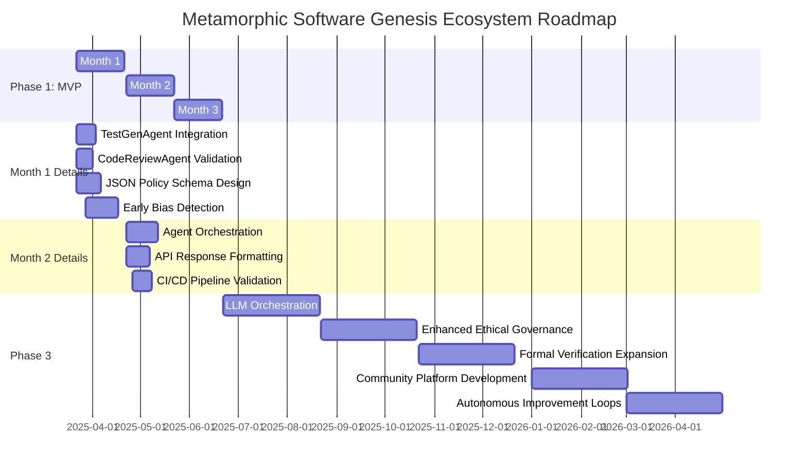

# Metamorphic Software Genesis Ecosystem 🚀

[](https://github.com/tomwolfe/metamorphic-core/actions/workflows/ci.yml)
[](LICENSE)
[](https://github.com/tomwolfe/metamorphic-core/milestones?direction=asc&sort=due_date&state=open)

**Version ∞: An Ever-Evolving Framework for Software Excellence** ✨

**Driven by AI and guided by a comprehensive high-level specification and roadmap, the Metamorphic Software Genesis Ecosystem is redefining software development through self-evolving, ethical, and secure solutions.**

---

**⚠️ Roadblock Alert:**  Progress on the **Ethical Policy Engine (JSON Configurable)** is currently behind schedule (Status: Not Implemented, Dev %: 30%).  This is a critical component for the MVP. We are actively focusing on resolving this to ensure MVP delivery.  See "Phase 1 MVP - Internal Metrics Tracking" for details.

---

**Table of Contents**
* [Vision](#vision)
* [Key Objectives](#key-objectives)
* [Envisioned Workflow: From Concept to Code](#envisioned-workflow-from-concept-to-code)
* [Current Status](#current-status)
* [Key Highlights of Current Capabilities](#key-highlights-of-current-capabilities)
* [Roadmap Update - Phase 1 MVP](#roadmap-update---phase-1-mvp)
    * [Phase 1 MVP Definition](#phase-1-mvp-definition)
    * [Phase 1 Deliverables](#phase-1-deliverables)
    * [Phase 1 Actionable Steps (Version 1.3 - Revised 3 - *Final Revision*)](#phase-1-actionable-steps-version-13---revised-3---final-revision)
        * [Month 1: Refine Agents & Ethical Engine Foundation](#month-1-refine-agents--ethical-engine-foundation)
            * [Week 1: MVP API Endpoint Shell & Basic Agent Wiring - *Get the API Talking to Agents*](#week-1-mvp-api-endpoint-shell--basic-agent-wiring---get-the-api-talking-to-agents)
            * [Week 2:  `CodeReviewAgent` MVP Functionality - *Flake8 Focus*](#week-2--codereviewagent-mvp-functionality---flake8-focus)
            * [Week 3: `EthicalPolicyEngine` MVP Foundation - *JSON Policy Loading & Basic Enforcement*](#week-3-ethicalpolicyengine-mvp-foundation---json-policy-loading--basic-enforcement)
            * [Week 4: `TestGenAgent` MVP & API Integration - *Placeholder Tests*](#week-4-testgenagent-mvp--api-integration---placeholder-tests)
        * [Month 2: Integrate Agents & API Endpoint](#month-2-integrate-agents--api-endpoint)
            * [Week 5:  `EthicalPolicyEngine` - Basic Constraint Enforcement Logic Implementation (BiasRisk, TransparencyScore, Safety Boundary)](#week-5--ethicalpolicyengine---basic-constraint-enforcement-logic-implementation-biasrisk-transparencyscore-safety-boundary)
            * [Week 6:  API Endpoint Response Refinement & Basic Error Handling - *Polish API Output*](#week-6--api-endpoint-response-refinement--basic-error-handling---polish-api-output)
            * [Week 7:  Documentation - MVP API Endpoint in `README.md` - *Basic API Usage Guide*](#week-7--documentation---mvp-api-endpoint-in-readmemd---basic-api-usage-guide)
            * [Week 8:  MVP Internal/Alpha Release & Initial Testing - *First Release & Feedback*](#week-8--mvp-internalalpha-release--initial-testing---first-release--feedback)
        * [Month 3: MVP Refinement & Documentation](#month-3-mvp-refinement--documentation)
    * [Phase 1 MVP - Internal Metrics Tracking](#phase-1-mvp---internal-metrics-tracking)
    * [Gantt Chart: Phase 1 MVP Roadmap](#gantt-chart-phase-1-mvp-roadmap)
    * [Development Kickstart - Week 1 Tasks](#development-kickstart---week-1-tasks)
    * [Roadmap Optimization Tricks (Refined for MVP Focus)](#roadmap-optimization-tricks-refined-for-mvp-focus)
    * [Beyond Month 2 (Future Iterations)](#beyond-month-2-future-iterations)
* [Getting Started](#getting-started)
    * [Prerequisites](#prerequisites)
    * [Installation](#installation)
    * [Running the API Server](#running_the_api_server)
    * [Quickstart Guide](#quickstart_guide)
    * [System Requirements](#system-requirements)
* [API Endpoints](#api-endpoints)
    * [Sample MVP Request/Response - `/genesis/analyze-ethical`](#sample-mvp-requestresponse---genesisanalyze-ethical)
    * [Core API Endpoints](#core-api-endpoints)
* [Contributing](#contributing)
* [License](#license)
* [License and Compliance](#license-and-compliance)
* [Contact](#contact)
* [Disclaimer](#disclaimer)
* [Troubleshooting](#troubleshooting)
* [Terminology Footnotes](#terminology-footnotes)

---

## Vision <a name="vision"></a>

To create a self-refining, AI-driven framework capable of independently generating, maintaining, and evolving high-quality software solutions, operating as a perpetual engine of innovation and improvement.

## Key Objectives <a name="key-objectives"></a>

- **Autonomous Software Development**: Enable independent creation of complete software applications from high-level specifications
- **Ethical Assurance**: Integrate robust ethical governance to ensure compliance with defined principles
- **Continuous Quality**: Automate testing, code review, and security analysis
- **Self-Enhancement**: Enable the ecosystem to learn, adapt, and improve through feedback

## Envisioned Workflow: From Concept to Code <a name="envisioned-workflow-from-concept-to-code"></a>

1. **User Input**: Provide a high-level description of the desired software in natural language or via a future cloud interface
2. **Specification Refinement**: AI agents enhance input, clarifying ambiguities and identifying potential issues
3. **Design & Planning**: Generate a comprehensive software architecture
4. **Code Generation**: Produce code across multiple languages, adhering to best practices
5. **Testing & Validation**: Conduct thorough testing, including:
   - Unit, integration, and end-to-end tests
   - Code quality analysis with Flake8
   - Ethical assessment using a basic rule-based engine and quantum-inspired analysis<a href="#footnote-quantum-inspired"><sup>1</sup></a>
   - Security scans with OWASP ZAP and Bandit (Bandit integration within `CodeReviewAgent` is currently commented out for MVP)
6. **Continuous Integration**: Integrate seamlessly into CI/CD pipelines using GitHub Actions
7. **Self-Improvement**: Evolve capabilities through learning and adaptation

## Current Status <a name="current-status"></a>

The ecosystem is actively under development and demonstrating core functionalities as an **advanced AI-powered code analysis, ethical validation, and security scanning framework.** While full autonomous software generation is still under development, the current status showcases significant progress in key areas:

**Current Phase 1 Capabilities**

**Note:**  The Phase 1 MVP provides a *basic* level of ethical analysis and placeholder test generation. Functionality beyond Flake8 code quality checks and basic ethical rule enforcement is currently under development and will be implemented in subsequent phases.

### Key Milestones Achieved:
- Operational `/genesis/analyze-ethical` API endpoint with:
  – Basic code quality assessment (API v1.1) via Flake8
  – Initial rule-based ethical analysis backbone (very basic rule enforcement directly in code; JSON policy configuration is under active development)
  – Placeholder test-generation proof-of-concept (TestGenAgent generates placeholder test *code*, but tests are not executed by the API in MVP)

### Technical Foundations Live:
- **LLM Orchestration Layer** (Gemini/Hugging Face)
- **Security Scanning Integration** (OWASP ZAP 2.12+)
- **Knowledge Graph** (Central repository of ethical code patterns - *initial phase, content being expanded*)

- **Ethical Validation Framework**: Mechanisms for ethical assessment are in place, leveraging a *very basic* rule-based engine (currently rules are implemented directly in code, not yet JSON configurable) and quantum-inspired state analysis for ethical insights.  Policy configuration via JSON is under development and a key focus for MVP completion.
- **Code Analysis Agents**: Code review capabilities are implemented using static analysis tools like Flake8, providing detailed code quality assessments accessible via API. Bandit security scanning integration within the `CodeReviewAgent` is implemented in code but currently commented out for the Phase 1 MVP to streamline development and focus on core MVP features (Flake8 integration). Basic pytest placeholder test generation is implemented but not yet fully integrated into the API workflow beyond returning placeholder test *code* as a string in the API response.  *Note: Bandit integration is commented out within the `CodeReviewAgent` code.*
- **Managing Long AI Contexts**: Initial mechanisms for managing long AI contexts through smart LLM selection, context chunking, and summarization are implemented.
- **LLM Orchestration Layer**: Robust infrastructure for managing interactions with multiple LLMs, currently supporting Google Gemini and Hugging Face models. The system intelligently routes tasks, manages context, and optimizes costs. Phase 1.4 development is ongoing, with focus on enhanced context management and ethical policy engine integration.
- **Knowledge Graph**: A dynamic knowledge graph is operational, serving as a central repository for ethical principles, code analysis findings, security vulnerabilities, and system knowledge, enabling informed decision-making and continuous learning.  The Knowledge Graph is in its early stages and content related to ethical principles and code patterns is actively being expanded.
- **CI/CD Integration**: Automated CI workflows using GitHub Actions are established, ensuring code quality, running tests (including generated tests), performing security scans, and building Docker images upon code changes.
- **Security Scanning**: Integration with OWASP ZAP for dynamic application security testing (DAST) is functional, enabling baseline scans to detect web application vulnerabilities, particularly for APIs. The system actively scans API endpoints and reports high-risk issues. Baseline security scanning with Bandit is integrated in code but currently commented out for MVP, specifically the Bandit integration within `CodeReviewAgent` is not active in the MVP build.
- **Formal Verification**: Initial integration of formal verification using Coq is in place, with compiled proofs included in the CI pipeline, starting with core modules like boundary detection.

## Key Highlights of Current Capabilities <a name="key-highlights-of-current-capabilities"></a>

- **Advanced Code Analysis**: Static analysis with Flake8, providing detailed code quality insights accessible via API. We aim to align with the latest stable versions of Flake8 rules for up-to-date analysis. Bandit integration is present in the codebase but commented out within `CodeReviewAgent` for the MVP.
- **OWASP ZAP Integration**: Automated security scanning for web applications and APIs, with vulnerability reporting and scan history caching.
- **Ethical Code Assessment**: *Basic* rule-based ethical assessment engine (rules directly in code, not yet JSON configurable) with quantum-inspired analysis<a href="#footnote-quantum-inspired"><sup>1</sup></a> providing *initial* ethical insights on code. Policy configuration via JSON is under development and a key next step.  **Note:** The configurable Ethical Policy Engine is a key development task for the MVP.  The current ethical assessment is rule-based but represents a *very early stage* of ethical analysis capabilities.
- **LLM Powered Features**:  Leveraging Gemini and Hugging Face models for code analysis, *placeholder* test *code* generation (tests are not executed), and problem-solving.
- **CI/CD Pipeline**: Automated testing, security scanning, and build processes via GitHub Actions, including Coq proof compilation.
- **Knowledge Graph Backbone**: Centralized storage and retrieval of system knowledge, analysis data, and ethical guidelines.  Knowledge Graph is in early stage and actively being populated.

**Note**: While the system is not yet capable of fully autonomous software generation, it currently functions as an advanced AI-powered code quality analysis and *very basic* ethical assessment framework with basic security scanning capabilities. Bandit integration for security scanning within `CodeReviewAgent` is commented out for the MVP phase. The ethical assessment in the MVP is rule-based and provides a foundational level of ethical insight, with more advanced capabilities planned for future phases.

## Roadmap Update - Phase 1 MVP <a name="roadmap-update---phase-1-mvp"></a> 🚧

**Roadmap for Completion (Optimized for Existing Codebase - Iterative MVP Approach)**

#### Phase 1 MVP Definition <a name="phase-1-mvp-definition"></a>

A functional API endpoint (`/genesis/analyze-ethical`) capable of:

1.  **Analyzing Python Code for Basic Ethical Concerns:** Using a *very basic*, directly-in-code rule-based policy engine (initially enforcing BiasRisk, TransparencyScore, and Safety Boundary constraints - configurable via JSON in active development).
2.  **Providing Basic Code Quality Assessment:**  Leveraging `CodeReviewAgent` (Flake8 output reporting via API).
3.  **Generating Placeholder Tests:** Utilizing `TestGenAgent` to create basic pytest placeholder tests for Python code and return the placeholder test *code* as a string in the API response (*Tests are not executed by the API in the MVP*).
4.  **API Access:**  Providing a functional `/genesis/analyze-ethical` API endpoint that integrates basic ethical analysis and code quality checks.

#### Phase 1 Deliverables <a name="phase-1-deliverables"></a>

1. Functional API endpoint (`/genesis/analyze-ethical`) for basic ethical code analysis and code quality assessment.
2. Basic Ethical Policy Engine enforcing BiasRisk, TransparencyScore, and Safety Boundary constraints (*JSON configuration loading and enforcement in active development*).

#### Phase 1 Actionable Steps (Version 1.3 - Revised 3 - *Final Revision*) <a name="phase-1-actionable-steps-version-13---revised-3---final-revision"></a>

##### Month 1: Refine Agents & Ethical Engine Foundation <a name="month-1-refine-agents--ethical-engine-foundation"></a>
* **Month 1: Refine Agents & Ethical Engine Foundation**
    1.  **Refine TestGenAgent:** Integrate into API endpoint workflow, add unit tests.
    2.  **Refine CodeReviewAgent:** Verify API integration, update unit tests.
    3.  **Design JSON Schema:** Create `ethical_policy_schema.json` file.
    4.  **Implement Ethical Policy Engine:** JSON configuration loading, basic enforcement, unit tests.
    5.  **GDPR/COPPA Placeholder API:** Verify API routes, document interfaces.
    6.  **Bias Detection Module:** Integrate starter library, basic text analysis.

    **Detailed Weekly Breakdown for Month 1:** *To achieve the Month 1 goals, we will follow this weekly plan, breaking down each step into actionable tasks:*

    ##### Week 1: MVP API Endpoint Shell & Basic Agent Wiring - *Get the API Talking to Agents* <a name="week-1-mvp-api-endpoint-shell--basic-agent-wiring---get-the-api-talking-to-agents"></a>
        *   **Task 1.1: API Endpoint Route (`/genesis/analyze-ethical`) Implementation:**
            *   **Action:**  Implement the Flask API route `/genesis/analyze-ethical` in `src/api/routes/ethical_endpoints.py`. Ensure it correctly accepts POST requests with Python code provided in the `code` field of a JSON payload.
            *   **Specific Action:** Create the Flask route in `ethical_endpoints.py`.  Use Flask decorators to define it as accepting POST requests.  Implement code to extract the `code` from the incoming JSON request and return a basic JSON response like `{"status": "working"}` to confirm basic functionality.
        *   **Task 1.2: Agent Stub Integration into API Endpoint:**
            *   **Action:**  Integrate stubbed versions of `CodeReviewAgent` and `EthicalPolicyEngine` into the `/genesis/analyze-ethical` API endpoint.  These stubs should be instantiated within the API route handler and their core MVP methods (`analyze_python()` for `CodeReviewAgent`, `validate_code()` for `EthicalPolicyEngine`) should be called.
            *   **Specific Action:**  Instantiate `CodeReviewAgent` and `EthicalPolicyEngine` classes within the API route handler function.  Call `code_review_agent.analyze_python(code)` and `ethical_policy_engine.validate_code(code)`.
        *   **Task 1.3: Define Basic API Response Structure (JSON):**
            *   **Action:** Define and implement the basic JSON response structure for the `/genesis/analyze-ethical` endpoint according to the MVP definition.  This structure should include fields for `status`, `analysis`, `code_quality`, and `quantum_state`.
            *   **Specific Action:**  Modify the API route handler to return a JSON response that conforms to the MVP defined structure, including `status`, `analysis`, `code_quality`, and `quantum_state` fields.
        *   **(Daily Integration Testing - *Critical*):** **Action:** Implement minimal integration tests using `pytest` and `requests` to call the `/genesis/analyze-ethical` API endpoint daily. These tests should verify that the API endpoint is reachable, accepts POST requests, and returns a JSON response with the basic MVP defined structure (status, analysis, code\_quality, quantum\_state). *Specific Action:* Create `tests/integration/test_api_mvp_endpoint.py` and add tests to validate API endpoint reachability and basic JSON response structure.  Run these tests automatically as part of your daily development workflow.

    ##### Week 2:  `CodeReviewAgent` MVP Functionality - *Flake8 Focus* <a name="week-2--codereviewagent-mvp-functionality---flake8-focus"></a>
        *   **Task 2.1: `CodeReviewAgent` - Flake8 MVP Integration:**
            *   **Action:** Refine your existing `CodeReviewAgent` code to focus *exclusively* on running Flake8 and returning basic, parsed output.  Critically review the existing `CodeReviewAgent` code and comment out or skip any non-MVP functionality (like Bandit integration or advanced static analysis features) to streamline it for the MVP.
            *   **Specific Action:** Modify `CodeReviewAgent.analyze_python()` to *only* execute Flake8 via `subprocess` using the `flake8` command-line tool.  Simplify the output parsing logic to extract just the essential information: file path, line number, error code, and message from Flake8's standard output.
        *   **Task 2.2: `CodeReviewAgent` - Unit Testing (MVP - Flake8):**
            *   **Action:** Write focused unit tests specifically for the MVP-refined `CodeReviewAgent` to rigorously verify that it correctly executes Flake8 via `subprocess` and accurately parses the basic Flake8 output format.
            *   **Specific Action:** Use `pytest` and `unittest.mock` to create mock objects for `subprocess.run`.  Write unit tests in `tests/test_code_review_agent.py` to simulate various Flake8 outputs (including cases with and without errors, and different error types). Assert that the `CodeReviewAgent`'s `analyze_python()` method correctly parses these mock outputs and returns the expected structured data.
        *   **Task 2.3: API Integration - `CodeReviewAgent` MVP into Endpoint:**
            *   **Action:** Integrate the MVP-refined and unit-tested `CodeReviewAgent` into the `/genesis/analyze-ethical` API endpoint handler function. Update the API endpoint code to call the functional `CodeReviewAgent` and ensure that the `code_quality` section of the JSON API response is now populated with the actual output from the agent.
            *   **Specific Action:** Modify the API route handler in `ethical_endpoints.py` to instantiate the *functional* `CodeReviewAgent` and call its `analyze_python()` method with the code received from the API request.  Ensure the returned `code_quality` data from the agent is correctly included in the JSON API response.
        *   **(Daily Integration Testing - *Expand*):** **Action:** Expand the daily integration tests in `tests/integration/test_api_mvp_endpoint.py` to now specifically verify that the `code_quality` section of the API response is correctly populated with the output from the MVP `CodeReviewAgent`. Run these tests daily to ensure continuous integration of the agent with the API.

    ##### Week 3: `EthicalPolicyEngine` MVP Foundation - *JSON Policy Loading & Basic Enforcement* <a name="week-3-ethicalpolicyengine-mvp-foundation---json-policy-loading--basic-enforcement"></a>
        *   **Task 3.1: JSON Schema & Example Ethical Policies Definition:**
            *   **Action:** Define a robust JSON schema (`ethical_policy_schema.json`) to represent ethical policies.  Focus on the MVP-required constraints: BiasRisk, TransparencyScore, and Safety Boundary. Create *realistic example* JSON policy files that conform to this schema and define example policies for each of the MVP constraints.
            *   **Specific Action:** Create the `ethical_policy_schema.json` file in the project root directory. Within this file, define the JSON schema to structure ethical policies, including fields for `policy_name`, `description`, `constraints` (with nested objects for BiasRisk, TransparencyScore, Safety Boundary, each with fields like `threshold`, `enforcement_level`).  Create example policy JSON files (e.g., `policy_bias_risk_strict.json`, `policy_transparency_minimum.json`, `policy_safety_moderate.json`) in a new `policies/` directory in the project root. These example policies should define concrete thresholds and enforcement levels for the MVP constraints.
        *   **Task 3.2: `EthicalPolicyEngine` - Basic Loading & Enforcement Implementation:**
            *   **Action:** Implement the basic `EthicalPolicyEngine` class in `src/core/ethics/governance.py`. Focus on implementing functionality to load ethical policies from the JSON files defined in Task 3.1.  Implement a basic `enforce_policy(code, policy_config)` method that, for the MVP, provides basic enforcement logic for BiasRisk, TransparencyScore, and Safety Boundary.  Initially, this enforcement logic can be simplified (e.g., always returning "approved" or "rejected" based on a fixed policy, or using very basic rule-based checks instead of complex analysis).  *Defer database integration for policy storage; use in-memory storage for now.*
            *   **Specific Action:** Implement the `EthicalPolicyEngine` class in `governance.py`.  Create methods like `load_policy_from_json(filepath)` to load policies from JSON files based on the schema.  Implement the `enforce_policy(code, policy_config)` method. For initial MVP enforcement, this method can contain simplified logic.
        *   **Task 3.3: `EthicalPolicyEngine` - Unit Testing (Loading & Basic Enforcement):**
            *   **Action:** Write unit tests for the `EthicalPolicyEngine` to rigorously verify that it can correctly load ethical policies from the JSON files defined in Task 3.1 and that the basic enforcement logic implemented in Task 3.2 functions as expected based on different policy configurations and code samples.
            *   **Specific Action:** Use `pytest` to create unit tests in `tests/test_ethics.py` specifically for the `EthicalPolicyEngine`.  Test cases should include: 1) Verifying that `load_policy_from_json()` correctly loads policy data from valid JSON files and raises errors for invalid files or schema violations. 2) Verifying that `enforce_policy()` method returns the expected "policy compliant" or "policy violation" results based on different policy configurations and example code inputs.
        *   **Task 3.4: API Integration - `EthicalPolicyEngine` into Endpoint:**
            *   **Action:** Integrate the basic `EthicalPolicyEngine` (with its basic enforcement logic) into the `/genesis/analyze-ethical` API endpoint handler function. Modify the API endpoint code to instantiate the `EthicalPolicyEngine` and call its `enforce_policy()` method with the Python code received from the API request and a default MVP policy configuration.  Ensure that the API response now includes an `ethical_analysis` section in the JSON output.
            *   **Specific Action:** Modify the API route handler in `ethical_endpoints.py` to: 1) Instantiate the `EthicalPolicyEngine`. 2) Load a *default MVP policy configuration*. 3) Call `ethical_policy_engine.enforce_policy(code, default_policy_config)`. 4) Ensure that the API response JSON now includes an `ethical_analysis` section.
        *   **(Daily Integration Testing - *Expand*):** **Action:** Expand the daily integration tests in `tests/integration/test_api_mvp_endpoint.py` to now verify that the `ethical_analysis` section is present in the API response JSON.  This confirms that the `EthicalPolicyEngine` (even in its basic form) is being called and its output is being incorporated into the API response structure.

    ##### Week 4: `TestGenAgent` MVP & API Integration - *Placeholder Tests* <a name="week-4-testgenagent-mvp--api-integration---placeholder-tests"></a>
        *   **Task 4.1: `TestGenAgent` - MVP Placeholder Test Generation Implementation:**
            *   **Action:** Refine your existing `TestGenAgent` code to *exclusively* focus on generating basic pytest placeholder tests.  Simplify the `generate_tests()` method to produce pytest test code that includes: 1) `import pytest` statement. 2) Test functions named `test_<function_name>_positive()` and `test_<function_name>_negative()`. 3) Within each test function, include `pytest.skip("Placeholder test - function implementation pending")` and a basic `assert True` statement.  Remove any non-MVP test generation logic to ensure it's streamlined for the MVP.
            *   **Specific Action:** Modify the `TestGenAgent.generate_tests(code, spec_analysis)` method to *only* generate the basic pytest placeholder test structure.  The `spec_analysis` input can be ignored for the MVP version. The method should return a string containing the generated pytest code.  Focus on generating *valid Python code* that includes the `pytest.skip()` markers and `assert True` statements.
        *   **Task 4.2: `TestGenAgent` - Unit Testing (MVP Placeholder Test Generation):**
            *   **Action:** Write unit tests specifically for the MVP-refined `TestGenAgent` to rigorously verify that its `generate_tests()` method correctly generates basic pytest placeholder test code in the expected format (including `import pytest`, test function structure, `pytest.skip()`, and `assert True`).
            *   **Specific Action:** Use `pytest` to create unit tests in `tests/test_test_generator.py` to test the `TestGenAgent`'s `generate_tests()` method.  Test cases should include: 1) Verifying that the output string contains `import pytest`. 2) Verifying that the output string contains test functions named `test_<function_name>_positive()` and `test_<function_name>_negative()`. 3) Verifying that each test function includes `pytest.skip("Placeholder test - function implementation pending")` and `assert True`.
        *   **Task 4.3: API Integration - `TestGenAgent` MVP into Endpoint:**
            *   **Action:** Integrate the MVP-refined and unit-tested `TestGenAgent` into the `/genesis/analyze-ethical` API endpoint handler function. Update the API endpoint code to call the `TestGenAgent` and *include the generated placeholder test code as a string within the JSON API response* in a new field (e.g., `"generated_tests_placeholder"`).  For the MVP, the API does *not* need to execute or run these tests, just generate and return the placeholder test code.
            *   **Specific Action:** Modify the API route handler in `ethical_endpoints.py` to: 1) Instantiate the `TestGenAgent`. 2) Call `test_gen_agent.generate_tests(code, spec_analysis)` to generate the placeholder test code. 3) Include the returned test code string in the JSON API response in a new field named `"generated_tests_placeholder"`.
        *   **(Daily Integration Testing - *Expand*):** **Action:** Expand the daily integration tests in `tests/integration/test_api_mvp_endpoint.py` to now verify that the API response JSON includes the new `"generated_tests_placeholder"` field and that this field contains a string that *looks like* basic pytest code (you can use basic string checks for keywords like `import pytest`, `def test_`, `pytest.skip`, `assert True`).  This confirms that the `TestGenAgent` is being called by the API endpoint and its generated output is being returned in the API response.

##### Month 2: Integrate Agents & API Endpoint <a name="month-2-integrate-agents--api-endpoint"></a>
* **Month 2: Integrate Agents & API Endpoint**
    1.  **Integrate Specification Analysis Agent:** API endpoint integration, JSON output, basic ethical engine use. (*Commented out for MVP focus*)
    2.  **Refine API Endpoint (`/genesis/analyze-ethical`):**
        *   **2a. Orchestrate Agents:** Integrate `CodeReviewAgent`, `EthicalPolicyEngine`, `SpecificationAnalyzer` (*Commented out for MVP focus*), `BiasDetectionMitigationModule` (*Commented out for MVP focus*).
        *   **2b. Format JSON Response:** Structure output from agents and engine into MVP-defined JSON format.
        *   **2c. Integration Tests:** Write integration tests for the complete `/genesis/analyze-ethical` endpoint flow.
    3.  **(Step Removed - Redundant)**
    4.  **CI/CD Integration:** Extend CI pipeline for MVP endpoint integration tests.

    **Detailed Weekly Breakdown for Month 2:** *Building upon Month 1, Month 2 focuses on API endpoint integration and agent orchestration, with the following weekly steps:*

    ##### Week 5:  `EthicalPolicyEngine` - Basic Constraint Enforcement Logic Implementation (BiasRisk, TransparencyScore, Safety Boundary) <a name="week-5--ethicalpolicyengine---basic-constraint-enforcement-logic-implementation-biasrisk-transparencyscore-safety-boundary"></a>
        *   **Task 5.1: `EthicalPolicyEngine` - Implement Constraint Enforcement Logic:**
            *   **Action:** Replace the placeholder enforcement logic in `EthicalPolicyEngine.enforce_policy(code, policy_config)` with *basic but functional* constraint enforcement logic for BiasRisk, TransparencyScore, and Safety Boundary.  For the MVP, this logic does not need to be highly sophisticated, but it should: 1) Load constraint thresholds from the provided `policy_config` (JSON policy - *in development*). 2) Implement *simple, rule-based checks* to evaluate the `code` against each constraint.  For example:
                *   **BiasRisk:**  Check if the code string contains keywords associated with bias (e.g., racial terms, gendered pronouns if relevant to your ethical policy - *basic keyword check for MVP*).  If it does, consider it a "high bias risk" violation.
                *   **TransparencyScore:** Check if the code includes comments and docstrings.  Calculate a basic "transparency score" based on the presence/absence of comments and docstrings. Compare against the TransparencyScore threshold in the policy (*basic presence check for MVP*).
                *   **Safety Boundary:**  For the MVP, you can implement a very basic safety check. For example, check if the code contains potentially unsafe operations like `os.system()` or `eval()`. If it does, consider it a "safety boundary violation" (*basic operation check for MVP*).
            *   **Specific Action:**  Within the `EthicalPolicyEngine.enforce_policy(code, policy_config)` method: 1) Implement logic to extract threshold values for BiasRisk, TransparencyScore, and Safety Boundary from the `policy_config` JSON object (*JSON policy loading in development*). 2) Implement the simplified, rule-based checks described above for each constraint. 3) Return a dictionary or object that clearly indicates the enforcement status (compliant/violation) for each constraint, and a overall "policy enforcement result" (APPROVED/REJECTED) based on whether any constraints were violated.
        *   **Task 5.2: `EthicalPolicyEngine` - Unit Testing (Constraint Enforcement):**
            *   **Action:** Write comprehensive unit tests for the `EthicalPolicyEngine` to rigorously verify that the constraint enforcement logic implemented in Task 5.1 functions correctly.  Test different policy configurations (with varying thresholds - *JSON policy loading in development*) and code samples that are designed to either violate or comply with each of the BiasRisk, TransparencyScore, and Safety Boundary constraints based on your simplified rule-based enforcement logic.
            *   **Specific Action:** Use `pytest` to expand unit tests in `tests/test_ethics.py` for the `EthicalPolicyEngine`.  Test cases should include: 1) Test BiasRisk enforcement: provide code samples that should and should not trigger bias risk violations based on your keyword-based check, and verify `enforce_policy()` returns the correct result for different BiasRisk thresholds in the policy (*JSON policy loading in development*). 2) Test TransparencyScore enforcement: provide code samples with varying levels of comments/docstrings, and verify `enforce_policy()` correctly assesses the transparency score and compares it to the policy threshold (*basic presence check for MVP*). 3) Test Safety Boundary enforcement: provide code samples that include and exclude unsafe operations like `os.system()` and `eval()`, and verify `enforce_policy()` correctly identifies safety boundary violations based on your check for these operations and the Safety Boundary threshold in the policy (*basic operation check for MVP*).
        *   **Task 5.3: API Integration - `EthicalPolicyEngine` Basic Enforcement into Endpoint:**
            *   **Action:** Integrate the basic constraint enforcement logic of the `EthicalPolicyEngine` into the `/genesis/analyze-ethical` API endpoint handler function. Update the API endpoint code to call `enforce_policy()` and use the returned enforcement results to dynamically set the `status` (APPROVED/REJECTED) in the JSON API response, and to populate the `ethical_analysis` section with the detailed constraint enforcement results.
            *   **Specific Action:** Modify the API route handler in `ethical_endpoints.py` to: 1) Call `ethical_policy_engine.enforce_policy(code, default_policy_config)` (*default policy config in development*). 2) Use the returned "policy enforcement result" from `enforce_policy()` to set the `status` field in the JSON API response to either "APPROVED" or "REJECTED". 3) Populate the `ethical_analysis` section of the JSON API response with the detailed constraint violation/compliance information returned by `enforce_policy()`.
        *   **(Weekly Integration Testing - *Expand*):** **Action:** Expand the weekly integration tests in `tests/integration/test_api_mvp_endpoint.py` to now rigorously verify that the API endpoint correctly returns `status` (APPROVED/REJECTED) and a detailed `ethical_analysis` section in the JSON response, based on the *functional* (albeit basic) ethical policy enforcement logic you've implemented. Run these tests weekly to ensure the API endpoint and `EthicalPolicyEngine` are working together correctly.

    ##### Week 6:  API Endpoint Response Refinement & Basic Error Handling - *Polish API Output* <a name="week-6--api-endpoint-response-refinement--basic-error-handling---polish-api-output"></a>
        *   **Task 6.1: API Response - Detailed Analysis Output Refinement:**
            *   **Action:** Refine the structure and formatting of the detailed analysis output in the API response JSON.  Specifically, improve the `code_quality` section (from `CodeReviewAgent`) and the `ethical_analysis` section (from `EthicalPolicyEngine`) to be more readable, informative, and user-friendly for the MVP.  Ensure the JSON output is well-structured and easy to parse programmatically if needed.
            *   **Specific Action:** Review the current JSON output in the `code_quality` and `ethical_analysis` sections of the API response.  Restructure and reformat this data to be more organized and easily understandable.  For `code_quality`, ensure Flake8 findings are presented clearly (file, line, code, message). For `ethical_analysis`, ensure constraint enforcement results (status for each constraint, violation details if any - *basic enforcement logic for MVP*) are clearly presented.  Aim for a JSON structure that is both human-readable and machine-parseable.
        *   **Task 6.2: API Endpoint - Implement Basic Error Handling:**
            *   **Action:** Implement robust basic error handling within the `/genesis/analyze-ethical` API endpoint handler function. Ensure the API endpoint gracefully catches potential exceptions that might occur during agent execution (e.g., exceptions from `CodeReviewAgent.analyze_python()` or `EthicalPolicyEngine.enforce_policy()`) and returns informative JSON error responses to the client instead of crashing or returning unhandled exceptions.  Use appropriate HTTP status codes (e.g., 500 Internal Server Error for unexpected errors).
            *   **Specific Action:** Add `try...except` blocks within the API route handler function in `ethical_endpoints.py` to wrap calls to `code_review_agent.analyze_python()` and `ethical_policy_engine.enforce_policy()`.  Within the `except` blocks, implement logic to: 1) Log the error details using Flask's logging mechanism. 2) Construct a JSON error response that includes an `error` field with a descriptive error message and a `status` field set to "error". 3) Return this JSON error response to the client with a 500 Internal Server Error HTTP status code using `jsonify()` and `return ..., 500`.
        *   **Task 6.3: API Integration Testing - Response Refinement & Error Handling:**
            *   **Action:** Expand the integration tests in `tests/integration/test_api_mvp_endpoint.py` to thoroughly verify both the refined API response structure (including the improved `code_quality` and `ethical_analysis` sections) and the implemented error handling.  Specifically, add test cases to simulate error scenarios (e.g., by mocking agent methods to raise exceptions) and verify that the API endpoint correctly catches these exceptions and returns the expected JSON error responses with 500 status codes.
            *   **Specific Action:** Add integration tests to `tests/integration/test_api_mvp_endpoint.py` to: 1) Validate the refined JSON response structure, ensuring the `code_quality` and `ethical_analysis` sections are formatted as expected and contain the correct data. 2) Test error handling: Use `unittest.mock` to mock the `analyze_python()` method of `CodeReviewAgent` and the `enforce_policy()` method of `EthicalPolicyEngine` to raise exceptions.  Verify that when these exceptions are raised during API endpoint calls, the API returns a JSON error response with a 500 status code and an informative error message in the `error` field.

    ##### Week 7:  Documentation - MVP API Endpoint in `README.md` - *Basic API Usage Guide* <a name="week-7--documentation---mvp-api-usage-guide"></a>
        *   **Task 7.1: README.md - MVP API Endpoint Documentation - *Write Usage Guide*:**
            *   **Action:** Update the `README.md` file in the project root to include comprehensive documentation for the MVP `/genesis/analyze-ethical` API endpoint.  This documentation should serve as a basic usage guide for developers or internal users who want to use the MVP functionality.  Include the following sections:
                *   **Endpoint Overview:** Briefly describe the purpose of the `/genesis/analyze-ethical` endpoint (ethical code analysis and basic code quality assessment).
                *   **Request Format:** Clearly specify the HTTP method (POST), the API endpoint URL (`/genesis/analyze-ethical`), the request headers (e.g., `Content-Type: application/json`), and the JSON request body format (including the required `code` field and its expected data type - string). Provide a clear example of a request.
                *   **Response Format:** Detail the JSON response format returned by the API endpoint.  Explain each field in the JSON response: `status` (APPROVED/REJECTED/error - *basic enforcement logic for MVP*), `analysis` (detailed ethical analysis results - describe the structure and data - *basic enforcement logic for MVP*), `code_quality` (code quality assessment results from Flake8 - describe the structure and data), and `generated_tests_placeholder` (placeholder test code string - *tests not executed in MVP*). Provide *example* JSON responses for both APPROVED and REJECTED scenarios, and for error scenarios.
                *   **Basic Instructions:** Include basic instructions on how to run the Flask API server locally (referencing `src/api/server.py`) and how to send requests to the `/genesis/analyze-ethical` API endpoint using `curl` or `Postman` or similar tools.
            *   **Specific Action:**  Open the `README.md` file and add a new section specifically for documenting the `/genesis/analyze-ethical` MVP API endpoint.  Write clear and concise text for each of the sections outlined above (Endpoint Overview, Request Format, Response Format, Basic Instructions).  Create well-formatted code blocks to show example requests and JSON responses.  Ensure the documentation is accurate, complete, and easy for a developer to understand and use.
        *   **Task 7.2: Documentation Review & Refinement - *Clarity and Accuracy Check*:**
            *   **Action:** Thoroughly review the updated `README.md` documentation for clarity, accuracy, completeness, and user-friendliness.  Refine the documentation based on this review to ensure it is high-quality and effectively guides users on how to use the MVP API endpoint.
            *   **Specific Action:**  After writing the initial documentation in Task 7.1, take a break and then re-read the documentation from the perspective of a developer who is new to the project and wants to use the `/genesis/analyze-ethical` API endpoint.  Check for: 1) Clarity: Is the language clear, concise, and easy to understand? Are there any ambiguous sentences or technical jargon that needs to be explained? 2) Accuracy: Is all the information technically correct? Are the request and response examples accurate and up-to-date with the current API implementation? 3) Completeness: Does the documentation cover all the essential information needed to use the API endpoint effectively (endpoint purpose, request format, response format, basic usage instructions)? 4) User-Friendliness: Is the documentation well-organized and easy to navigate? Is it presented in a logical flow that makes sense to a user trying to learn how to use the API?  Based on this review, make necessary refinements and edits to improve the overall quality of the documentation.  Ideally, ask someone else (even a colleague or fellow developer) to review the documentation and provide feedback from a fresh perspective.

    ##### Week 8:  MVP Internal/Alpha Release & Initial Testing - *First Release & Feedback* <a name="week-8--mvp-internalalpha-release--initial-testing---first-release--feedback"></a>
        *   **Task 8.1:  Prepare MVP Release Package (Internal/Alpha):**
            *   **Action:** Prepare a minimal release package of the MVP for internal testing or distribution to a small group of alpha users.  This involves tagging the current codebase in Git to mark the release version, ensuring the Docker image is buildable and runnable with the MVP functionality, and preparing any necessary release notes or instructions for internal testers.
            *   **Specific Action:** 1) Use Git to tag the current commit as a release version (e.g., `git tag v0.1-alpha -m "MVP Alpha Release"` and `git push --tags`). 2) Verify that the `Dockerfile` in the project root correctly builds a Docker image that includes all the MVP functionality. Test building the Docker image locally using `docker build -t metamorphic-core-mvp-alpha .`. 3) Verify that the built Docker image is runnable and the API server starts correctly when you run it using `docker run -p 5000:5000 metamorphic-core-mvp-alpha`. 4) Prepare a brief set of release notes or instructions for internal testers. This can be a simple text file (e.g., `RELEASE_NOTES_ALPHA.md`) that includes: a summary of the MVP functionality, instructions on how to run the Docker image, instructions on how to use the `/genesis/analyze-ethical` API endpoint (referencing the `README.md` documentation), and guidance on how to provide feedback.
        *   **Task 8.2:  Conduct Internal/Alpha Testing of MVP Endpoint - *Gather Initial Usage Data*:**
            *   **Action:** Distribute the MVP release package to internal testers or a small group of alpha users and have them conduct testing of the `/genesis/analyze-ethical` API endpoint.  Provide testers with example Python code snippets to use for testing and ask them to systematically test the API endpoint's functionality based on the documentation.
            *   **Specific Action:** Share the Docker image and release notes/instructions with your internal testers or alpha users. Provide them with a set of diverse Python code snippets that represent different scenarios (ethical code, unethical code, code with code quality issues, syntactically correct code, code with syntax errors, etc.).  Ask testers to use these code snippets to send requests to the `/genesis/analyze-ethical` API endpoint, and to verify: 1) That the API endpoint is reachable and responds correctly. 2) That the API returns JSON responses in the documented format. 3) That the `status` field in the response is APPROVED/REJECTED based on the enforced policies, and that the `ethical_analysis` section breaks down violations.

##### Month 3: MVP Refinement & Documentation <a name="month-3-mvp-refinement--documentation"></a>
* **Month 3: MVP Refinement & Documentation**
    1.  **Polish MVP API Endpoint:** Refine error handling, response formatting, performance.
    2.  **Document MVP API Endpoint:** Update `README.md` with usage instructions, examples.
    3.  **Initial MVP Release:** Prepare minimal MVP release, update `INSTALL.md`/`README.md`.
    4.  **Gather MVP Feedback:** Collect feedback from internal/alpha testers.


#### Phase 1 MVP - Internal Metrics Tracking <a name="phase-1-mvp---internal-metrics-tracking"></a>

**Contribution Sprint Queue (Phase 1 MVP - Top 3 Tasks):**

1. **Ethical Policy Engine - JSON Configuration Loading & Enforcement:** Implement the ability to load ethical policies from JSON files and enforce these policies within the `EthicalPolicyEngine`.  This is crucial for configurable ethical assessments and a primary focus to resolve the current roadblock. (See: "Month 1, Step 4: Implement Ethical Policy Engine").
2. **`/genesis/analyze-ethical` API Endpoint - Agent Orchestration & JSON Response:** Refine the API endpoint to orchestrate relevant agents (`CodeReviewAgent`, `EthicalPolicyEngine`, `TestGenAgent`) and structure their outputs into a well-defined JSON response format.  `SpecificationAnalyzer` and `BiasDetectionMitigationModule` are currently deferred for post-MVP phases. (See: "Month 2, Step 2b: Format JSON Response").
3. **Integration Tests for `/genesis/analyze-ethical` Endpoint:** Write comprehensive integration tests for the `/genesis/analyze-ethical` API endpoint to ensure the entire workflow, including agent orchestration (of the MVP agents) and basic ethical policy enforcement, functions correctly. (See: "Month 2, Step 2c: Integration Tests").


<details>
<summary>Click to expand Phase 1 MVP Internal Metrics Tracking Table</summary>

| Roadmap Item                                  | Effort Completed (Dev %) | Functionality Validated (MVP %) | Status (Roadmap)      | Next Steps                                                                                                                              |
| :-------------------------------------------- | :-----------------------: | :-----------------------------: | :-------------------- | :-------------------------------------------------------------------------------------------------------------------------------------- |
| MVP Deliverable 1: API Endpoint              |            90%            |               85%               | Implemented           | 1. Write integration tests 2. Polish error handling                                                                                   |
| MVP Deliverable 2: Configurable Policy Engine |            30%            |               5%                | **Not Implemented**   | 1. Design `ethical_policy_schema.json` 2. Implement JSON loading in `EthicalPolicyEngine` 3. Implement `/ethical/policy/load` endpoint 4. Implement `/ethical/policy/view` endpoint |
| TestGenAgent Refinement                       |            80%            |               50%               | Partially Implemented | 1. Integrate into API workflow 2. Activate in endpoint 3. Write integration tests                                                                    |
| CodeReviewAgent Refinement                      |            95%            |               90%               | Implemented           | 1. Write integration tests (if needed) 2. Minor polish                                                                                       |
| JSON Schema Design                             |             0%            |                0%               | Not Implemented       | 1. Design and create `ethical_policy_schema.json` file                                                                                     |
| Ethical Policy Engine (JSON Configurable)      |            30%            |                5%               | Not Implemented       | 1. Implement JSON loading 2. Implement `/ethical/policy/load` endpoint 3. Implement `/ethical/policy/view` endpoint 4. Integrate into workflow 5. Write tests 6. MVP constraints |
| GDPR/COPPA Placeholder API                     |            70%            |               60%               | Partially Implemented | 1. Document API endpoints in README/Swagger                                                                                            |
| Bias Detection Module Integration             |            20%            |               10%               | Not Implemented       | 1. Integrate starter bias detection library 2. Basic text analysis 3. Placeholder integration in workflow                                 |
| **API Endpoint Integration Task**              |            60%            |               50%               | Partially Implemented | 1. Refine agent orchestration (for MVP agents) 2. Implement JSON response formatting 3. Write integration tests                                                            |

</details>

#### Gantt Chart: Phase 1 MVP Roadmap <a name="gantt-chart-phase-1-mvp-roadmap"></a>


#### Development Kickstart - Week 1 Tasks <a name="development-kickstart---week-1-tasks"></a>

**Objective:**  Kickstart Phase 1 MVP development by establishing the foundational API endpoint structure and basic agent wiring for the `/genesis/analyze-ethical` endpoint, as outlined in **Week 1 of Month 1** of the Roadmap (v1.5).

**Context:**  Achieving a functional MVP API endpoint `/genesis/analyze-ethical` is the **top priority** for Phase 1. Week 1's tasks are crucial for setting up the core infrastructure and enabling rapid iteration. Remember: **Start Simple - Iterate Fast**.  Build a basic, functional shell *first*, then enhance. Daily integration testing is **mandatory** from Week 1 onward, enabling early issue detection and faster iteration.  **These Week 1 agent stubs are foundational for self-bootstrapping in later development phases.**

**Actionable Tasks for This Prompt (Week 1 - Month 1 MVP):**

1.  **Task 1.1: Implement API Endpoint Route (`/genesis/analyze-ethical`)**
    *   **Goal:** Create the Flask API route in `src/api/routes/ethical_endpoints.py` to handle POST requests at `/genesis/analyze-ethical`.
    *   **Specific Steps:**
        *   Open `src/api/routes/ethical_endpoints.py`.
        *   Define Flask route: `@ethical_bp.route('/genesis/analyze-ethical', methods=['POST'])`.
        *   Implement handler: `def genesis_ethical_analysis_endpoint():`.
        *   Extract `code` from JSON request: `code = request.get_json().get('code')`.
        *   Return basic JSON response: `return jsonify({"status": "working"})`.

2.  **Task 1.2: Agent Stub Integration into API Endpoint**
    *   **Goal:** Integrate stubbed `CodeReviewAgent` & `EthicalPolicyEngine` and call MVP methods within the API endpoint.
        *   **Specific Steps:**
        *   Import agents in `ethical_endpoints.py`: `from src.core.agents import CodeReviewAgent` and `from src.core.ethics.governance import EthicalPolicyEngine`.
        *   Instantiate agents in `genesis_ethical_analysis_endpoint()`: `code_review_agent = CodeReviewAgent()` and `ethical_policy_engine = EthicalPolicyEngine()`.
        *   Call MVP methods: `code_quality_result = code_review_agent.analyze_python(code)` and `ethical_analysis_result = ethical_policy_engine.validate_code(code)`.
        *   Update API response: `return jsonify({"status": "working", "code_quality": "initial setup", "ethical_analysis": "initial setup"})`.

3.  **Task 1.3: Define Basic API Response Structure (JSON)**
    *   **Goal:** Ensure API returns JSON response with MVP structure: `status`, `analysis`, `code_quality`, `quantum_state`.
    *   **Specific Steps:**
        *   Review MVP response structure: `{"status": "...", "analysis": "...", "code_quality": "...", "quantum_state": "..."}`.
        *   Modify `jsonify()` in `genesis_ethical_analysis_endpoint()` to strictly adhere to this structure.
        *   Populate `analysis` & `quantum_state` with initial setup messages.

4.  **Daily Integration Testing (Mandatory)**
    *   **Goal:** Implement daily integration tests to verify API endpoint and JSON response structure.
        *   **Specific Steps:**
        *   Create `tests/integration/test_api_mvp_endpoint.py`.
        *   Use `pytest` and `requests`.
        *   Write tests to:
            *   POST request to `http://localhost:5000/genesis/analyze-ethical` (`{"code": "print('hello')"}`).
            *   Assert 200 status code.
            *   Assert valid JSON response.
            *   Assert JSON contains fields: `"status"`, `"analysis"`, `"code_quality"`, `"quantum_state"`.
        *   Run tests **daily** after code changes.

**Guiding Principles for Week 1:**

*   **Start Simple:** Focus on basic API structure and wiring.
*   **Iterate Fast:**  Small changes, frequent testing.
*   **Daily Integration Tests:** Run tests daily for continuous validation.
*   **Initial Setup is OK (MVP Foundation):**  Basic agent outputs are expected in Week 1.

**Expected Outcome (End of Week 1 Checklist):**

*   [x] Functional `/genesis/analyze-ethical` API endpoint (Flask).
*   [x] Basic wiring to stubbed `CodeReviewAgent` & `EthicalPolicyEngine`.
*   [x] API returns MVP JSON response structure.
*   [x] Automated daily integration tests (verifying API & JSON structure).

**Next Steps (After Week 1):**  Proceed to **Week 2 of Month 1**, focusing on **implementing Flake8 integration in `CodeReviewAgent`** to provide basic code quality assessment for the MVP API endpoint.

#### Roadmap Optimization Tricks (Refined for MVP Focus) <a name="roadmap-optimization-tricks-refined-for-mvp-focus"></a>

* **Lean Development & Iteration:** Focus on building a functional core first and iterating rapidly based on testing and feedback. Avoid over-engineering upfront.
* **Prioritize MVP Features:**  Strictly prioritize features needed for a minimally viable product in Phase 1. Defer less critical features to later phases.
* **Self-Bootstrapping Everywhere:**  Actively leverage the Ecosystem's own capabilities (TestGenAgent, Code Review Agent) to accelerate its own development. Automate testing, code generation (stubs), and documentation where possible.
* **"Good Enough" is OK for MVP:**  For the initial MVP, focus on getting *basic* functionality working reliably.  Perfection is the enemy of "done."  Refinement and polish come later.
* **Focus on Testability:** Write tests *before* or *concurrently* with code development.  Good test coverage will speed up development and reduce bugs in the long run.
* **Consider Early Community Feedback:**  Actively seek early community feedback on the spec and roadmap *even in Phase 1* to gain valuable insights and potentially attract early contributors.  Even limited early feedback can be incredibly valuable and help refine the direction and attract initial interest.

#### Beyond Month 2 (Future Iterations) <a name="beyond-month-2-future-iterations"></a>

*   **Iterate on MVP Feedback:** Address feedback collected from internal/alpha testing of the MVP API endpoint.  Refine the API endpoint, ethical policy engine, and agents based on user input.
*   **Implement Basic Bias Detection (Month 3 - if time allows):**  Integrate a *basic* bias detection library into the `BiasDetectionMitigationModule`. (*Deferred to post-MVP phases*)
*   **GDPR/COPPA Placeholder API (Month 3 - if time allows):** Implement the placeholder GDPR/COPPA API endpoints (`/ethical/gdpr`, `/ethical/coppa`) with clear request/response interfaces.
*   **Phase 2 Feature Planning:** Begin more detailed planning and outlining of the enhanced features and quality improvements for Phase 2.

## Getting Started <a name="getting-started"></a>

### System Requirements <a name="system-requirements"></a>
- **Python**: 3.11+
- **Docker**: Optional (Redis caching/OWASP ZAP)
- **API Keys**:
  - Gemini API Key (Required)
  - Hugging Face API Key (Optional)

### Prerequisites <a name="prerequisites"></a>

- Python 3.11+
- Docker and Docker Compose (optional, for Redis caching and advanced OWASP ZAP features)
- Google Gemini API Key (Required for Gemini LLM Provider)
- Hugging Face API Key (Optional, for Hugging Face LLM Provider)
- GitHub API Key (Optional, for future GitHub integrations)
- OWASP ZAP API Key (Optional, for advanced OWASP ZAP security scan configurations)

### Installation <a name="installation"></a>

1. **Clone the Repository**:

```bash
git clone https://github.com/tomwolfe/metamorphic-core.git
cd metamorphic-core
```

2. **Set Up Environment Variables**:

```bash
cp .env.example .env
```

Modify `.env` with your API keys and desired configurations.  Ensure you set at least `GEMINI_API_KEY` if using the default Gemini LLM provider.

```env
LLM_PROVIDER=gemini # or huggingface
GEMINI_API_KEY=your_key_here
# HUGGING_FACE_API_KEY=your_hf_api_key # Required if LLM_PROVIDER=huggingface
# YOUR_GITHUB_API_KEY=your_github_token # Optional
# ZAP_API_KEY=your_zap_api_key # Optional
# DOCKERHUB_USERNAME=your_dockerhub_username # Optional

# System configuration (adjust as needed)
SAFETY_MARGIN=5
QUANTUM_DEPTH=3
ETHICAL_THRESHOLD=90
PYTHONPATH=./src
```

3. **Start Redis and ZAP (Optional, using Docker Compose):**

If you want to use Redis for caching or utilize advanced features of OWASP ZAP security scans locally, you can start these services using Docker Compose:

```bash
docker-compose -f docker-compose.yml.example up -d redis zap
```

4. **Set Up Virtual Environment:**

```bash
python -m venv venv
source venv/bin/activate  # Linux/macOS
venv\Scripts\activate     # Windows
```

5. **Install Dependencies:**

```bash
pip install --upgrade pip
pip install -r requirements/base.txt
pip install -r requirements/dev.txt # Optional: for development dependencies (testing, linting)
```

### Running the API Server <a name="running_the_api_server"></a>

```bash
cd src/api
python server.py
```

The API server will be available at http://0.0.0.0:50000/.

### Quickstart Guide <a name="quickstart_guide"></a>

#### 1. Clone Repository
```bash
git clone https://github.com/tomwolfe/metamorphic-core.git
cd metamorphic-core
```

#### 2. Configure Environment
```bash
cp .env.example .env
```
Adjust critical parameters like:
```env
GEMINI_API_KEY=your-production-key
ETHICAL_THRESHOLD=90  # Higher = stricter policies
```

#### 3. Setup Virtual Environment
```bash
python -m venv venv
source venv/bin/activate  # Linux/macOS
venv\Scripts\activate     # Windows
```

#### 4. Install Dependencies
```bash
pip install -r requirements/base.txt
```

#### 5. Run Server
```bash
cd src/api
python server.py
```

Visit `http://0.0.0.0:50000/` for live API status.

## API Endpoints <a name="api-endpoints"></a>

For detailed API documentation, see: [docs/api/api-endpoints.md](docs/api/api-endpoints.md) (Under development)

| Endpoint                      | Method | Description                                                                     |
|-------------------------------|--------|---------------------------------------------------------------------------------|
| `/genesis/health`             | GET    | Check API server status. Returns `{"status": "ready"}` if the server is running. |
| `/genesis/analyze-ethical`    | POST   | Analyzes Python code for ethical and code quality issues. **MVP Core Endpoint.**    |
| `/genesis/solve-math`        | POST   | Test endpoint for mathematical problem-solving (basic test).                     |
| `/genesis/ethical/audit/{state_id}`   | GET    | Retrieve audit trail data for a given `state_id` (not yet fully implemented).     |
| `/genesis/ethical/visualize/{state_id}` | GET    | Obtain visualization data for a given `state_id` (not yet fully implemented).   |

**Note:**  The API functionality is currently focused on the `/genesis/analyze-ethical` endpoint as part of the Phase 1 MVP.  Other endpoints are for testing or represent future functionality.

#### Sample MVP Request/Response - `/genesis/analyze-ethical` <a name="sample-mvp-requestresponse---genesisanalyze-ethical"></a>

**Request:**

```bash
curl --request POST \
  --url http://0.0.0.0:50000/genesis/analyze-ethical \
  --header 'Content-Type: application/json' \
  --data '{"code":"def hello_world():\n  print(\"Hello, world!\")"}'
```

**Response (Example - *Basic MVP Output*):**
```json
{
  "status": "completed",
  "code_quality": "Flake8 analysis output will be here.",
  "analysis": "Ethical analysis results from basic rule-based checks will be here. (JSON Configurable Policy Engine in development for enhanced ethical analysis)",
  "generated_tests_placeholder": "Placeholder pytest test code will be returned here. (Tests are not executed in the MVP API)"
}
```

#### Core API Endpoints <a name="core-api-endpoints"></a>
<details>
<summary>Phase 1 MVP API Overview</summary>

| Endpoint                          | Method | Status             | Description |
|-----------------------------------|--------|--------------------|-------------|
| **/genesis/health**               | GET    | Working            | Basic liveness check (healthcheck response) |
| **/genesis/analyze-ethical**      | POST   | Alpha              | Full code analysis including: <br> • Grammar/Quality (Flake8) <br> • Basic ethics assessment (Beta - *very basic rule-based*, JSON Configurable Policy Engine in development) <br> • Test placeholder generation (v1.1 - *placeholder code only, tests not executed*) |
| /genesis/solve-math               | POST   | MVP Baseline       | LLM-powered mathematical problem solving demo |
| /genesis/ethical/audit/{state_id} | GET    | To Be Implemented  | Future ethics audit history access |
| /genesis/ethical/visualize/*      | ALL    | Coming Soon        | Maturity visualizations (API v1.3+) |

*Example Request:*
```bash
curl -X POST \
  http://0.0.0.0:50000/genesis/analyze-ethical \
  -H "Content-Type: application/json" \
  -d '{"code": "def gcd(a,b): return a if b==0 else gcd(b,a%b)"}'
```
</details>

## Contributing <a name="contributing"></a>
- **Start Contributing:** Begin with issues labeled **"Good First Issue"** in our repo. **A recommended first contribution is extracting documentation from code comments to enhance Phase 1 APIs.**
- Verify implementation against the Phase 1 MVP Roadmap Actionable Steps.

**Want visibility**? Our contributor acknowledgment badge initiative will be launched in Phase 2.

## License <a name="license"></a>

This project is licensed under the GNU Affero General Public License v3.0 (AGPLv3). See `LICENSE`.

## License and Compliance <a name="license-and-compliance"></a>
**Developed under AGPLv3**: See `LICENSE`.

This project adheres to **OECD AI Principles** and leverages policy schemas compliant with GPDR/Brexit specifications.

## Contact <a name="contact"></a>

For inquiries, contact: tomwolfe@gitproject.devices

## Disclaimer <a name="disclaimer"></a>

**This project is in early MVP development and not intended for production use.** Functionality is limited to the features outlined in the Phase 1 Roadmap and is subject to change. API endpoints and responses are under active development and may evolve.  **We are actively working towards the Phase 1 MVP outlined in the Roadmap below. The Ethical Policy Engine with JSON configuration is a key feature still under development and represents a current known limitation of the MVP.  The ethical analysis and test generation capabilities in the current MVP are intentionally basic and will be significantly enhanced in future iterations.**

---


## Troubleshooting <a name="troubleshooting"></a>

**Common Issues & Solutions:**

* **LLM API Key Errors:** If you encounter errors related to LLM providers (Gemini, Hugging Face), ensure you have correctly set the API keys in your `.env` file and that the `LLM_PROVIDER` environment variable is set appropriately. Double-check for typos and ensure the keys are valid.
* **Docker Compose Issues (Redis/ZAP):** If you have problems starting Redis or ZAP with Docker Compose, ensure Docker is running correctly and that there are no port conflicts. Check the Docker logs for specific error messages using `docker-compose logs <service_name>`.
* **Python Dependency Errors:** If you encounter dependency-related errors during installation, ensure you are using Python 3.11+ and have activated the virtual environment correctly. Try upgrading `pip` and re-installing the requirements.

## Terminology Footnotes <a name="terminology-footnotes"></a>

**Quantum-inspired analysis**: <a name="footnote-quantum-inspired"></a><sup>1</sup> Leverages principles inspired by quantum computing to explore multiple ethical risk pathways and potential states within the ethical assessment engine.  In practice, this means the engine analyzes the code from various perspectives to determine potential ethical risk factors and outputs a state representing the overall ethical risk assessment.

---
