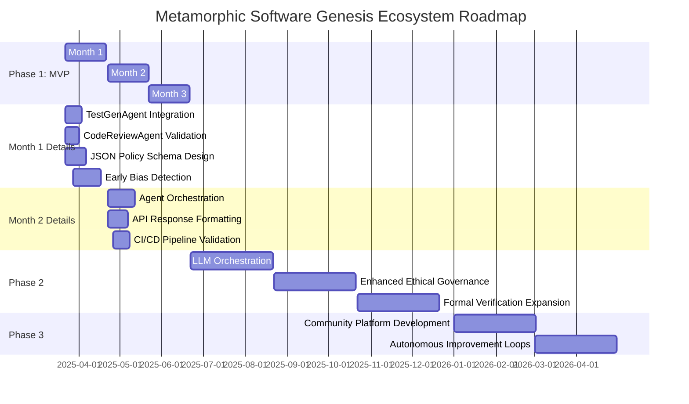

# Metamorphic Software Genesis Ecosystem 🚀

[](https://github.com/tomwolfe/metamorphic-core/actions/workflows/ci.yml)
[](LICENSE)

**Version ∞: An ever-evolving framework for software excellence (MVP - Phase 1 under development)**

**Phase 1 MVP Roadmap**: Drive autonomous code analysis, ethical validation, and security scanning capabilities with AI. **Not for production use**—focus remains on core MVP milestones.

---

**Table of Contents**
* [Vision](#vision)
* [Key Objectives](#key-objectives)
* [Envisioned Workflow: From Concept to Code](#envisioned-workflow-from-concept-to-code)
* [Key Features](#key-features)
* [Roadmap](#roadmap)
    * [Gantt Chart: Phase 1 MVP Roadmap](#gantt-chart-phase-1-mvp-roadmap)
    * [Roadmap Update (v1.1)](#roadmap-update-v11)
* [Current Phase 1 Capabilities](#current-phase-1-capabilities)
* [Competitive Landscape](#competitive-landscape)
* [Full High-Level Specification](#full-high-level-specification)
* [Installation & Quickstart](#installation--quickstart)
* [Core API Endpoints](#core-api-endpoints)
* [Contribution](#contribution)
* [License and Compliance](#license-and-compliance)
* [Disclaimer](#disclaimer)

---

## Vision <a name="vision"></a>

To create a self-refining, AI-driven framework capable of independently generating, maintaining, and evolving high-quality software solutions, operating as a perpetual engine of innovation and improvement.

## Key Objectives <a name="key-objectives"></a>

- **Autonomous Software Development**: Enable independent creation of complete software applications from high-level specifications
- **Ethical Assurance**: Integrate robust ethical governance to ensure compliance with defined principles
- **Continuous Quality**: Automate testing, code review, and security analysis
- **Self-Enhancement**: Enable the ecosystem to learn, adapt, and improve through feedback

## Envisioned Workflow: From Concept to Code <a name="envisioned-workflow-from-concept-to-code"></a>

1. **User Input**: Provide a high-level description of the desired software in natural language or via a future cloud interface
2. **Specification Refinement**: AI agents enhance input, clarifying ambiguities and identifying potential issues
3. **Design & Planning**: Generate a comprehensive software architecture
4. **Code Generation**: Produce code across multiple languages, adhering to best practices
5. **Testing & Validation**: Conduct thorough testing, including:
   - Unit, integration, and end-to-end tests
   - Code quality analysis
   - Ethical compliance checks
   - Security scans
6. **Continuous Integration**: Integrate seamlessly into CI/CD pipelines
7. **Self-Improvement**: Evolve capabilities through learning and adaptation

---

## Key Features <a name="key-features"></a>

- 🔍 **AI-Driven Analysis**: Static code analysis with Flake8/Bandit
- 🖥️ **Ethical Validation**: Policy-configurable ethical checks, quantum-inspired risk analysis
- 🔒 **Security Scans**: OWASP ZAP, Bandit integrations
- ♻️ **Self-Enhancement**: Recommends improvements via analysis-of-analysis feedback loop

---

## Roadmap <a name="roadmap"></a>

### Gantt Chart: Phase 1 MVP Roadmap <a name="gantt-chart-phase-1-mvp-roadmap"></a>


### Roadmap Update (v1.1) <a name="roadmap-update-v11"></a>

**Roadmap for Completion (Optimized for Existing Codebase - Iterative MVP Approach)**

#### **Phase 1: MVP - Refine Existing Core (Next ~3 Months) - *Leverage & Focus***

**Key Principle:** *Phase 1 is about *refining and focusing your existing codebase* to meet the MVP definition, not starting from scratch. We use your current agents as a *starting point* for the "barebones" implementations.*

---

**Phase 1 MVP Definition:**  A functional API endpoint (`/genesis/analyze-ethical`) capable of:

1.  **Analyzing Python Code for Ethical Concerns:** Using a configurable policy engine (enforcing BiasRisk, TransparencyScore, and Safety Boundary constraints, configurable via JSON).
2.  **Providing Basic Code Quality Assessment:**  Leveraging `CodeReviewAgent` (Flake8 output reporting via API).
3.  **Generating Placeholder Tests:** Utilizing `TestGenAgent` to create basic pytest placeholder tests for Python code.
4.  **API Access:**  Providing a functional `/genesis/analyze-ethical` API endpoint that integrates ethical analysis and code quality checks.

---

**Phase 1 Deliverables:**
1. Functional API endpoint (`/genesis/analyze-ethical`) for ethical code analysis.
2. Basic Ethical Policy Engine enforcing BiasRisk, TransparencyScore, and Safety Boundary constraints, with policies configurable via JSON.

**Phase 1 Actionable Steps (Revised & Iterative - *Build on Existing*):**

* **Month 1: Refine Existing Agents & Ethical Engine Foundation - *MVP Agent Focus & Ethical Core (Iterative)* - (**Existing Codebase Leverage**)**

    *1. **Agent Refinement - *Leverage Existing Agents for MVP* - (**Iterative & Adaptive**):**
        *   **TestGenAgent - MVP Refinement:** **Action:** *Adapt your existing `TestGenAgent`*. *Specific Action:*
            * **Start with your current `TestGenAgent` code.**
            * **Simplify `generate_tests()`**:  Refocus it to generate *basic pytest placeholder tests* as per MVP.  *Initially, prioritize functionality over sophistication*.  You likely already have a `TestGenAgent` - refine it to meet the *minimum MVP requirement* of generating *any* placeholder tests.
            * **Verify Functionality (Unit Tests):** Write unit tests to ensure the *refined* `TestGenAgent` can generate *basic* pytest code.
        *   **CodeReviewAgent - MVP Refinement:** **Action:** *Adapt your existing `CodeReviewAgent`*. *Specific Action:*
            * **Start with your current `CodeReviewAgent` code.**
            * **Simplify `analyze_python()`**: Refocus it to *only* run Flake8 and report basic output.  *Defer more advanced static analysis or Bandit integration for Phase 2*.  Your current agent already runs Flake8 - *simplify* it to just handle that MVP task for now.
            * **Verify Functionality (Unit Tests):** Write unit tests to ensure the *refined* `CodeReviewAgent` can execute Flake8 and parse *basic* output.
        *   **(Iterative Testing - Agent Readiness):** **Action:** *Iteratively test and refine* these agents.  *Specific Action:*
            * **Write unit tests *first* (or concurrently).**
            * **Run tests frequently as you simplify/refine the agents.**
            * **Ensure agents are *operationally ready* for the MVP endpoint.**

    *2. **JSON Schema Design for Ethical Policies:**
        *   **Action:** *Define* a robust JSON schema to represent ethical principles, constraints (BiasRisk, TransparencyScore, SafetyBoundary), categories, and enforcement levels.  *Specific Action:* Create `ethical_policy_schema.json` file defining the schema.
        *   (**Self-Bootstrapping Example**: **Self-Bootstrap (Iterative):**  *Adapt your refined `TestGenAgent`* (from Task 1) to *iteratively generate validation tests* for the `EthicalPolicyEngine` as you define the `ethical_policy_schema.json`.  Test schema loading and basic validation logic *incrementally*.)

    *3. **Ethical Policy Engine (Basic & Configurable):**
        *   **Action:** *Implement* a basic `EthicalPolicyEngine` capable of loading and enforcing ethical policies from JSON configurations (based on `ethical_policy_schema.json`).  Focus on enforcing BiasRisk, TransparencyScore, and SafetyBoundary constraints initially.
        *   **Action:** *Implement* API endpoints for basic policy management (e.g., `/ethical/policy/load`, `/ethical/policy/view`).  Use in-memory storage for policies initially; defer database integration.
        *   (**Automated Testing - Critical & Iterative**): **Self-Bootstrap (Iterative):** *Use your refined `TestGenAgent`* (from Task 1) to *iteratively generate comprehensive unit and integration tests* for the `EthicalPolicyEngine`, focusing on rigorous testing of policy loading, enforcement logic, constraint validation, and API endpoint functionality *incrementally*.

    *4. **GDPR/COPPA Placeholder API (Interface Definition Only):**
        *   **Action:** *Define* placeholder API endpoints (`/ethical/gdpr`, `/ethical/coppa`) with clear request/response interfaces documented in API specifications (e.g., OpenAPI/Swagger).  *Specific Action:* Create API route definitions in `ethical_endpoints.py` but leave the function implementations empty (returning "Not Implemented" responses).

    *5. **Bias Detection Module (Starter Integration - Text Analysis Focus):**
        *   **Action:** *Integrate* a starter-level bias detection library (e.g., `Fairlearn` or basic `transformers` text analysis tools) into the `BiasDetectionMitigationModule`. Focus *initially* on text-based bias detection capabilities for code comments and docstrings.  *Specific Action:* Implement basic text bias analysis within `BiasDetectionMitigationModule` that can be called by the `EthicalPolicyEngine`.

* **Month 2: Integrate Agents & API Endpoint - Specification Analysis & Test Generation (**Iterative Integration**)**
    1. **Integrate Specification Analysis Agent (Iterative Enhancement):**  *Adapt your `SpecificationAnalyzer`* to be ready for the MVP endpoint. *Action:* *Iteratively enhance* `SpecificationAnalyzer` to handle the input expected by the `/genesis/analyze-ethical` endpoint. *Specific Action:* Ensure it can analyze Python code strings and output structured specifications in JSON format relevant to ethical analysis and code quality.
    2. **API Endpoint Integration (`/genesis/analyze-ethical` - Core MVP):**  **Action:** *Implement the `/genesis/analyze-ethical` API endpoint*. *Specific Action:*
        * **Route code input:**  Ensure the API endpoint correctly receives Python code via POST request.
        * **Orchestrate Agents:** Wire up the refined `CodeReviewAgent` and `EthicalPolicyEngine` (and basic `BiasDetectionMitigationModule`) to be called by this endpoint.  *Start with a simple sequential flow*.
        * **Return JSON Response:** Format the output from the agents and policy engine into a JSON response as defined in the MVP.
    3. **Automated Testing - API Endpoint & Agent Integration:** (**Iterative Testing**): *Write integration tests* for the `/genesis/analyze-ethical` API endpoint. Focus on testing the *integration* of the agents and the endpoint, ensuring data flows correctly and the API returns the expected JSON response. *Action:* *Create integration tests* in `tests/integration/test_api_ethical_analysis.py`. *Specific Action:* Use `pytest` and API client libraries to send requests to the endpoint and validate the responses.
    4. **CI/CD Integration - MVP Endpoint Tests:** Extend the CI pipeline to automatically run the integration tests for the `/genesis/analyze-ethical` endpoint. *Action:* *Modify* `.github/workflows/ci.yml` to include execution of the new integration tests. *Specific Action:* Add a step in the CI workflow to discover and run pytest files in `tests/integration/`.

* **Month 3: MVP Refinement & Documentation - API Focus & Initial Polish (MVP Completion)**
    1. **Refine MVP API Endpoint (`/genesis/analyze-ethical` - Polish):** *Polish the MVP API endpoint* based on testing and initial feedback.  *Action:* *Refine error handling, response formatting, and performance* of the `/genesis/analyze-ethical` endpoint. *Specific Action:*  Implement better error responses, improve JSON output structure, and optimize for latency.
    2. **Basic Documentation - MVP API Endpoint:** *Document the MVP API endpoint*. *Action:* *Create basic documentation* for the `/genesis/analyze-ethical` API endpoint. *Specific Action:*  Update `README.md` with clear instructions on how to use the endpoint, request/response examples, and expected output.
    3. **Initial MVP Release (Internal/Alpha):** *Release an initial MVP version* for internal testing or alpha users. *Action:* *Prepare a minimal release* of the MVP. *Specific Action:* Tag a release in Git, ensure Docker image is buildable and runnable with the MVP functionality.
    4. **Gather Feedback - MVP Endpoint:** *Gather feedback on the MVP API endpoint*. *Action:* *Collect feedback* from internal testers or alpha users on the usability and functionality of the `/genesis/analyze-ethical` endpoint. *Specific Action:* Set up a feedback mechanism (e.g., a simple form or a dedicated communication channel) and actively solicit feedback.

**Phase 2: Enhanced Features & Quality (Next ~4-6 Months)**

* **Enhanced LLM Orchestration Layer:** Implement advanced context management (recursive summarization, improved chunking), cost optimization (token allocator), and failover protocols in `LLMOrchestrationLayer`. **Actionable Steps:**
    * Implement recursive summarization for long contexts.
    * Improve context chunking strategies based on semantic analysis.
    * Develop a dynamic token allocator to optimize LLM costs.
    * Implement failover mechanisms for LLM API calls (e.g., retry with different models or providers).
* **Modular AI Agent Network (Enhanced Agents):**
    * **Code Review Agent (Advanced):** Enhance `CodeReviewAgent` with more sophisticated static analysis tools (Semgrep, deeper Bandit integration) and LLM-powered code review capabilities. **Actionable Steps:**
        * Integrate Semgrep for advanced security and code pattern analysis.
        * Deepen Bandit integration for comprehensive vulnerability scanning.
        * Add LLM-powered code review features for semantic analysis and style improvements.
    * **Security Agent (Advanced):** Expand `SecurityAgent` with more advanced ZAP scan configurations, vulnerability analysis, and integration with vulnerability databases. **Actionable Steps:**
        * Implement advanced ZAP scan configurations and policies.
        * Integrate vulnerability databases (e.g., CVE) for enhanced reporting.
        * Develop automated vulnerability analysis and prioritization logic.
    * **Performance Analysis Agent:** Implement a `PerformanceAnalysisAgent` to measure and improve software performance. **Actionable Steps:**
        * Create `PerformanceAnalysisAgent` class.
        * Integrate profiling tools for performance measurement (e.g., cProfile for Python).
        * Implement basic performance analysis and reporting.
    * **Predictive Risk Assessment Module (Initial):** Implement a basic `PredictiveRiskAssessmentModule` using the existing `QuantumRiskPredictor` to provide initial risk predictions. **Actionable Steps:**
        * Integrate `QuantumRiskPredictor` into `PredictiveRiskAssessmentModule`.
        * Develop API endpoints to access risk predictions.
        * Implement basic risk visualization in logs or text dashboard.
    * **Self-Monitoring & Adaptive Healing Subsystem (Initial):**  Develop basic self-monitoring and logging capabilities in `SelfMonitoringAndAdaptiveHealingSubsystem`. **Actionable Steps:**
        * Implement `SelfMonitoringAndAdaptiveHealingSubsystem` class.
        * Integrate system health monitoring (CPU, memory, API latency).
        * Develop basic automated logging and error reporting mechanisms.
* **Ethical Governance Framework (Advanced):**
    * **Bias Detection & Mitigation Module (Advanced):** Implement more advanced bias detection and mitigation techniques, potentially using fairness metrics and adversarial debiasing methods. **Actionable Steps:**
        * Integrate fairness metric libraries (e.g., Fairlearn metrics).
        * Implement adversarial debiasing techniques.
        * Expand bias detection to more data types beyond text.
    * **Transparency & Explainability Module (Initial):** Implement basic transparency and explainability features, allowing users to query AI decisions and system outputs. **Actionable Steps:**
        * Develop `TransparencyAndExplainabilityModule` class.
        * Implement API endpoints to query AI decision rationale.
        * Provide basic explanations for ethical policy violations.
    * **Ethical Review Board Interface (Basic UI):** Develop a basic web UI for the Ethical Review Board to review compliance reports, adjust ethical guidelines, and provide overrides. **Actionable Steps:**
        * Develop a Flask-based web UI for ERB.
        * Implement basic dashboards for ethical compliance reporting.
        * Create UI elements for policy adjustments and overrides.
* **Performance Optimization:** Implement caching, asynchronous processing, and resource optimization techniques throughout the system. **Actionable Steps:**
    * Implement caching for LLM responses and Knowledge Graph queries.
    * Utilize asynchronous processing for non-blocking operations.
    * Optimize resource allocation using techniques like connection pooling.
* **Expanded Language Support (JavaScript/TypeScript):**  Extend Code Generation Agent and Test Generation Agent to support JavaScript/TypeScript. **Actionable Steps:**
    * Extend `CodeGenerationAgent` to generate JavaScript/TypeScript code.
    * Extend `TestGenerationAgent` to generate tests for JavaScript/TypeScript (e.g., Jest, Mocha).
    * Add language detection capabilities to agents.
* **Enhanced API Endpoints:**  Expand API endpoints to expose more agent functionalities and data. **Actionable Steps:**
    * Create API endpoints for Security Agent functions.
    * Expose Performance Analysis Agent metrics via API.
    * Provide API access to Predictive Risk Assessment Module outputs.
* **Quantifiable KPIs (Initial Tracking):** Implement basic KPI tracking for Code Quality Score, Performance & Efficiency Gains, and Error & Vulnerability Reduction. Display KPIs in the basic monitoring dashboard. **Actionable Steps:**
    * Integrate KPI tracking libraries (e.g., Prometheus client).
    * Implement KPI calculation logic for Code Quality, Performance, and Error Reduction.
    * Display KPIs in the text-based monitoring dashboard.

**Phase 3: Community & Autonomy (Ongoing)**

* **Community Contribution Platform (Basic):** Develop a basic web UI to facilitate community contributions (code, ethics, testing, features) and manage governance (PR reviews, voting). **Actionable Steps:**
    * Set up a community forum (e.g., Discourse, GitHub Discussions).
    * Develop a basic web UI for contribution submission and tracking.
    * Implement a basic PR review workflow within the platform.
* **Autonomous Self-Improvement Loop (Initial):**  Implement initial self-improvement loops, focusing on:
    * **Automated Test Generation Improvement:** Use Code Review Agent feedback to refine TestGenAgent and improve test quality. **Actionable Steps:**
        * Implement a feedback loop from `CodeReviewAgent` to `TestGenAgent`.
        * Refine `TestGenAgent`'s test generation strategies based on code review findings.
    * **Performance Optimization Feedback Loop:** Use Performance Analysis Agent data to guide Resource Management & Optimization Module. **Actionable Steps:**
        * Implement a feedback loop from `PerformanceAnalysisAgent` to `ResourceManagementAndOptimizationModule`.
        * Develop automated resource optimization strategies based on performance data.
* **Enhanced Formal Verification Engine:** Strategically apply formal verification to more critical components, especially security-related modules and the Ethical Policy Engine. **Actionable Steps:**
    * Identify critical modules for formal verification (e.g., Ethical Policy Engine core logic).
    * Extend Coq/Isabelle integration for formal verification of these modules.
    * Automate formal verification as part of the CI pipeline for critical components.
* **Global Accessibility Features:** Implement basic localization and explore integration with more open-source LLMs. **Actionable Steps:**
    * Implement basic localization for UI elements and documentation.
    * Explore integration with open-source LLMs (e.g., Alpa, StarCoder).
    * Evaluate cost and performance of open-source LLMs.
* **Advanced Monitoring & Telemetry Dashboard (UI):** Develop a more comprehensive and visually appealing monitoring and telemetry dashboard with UI, displaying detailed KPIs, system health metrics, and ethical compliance reports. **Actionable Steps:**
    * Develop a web-based monitoring dashboard using a UI framework (e.g., React, Vue).
    * Visualize KPIs, system health, and ethical metrics in the dashboard.
    * Implement user authentication and role-based access control for the dashboard.
* **Refinement & Iteration:** Continuously refine and iterate on all aspects of the Ecosystem based on community feedback, performance data, and ethical considerations. **Actionable Steps:**
    * Establish regular community feedback collection mechanisms (surveys, forums).
    * Continuously monitor performance data and ethical compliance metrics.
    * Implement iterative development cycles based on feedback and data analysis.

**Roadmap Optimization Tricks (Refined for MVP Focus):**

* **Lean Development & Iteration:** Focus on building a functional core first and iterating rapidly based on testing and feedback. Avoid over-engineering upfront.
* **Prioritize MVP Features:**  Strictly prioritize features needed for a minimally viable product in Phase 1. Defer less critical features to later phases.
* **Self-Bootstrapping Everywhere:**  Actively leverage the Ecosystem's own capabilities (TestGenAgent, Code Review Agent) to accelerate its own development. Automate testing, code generation (stubs), and documentation where possible.
* **"Good Enough" is OK for MVP:**  For the initial MVP, focus on getting *basic* functionality working reliably.  Perfection is the enemy of "done."  Refinement and polish come later.
* **Focus on Testability:** Write tests *before* or *concurrently* with code development.  Good test coverage will speed up development and reduce bugs in the long run.
* **Consider Early Community Feedback:**  Actively seek early community feedback on the spec and roadmap *even in Phase 1* to gain valuable insights and potentially attract early contributors.  Even limited early feedback can be incredibly valuable and help refine the direction and attract initial interest.

---

## Competitive Landscape <a name="competitive-landscape"></a>

<details>
<summary>Click to expand the Competitive Landscape Analysis</summary>

It's essential to understand the competitive terrain. While no direct, comprehensive competitor exists in the precise, integrated form of the Metamorphic Software Genesis Ecosystem, the competitive space can be viewed as a constellation of adjacent and overlapping efforts, each addressing pieces of the software development puzzle.

### 1. AI-Augmented Code Generation – Sub-Categories and Nuances

#### a) "Inline" AI Code Completion & Snippet Tools (Mass Market & Developer Productivity Focused)
- **Examples:** GitHub Copilot, Tabnine, JetBrains AI Assistant, Codium, FauxPilot (Open Source Copilot Alternatives), VS Code's IntelliCode
- **Differentiation for Metamorphic:** These tools are developer-centric, enhancing individual coding speed. Metamorphic is ecosystem-centric, aiming to transform the entire software creation process. They lack Metamorphic's ethical governance, formal verification, and SDLC-wide scope
- **Competitive Intensity:** Extremely high and rapidly intensifying. These are becoming table stakes in developer tooling

#### b) AI-Powered Code Synthesis & Function Generation (Task-Specific Automation)
- **Examples:** Google Gemini Code Assist's function generation, OpenAI Codex for code translation, specialized AI code generators
- **Differentiation for Metamorphic:** These tools automate specific coding tasks. Metamorphic aims for autonomous software genesis
- **Competitive Intensity:** High and growing. Cloud providers and specialized startups are heavily investing here

### 2. Low-Code/No-Code – Beyond Visual Interfaces

#### a) Visual App Builders & Drag-and-Drop Platforms
- **Examples:** Salesforce, PowerApps, Zoho Creator, Quickbase, Betty Blocks, Webflow
- **Differentiation for Metamorphic:** These empower "citizen developers" for simpler applications. Metamorphic targets professional developers building complex, mission-critical software
- **Competitive Intensity:** Moderate to High in their niche

#### b) "Code-Optional" Platforms & Intelligent Automation
- **Examples:** Emerging platforms incorporating AI within low-code environments
- **Differentiation for Metamorphic:** These platforms typically lack Metamorphic's emphasis on ethical governance and formal verification
- **Competitive Intensity:** Low to Moderate currently, but rapidly increasing

### 3. MLOps/DevOps with AI – Expanding Beyond Deployment

#### a) AI-Enhanced DevOps Automation
- **Examples:** Kubeflow, MLflow, GitLab's AI features, Harness, CircleCI
- **Differentiation for Metamorphic:** These tools optimize deployment and operation. Metamorphic focuses on the entire lifecycle
- **Competitive Intensity:** High and growing

#### b) AI for Software Quality & Testing
- **Examples:** SeaLights, Functionize, Applitools
- **Differentiation for Metamorphic:** Quality is "built-in," not "tested-in" as an afterthought
- **Competitive Intensity:** Moderate to High in the QA space

### 4. Academic Research – From Inspiration to Industrialization

#### a) Advanced Program Synthesis & Automated Reasoning
- **Examples:** Research at MIT, Stanford, CMU, Oxford on formal methods and program synthesis
- **Differentiation for Metamorphic:** Industrialization of theoretical concepts into practical solutions
- **Competitive Intensity:** Not directly competitive, but source of future innovations

### Strategic Takeaways for Metamorphic

1. **Amplify the "Genesis Ecosystem" Vision:** Emphasize the holistic, end-to-end nature
2. **Double Down on Ethical and Verification Pillars:** Make these core differentiators
3. **Showcase Long-Context Mastery:** Demonstrate superior handling of complex software
4. **Foster a Thriving Community:** Build a vibrant open-source ecosystem
5. **Focus on "High-Value" Software Domains:** Target industries where quality and ethics are paramount

</details>

---

## Full High-Level Specification <a name="full-high-level-specification"></a>

<details>
<summary>Click to expand the Full High-Level Specification</summary>

**Adaptive Software Genesis Ecosystem (Version 1.0): High-Level Specification (AGPLv3 Licensed)**
**Enhanced Version (Community-Driven & Passion-Project Focused - Iteration 6 Polished)**

Executive Summary:

The Adaptive Software Genesis Ecosystem (Version 1.0) is a transformative open-source platform (AGPL v3 licensed) poised to revolutionize software development through **ethical actionability, adaptive learning, and human-AI symbiosis.**  As a passionate community endeavor, it aims to achieve unprecedented software quality, efficiency, and ethical responsibility by synergistically combining advanced Artificial Intelligence with human expertise. Envisioned for creating exceptional software across diverse fields, especially complex, long-context tasks, the Ecosystem prioritizes verifiable reliability, resource efficiency, and transparent ethical operations.  It rigorously aligns with ethical frameworks and regulations like the **EU AI Act, GDPR, and COPPA.**  Long-term sustainability is secured through vibrant community contribution, resourceful shared resources, and a deep commitment to optimal resource utilization, ensuring its enduring value as an open resource. This document details the core design, system architecture, implementation roadmap, technical specifications, key considerations, and quantifiable performance metrics for Version 1.0.  **Our core purpose is to inspire community contribution, guide collaborative development, and establish a shared vision for the Adaptive Software Genesis Ecosystem as a groundbreaking passion project, built openly, ethically, and for the benefit of all.**

I. Foundational Design Principles:  **(Refined Flow and Emphasis)**

These core principles provide the bedrock for the Ecosystem's development and ensure a consistent, ethical direction. **Human-AI Symbiosis**, our first guiding star, recognizes the power of collaboration, while **Ethical Actionability** ensures responsible innovation:

1. **Human-AI Symbiosis**:  Recognizing the essential and balanced collaboration between human ingenuity and AI power as the driving force.
    * **Human-AI Partnership:**  We leverage AI for automation and efficiency, while retaining crucial human oversight for strategic direction, nuanced problem-solving, and ethical discernment.
    * **Ethical Review Board:** Expert human oversight is central to ethical governance and policy refinement.  Comprising 5+ voting members, the ERB meets quarterly to rigorously review ethics audits and requires a 3-person majority for ethical overrides.
    * **Human Input & Oversight Interface:** A user-friendly interface empowers diverse stakeholders to actively interact with and guide the Ecosystem.
    * **Open and Governed Community Contributions:**  We actively welcome and manage community contributions across all domains, fostering innovation and ensuring collective quality enhancement.

2. **Ethical Actionability**:  Ensuring ethical operation is not just a principle, but a demonstrable and actionable framework, woven into every component.
    * **Ethics by Design:** Ethical considerations are fundamentally integrated into the Ecosystem's core architecture from the outset.
    * **Ethical Policy Engine**:  This rule-based engine actively enforces core ethical principles, manages policy updates through community-vetted pull requests, and aligns with global frameworks (EU AI Act, COPPA) via configurable JSON schemas. Monthly audits by the Ethical Review Board ensure continuous ethical vigilance.
    * **Bias Detection & Mitigation:** Dedicated modules and continuous monitoring proactively identify and reduce biases in code, AI decision-making, and data.
    * **Transparency & Explainability:** AI reasoning is made inherently understandable. APIs allow querying LLM rationale in production decisions, while layered dashboards clearly explain outputs (e.g., "Why flagged? -> GDPR Clause 3 violation").
    * **Human Override & Intervention:** Clear, robust pathways for ethical intervention are established, including the Ethical Review Board's decisive veto power.
    * **Continuous Ethical Self-Assessment:** AI-driven self-evaluation against the ethical policy is continuous, with regular reports ensuring proactive ethical compliance.

3. **Adaptive Learning Fabric**: The Ecosystem is intelligently designed for continuous improvement and dynamic adaptation.
    * **Data-Driven Adaptation:**  Relentless improvement is driven by comprehensive data analysis, performance metrics, and responsive feedback loops.
    * **Continuous Learning & Adaptation Core:** Machine learning algorithms actively drive enhancements in performance, efficiency, and ethical alignment, employing techniques like A/B testing and reinforcement learning informed by agent feedback (e.g., static analysis).
    * **Self-Monitoring & Adaptive Healing:**  Automated systems vigilantly monitor Ecosystem health and performance, proactively detecting issues and implementing error recovery with minimal intervention.
    * **Predictive Risk Assessment:**  Proactive identification and robust mitigation of potential future risks are achieved through advanced modeling and simulation.

4. **Cyber-Physical Resilience and Resource Efficiency**:  Prioritizing robust security, system resilience, and truly sustainable resource utilization.
    * **Mathematical Proof for Critical Security and Functionality:** Formal verification, using tools like **Coq and Isabelle/HOL**, provides mathematical guarantees for critical components.  **Rust**, chosen for safety-critical modules like formal verification, leverages its inherent memory safety.
    * **Proactive Error Handling and Resilience:**  The system is engineered to prevent known errors and degrade gracefully in unforeseen situations, maintaining essential functionality.
    * **Resource Efficiency:**  Optimal resource utilization is a core design tenet, promoting long-term sustainability and cost-effectiveness. We target a 25% resource reduction and 40% performance improvement within 12 months of Phase 2, ensuring efficient operation.
    * **Primary Programming Languages:**  Strategic use of **Rust** for critical safety and **Go** for high-performance agents maximizes both resilience and efficiency.

5. **Knowledge-Based Problem Solving**:  Intelligently leveraging and continuously evolving knowledge for advanced software genesis.
    * **Knowledge-Based Problem Solving:** Complex challenges are addressed by intelligently combining and dynamically adapting existing solutions from our vast knowledge base.
    * **Dynamic Knowledge Graph:**  A constantly evolving, semantically rich knowledge graph serves as the Ecosystem's intelligent memory, storing technical expertise, ethical principles, project history, performance data, and valuable user feedback for advanced AI contextual reasoning.
    * **Intelligent LLM Orchestration Layer:**  This layer expertly manages a diverse array of Language Models (LLMs), optimizing for performance, cost-effectiveness, and nuanced context awareness.  LLM Orchestration intelligently handles API routing and robust failover (e.g., seamless auto-retry with Alpa if OpenAI API becomes unavailable). Specialized AI Agents then act as the Ecosystem's decision-making modules.

6. **Open Innovation and Global Accessibility**:  Fostering a vibrant community-driven ecosystem and ensuring broad usability worldwide.
    * **Open and Governed Community Contributions:**  We are committed to actively fostering and expertly managing community contributions across all domains, unleashing collective innovation and ensuring consistently high quality.
    * **Technical Specifications - Open Standards:**  A firm commitment to open standards and seamless interoperability ensures the Ecosystem remains flexible and accessible, prioritizing open-source tools wherever ethically and practically feasible.
    * **Version Control - Open Repository:**  **GitHub** serves as our primary platform, providing an open and readily accessible code repository for transparent development and community engagement.
    * **Global Accessibility (Future):**  Future development will prioritize global accessibility, including localization for 10+ languages and strategic support for diverse open-source LLMs (Alpa, StarCoder) to broaden usability and reduce cost dependencies worldwide.


II. System Architecture
Use code with caution.
Markdown
+------------------------------+ +------------------------+
| Human Input/API Gateways |----Ethics Layer→| Metamorphic Core |→| Software Artifacts/Reports |
| (Ethicists, Developers, |←Metrics | (LLM Orchestration, | +---------------------------+
| Community Contributions) |←Knowledge | Dynamic Graph) | (Includes ISO metrics)
+------------------------------+ +------------------------+
↑│Feedback Loops │Validation │Resource Management
││Ethical Override (ERB) ┌──Ethics by Design logic───→│Caching/Scheduling
▼│Continuous Improvement │

**System Architecture Diagram Legend:**

* **Human Input/API Gateways**:  The entry point for all interaction.
    * **Purpose**:  Provides interfaces for diverse stakeholders (developers, ethicists, community) to engage with the Ecosystem.
    * **Functionality**:  Handles specification submission, feedback input, ethical overrides, and API access for external systems.

* **Ethical Governance Layer**:  Ensures ethical operation and oversight.
    * **Purpose**:  Acts as the ethical conscience of the Ecosystem, enforcing policies and ensuring responsible AI behavior.
    * **Key Modules**:  Ethical Policy Engine, Bias Detection & Mitigation, Transparency & Explainability.
    * **Feedback Data Flow**: Receives code quality metrics (from agents), user feedback, and ethical audit reports for continuous ethical refinement.

* **Metamorphic Core**:  The intelligent heart of the Ecosystem, driving software genesis.
    * **Purpose**: Orchestrates AI agents, manages knowledge, and optimizes resource utilization for efficient and high-quality software creation.
    * **Key Modules**: LLM Orchestration Layer, Dynamic Knowledge Graph, Modular AI Agent Network, Resource Management Module.
    * **Validation Process**: Validates software outputs against specifications and ethical policies before release.

* **Software Artifacts/Reports**:  The output and record-keeping component.
    * **Purpose**:  Securely stores and provides access to all software outputs and comprehensive reports for transparency and accountability.
    * **Content**:  Includes generated code, tests, documentation, performance metrics (SonarQube), security reports, and ethical compliance reports (ISO/IEC 25010 metrics).

Component Specification:

Human Input & Oversight Interface: A secure, user-friendly web application for developers, ethicists, stakeholders, and community members. Features:

* Specification Submission: Accepts natural language and structured formats (like diagrams).
* Configuration: Detailed control over Ecosystem settings and workflows.
* Feedback: Easy ways to provide input at every stage of software creation.
* Ethical Guidance Input: Direct channels for ethicists to refine ethical policies.
* Override Controls: Human intervention points for ethical overrides and critical situations.
* Progress Dashboards: Real-time visual displays of progress, performance, and ethical adherence.

Metamorphic Core (Adaptive AI Orchestration): The intelligent heart of the Ecosystem, managing all operations. Designed to be flexible, expandable, and adapt to changing needs. Key parts:

* Dynamic Knowledge Graph: A constantly updated, semantically organized knowledge base. It stores technical information, ethical principles, project history, performance data, and learned best practices, enabling intelligent reasoning and learning.  **Serves as the long-term memory of the Ecosystem.**
* Intelligent LLM Orchestration Layer: Smartly manages a range of powerful language AI models (LLMs) including Gemini, OpenAI, and open-source options. It chooses the best LLM for each task based on capabilities, cost, and speed.  It also handles:
    * Task Routing: Directing tasks to the most suitable LLM.
    * Load Balancing: Distributing work across available LLMs for optimal performance.
    * Failover: Ensuring continuous operation even if some LLMs become unavailable.
    * Cost Optimization: Minimizing expenses by intelligently selecting LLMs and managing token usage.
    * Context-Awareness: Expertly manages long documents and complex information for LLMs using techniques like chunking and summarization.

* Modular AI Agent Network (Specialized Agents): A team of specialized AI agents, each focused on a specific part of the software creation process:
    * Specification Analysis Agent: Understands and assesses software requirements.
    * Test Generation Agent: Automatically creates comprehensive tests for all software aspects.
    * Code Generation Agent: Writes code in multiple programming languages, following best practices.
    * Code Review Agent: Evaluates code quality, identifies security issues, and performance problems.
    * Static Analysis Agent: Detects potential problems in code without running it.
    * Dynamic Analysis Agent: Finds issues by running and testing the software.
    * Security Agent: Proactively works to prevent security vulnerabilities.
    * Performance Analysis Agent: Measures and improves software performance.
    * Formal Verification Engine: Applies mathematical proofs to guarantee the correctness of critical code.
    * Predictive Risk Assessment Module: Identifies and proposes solutions for potential future risks.
    * Self-Monitoring & Adaptive Healing Subsystem: Continuously monitors the Ecosystem's health and performance, automatically detecting and resolving issues, and recovering from errors.
    * Continuous Learning & Adaptation Core: Uses machine learning to constantly improve the Ecosystem's performance, accuracy, efficiency, and ethical alignment based on feedback and data.
    * Resource Management & Optimization Module: Intelligently manages and allocates computing resources across the Ecosystem to ensure efficiency and cost-effectiveness, adapting to changing workloads and budget limits.

Ethical Governance Framework: Ensures the Ecosystem operates ethically through a structured and transparent approach:

* Ethical Policy Engine: A rule-based system that encodes core ethical principles and guidelines (drawing from ethical frameworks that consider both rules and consequences). This system is continuously updated, open to audit, and **transparently documented for community review.**
* Bias Detection & Mitigation Module: Identifies and reduces potential biases in code, AI decision-making, and data, ensuring fairness and equity.
* Transparency & Explainability Module: Makes AI reasoning understandable, providing clear explanations for AI decisions and system outputs.
* Human Override & Intervention Mechanisms: Provides clear pathways for ethicists and stakeholders to intervene and override automated decisions when necessary for ethical reasons.
* Continuous Ethical Self-Assessment Module: Uses AI to continuously evaluate the Ecosystem's behavior against the defined ethical policy, generating regular reports on ethical compliance.
* Ethical Review Board Interface: A dedicated interface for the Ethical Review Board to review compliance reports, adjust ethical guidelines, and provide expert ethical oversight. **Facilitates direct communication and feedback.**

Software Output & Data Repository: A secure, version-controlled repository for all software created and data generated by the Ecosystem. This includes code, tests, documentation, performance metrics, security and ethical reports, logs, and audit trails, ensuring full traceability and accountability. **Adherence to open data principles will be prioritized where ethically and practically feasible.**

III. Phased Implementation Plan (Iterative Roadmap):  **(Community & Resource Focused - with Milestones & KPI Alignment)**

(Simplified Overview - Detailed Plan in Appendix)

| **Phase**      | **Months** | **Key Deliverable & Milestone**                                    | **Illustrative Community Milestone**                                   | **Aligned KPI Target (Phase End)**                               |
|----------------|------------|-------------------------------------------------------------------|----------------------------------------------------------------------|--------------------------------------------------------------------|
| **Phase 1**    | 1–3        | Establish Ethical Review Board (Month 2); Core Ethical Policy Engine Operational (Month 3) | **Launch Initial Community Forum & Contribution Guidelines (Month 1)** | Baseline FOSS Code Quality Score Measured (Month 3)             |
| **Phase 2**    | 4–9        | Prometheus Monitoring Integrated (Month 6); Release First Functional Python/Go Output (Month 9)    | **Grow Core Contributor Base to [Target Number] Active Members (Month 7)**| Achieve 20% Performance Improvement; 10% Resource Reduction (Month 9)     |
| **Phase 3**    | 10–15      | Ethical Override Interface Finalized (Month 12); Achieve 30% Vulnerability Reduction (Month 15) | **Organize First Community Online Workshop/Event (Month 11)**          | Demonstrate 30% Error & Vulnerability Reduction from Baseline (Month 15)        |
| **Phase 4**    | 16+        | Community Contribution Platform Live (Month 18); Activate Initial Self-Improvement Loop (Month 18+) | **Launch Community Recognition Program & Showcase Early Contributions (Month 17)**| Reach 95% Formal Verification Coverage for Critical Components (Month 18) |

IV. Technical Specifications & Key Performance Indicators (KPIs):  **(Enhanced Specificity & Baseline Clarity)**

1. **KPI Anchoring & Measurement**:  **(Clear Baseline Purpose)**
    * **Code Quality KPI (Aspirational Target: 97%+ based on ISO/IEC 25010):**  *Purpose of Baseline:* To establish a starting point for tracking code quality improvement over time. *Baseline Measurement:* Initial measurement of 65% FOSS Code Quality Score (using SonarQube on the Phase 1 codebase).  Average score based on automated LLM assessment (using a standardized rubric aligned with ISO/IEC 25010 attributes like maintainability, reliability, security, usability). Measurement utilizes static analysis tools (**SonarQube** in CI/CD) and deep code analysis metrics. Aspirational Target: 97%+ within 12 months of Phase 2 completion (Month 21), with continuous improvement thereafter.  Target: 95% Formal verification coverage for critical security/functional components by Month 18 (**Coq/Isabelle**).
    * **Operational Efficiency KPI (Target: 40% Performance Improvement, 25% Resource Reduction):** *Purpose of Baseline:* To quantify efficiency gains relative to initial system performance. *Baseline Measurement:* Performance benchmark established during Phase 1 setup. Improvement measured in task speed/efficiency and resource use per task. Tracked via monitoring tools (**Prometheus, Azure Monitor** for cloud), optimized through **Kubernetes autoscaling, Rust/Go agents**. Target: 40% performance improvement and 25% resource reduction within 12 months of Phase 2 completion (Month 21). **Crucial for sustainable resource usage.**
    * **Error & Vulnerability Reduction KPI (Aspirational Target: 80% Reduction):** *Purpose of Baseline:* To demonstrate increasing software robustness and security over development cycles. *Baseline Measurement:* Number of vulnerabilities identified in the initial Phase 1 codebase.  Percentage reduction in internal bugs/security vulnerabilities per release cycle (adjusted for code complexity), tracked against Phase 1 baseline. Aspirational Target: 80% reduction within 18 months of Phase 3 completion (Month 33).
    * **User Satisfaction & Ethical Trust KPI (Target: 4.8/5 Rating & Positive Sentiment):** Average satisfaction rating (4.8/5 target) and positive sentiment in feedback from developers/ethicists, demonstrating trust in ethical approach/reliability. Measured via user surveys and sentiment analysis of community feedback.
    * **Self-Improvement Rate KPI (Target: 20+ Merges/Month):** Number of validated improvements merged into codebase monthly. Target: Sustained 20+ merges/month post-Phase 3, indicating a thriving community contribution model.

2. **Risk Mitigation Matrix (Example - Refined "Owner/Actor" Detail):**

    | Risk                               | Impact | Likelihood | Mitigation Strategy                                                                 | Owner/Actor                               | Monitoring Frequency |
    |------------------------------------|--------|------------|-------------------------------------------------------------------------------------|-------------------------------------------|----------------------|
    | Ethical Override Failure             | High   | Low        | Ethical Review Board 3-person majority voting system; Comprehensive Audit Trails.      | **ERB - Policy & Audit Subcommittee**     | Quarterly             |
    | Data Leakage/Privacy Violation     | High   | Moderate   | GDPR-compliant data handling; Rust's `zeroize!` macro for sensitive data; Strong Data encryption. | **Security Agent - Data Security Team** | Continuous/Monthly    |
    | LLM Bias Propagation                | Medium | Moderate   | Continuous bias detection modules; Ethical Policy Engine constraints; Human-in-the-loop review. | **Bias Mitigation Module - Analysis Team**| Continuous            |
    | Supply Chain Vulnerabilities (Deps) | Medium | Moderate   | Automated dependency vulnerability scanning using **Trivy** (monthly); Regular security audits; Dependency pinning. | **Security Agent - Infra Team**     | Monthly               |
    | Community Contribution Quality     | Medium | Moderate   | Rigorous code review process (3 approvals for policy changes); Automated testing.     | **Core Developer Team - Lead Developers** | Per Contribution     |

3. **Workflow Details (Simplified Git Model):**
    * **Version Control:** Primarily **GitHub**, with potential **GitLab** integration. Monthly dependency vulnerability scans using **Trivy** are automated in the CI/CD pipeline.
    * **Branching Strategy:**  Standard feature branches, release branches, and a stable main/trunk branch. Separate repositories for **Rust core components (`asg-rust-core` on GitHub - [Coming Soon] )** and **Go agents (potentially on GitLab - [Future])** for organizational flexibility.
    * **Code Review Process:**  Mandatory code reviews for all contributions. **3 approvals required for changes impacting the Ethical Policy Engine or critical security components.** Standard contributions require 2+ approvals. Recognition: Top contributors earn "Ethical Guardian" badges, displayed on monthly community leaderboards.

V. Sustainability through Community & Resourcefulness:  **(Refocused Section)**

The Ecosystem's enduring sustainability as a valuable open resource will be powerfully driven by:

* **Vibrant Community Contribution:**  We are building a thriving and deeply engaged community of passionate developers, ethicists, and enthusiasts.  Their diverse contributions are the very lifeblood of this project, fueling its innovation and growth.
* **Resourceful Efficiency:**  We embrace resource efficiency as a core value, optimizing every aspect of the Ecosystem – from algorithms to infrastructure – to minimize consumption and maximize impact. This intelligent resourcefulness ensures long-term viability.
* **Shared Infrastructure Potential:**  We envision a future where shared or donated infrastructure resources, generously offered by individuals and organizations who champion our ethical AI mission, could further empower our community (exploring this as needed).
* **Open Knowledge and Empowerment:**  Our commitment to creating comprehensive, freely accessible documentation, tutorials, and educational materials will empower community members to learn, contribute, and share knowledge, ensuring the Ecosystem's wisdom is widely disseminated and preserved for generations to come.
* **Ethical Foundation: A Magnet for Passion:**  Our unwavering commitment to ethical principles acts as a powerful magnet, attracting contributors who are deeply passionate about building responsible, beneficial AI systems. This shared ethical compass ensures the project's enduring relevance, positive societal impact, and long-term community vitality.

VI. Conclusion & Invitation:  **(Passion-Driven Call to Join)**

ASG 1.0 is more than just software; it is a passionate, community-led movement to forge a new paradigm for ethical software development through open collaboration.  Grounded in the core principles of ethical actionability, adaptive learning, cyber resilience, and community-driven innovation, it aims to establish a truly valuable open resource for building trustworthy AI systems that benefit all of humanity.  This Ecosystem is not simply about lines of code – it's about building a vibrant community united by the shared purpose of creating a future where software is inherently more reliable, efficient, ethically sound, and genuinely serves humanity.

**Become a Vital Part of Our Passion Project: Build the Future of Ethical AI-Driven Software with Us!**

* **Developers:  Fuel the Engine of Innovation.**  Contribute your coding prowess to the core codebase, especially the Rust components (**GitHub Repo: Rust core components repository link [Coming Soon]** ) and high-performance Go agents.  Explore current contribution opportunities and dive into the code: **[Contribution Portal - Coming Soon]**.
* **Ethicists:  Shape Our Ethical Compass.**  Lend your invaluable expertise to the Ethical Review Board and directly influence the ethical trajectory of the Ecosystem.  Apply to join and guide our ethical journey via the **MetaReview portal: [MetaReview Portal - Coming Soon]**.
* **Community Members:  Amplify Our Shared Vision.**  Participate actively in community discussions, generously share your insights, and help us cultivate a thriving, collaborative ecosystem.  Join the conversation on our community forum: **[Community Forum - Coming Soon]**.

Licensed under AGPLv3, the complete source code and all project artifacts will be openly and freely available at **[https://github.com/tomwolfe/metamorphic-core/]**.  Let's build something truly extraordinary, together, driven by passion, purpose, and a shared commitment to ethical AI!

</details>

---

## Installation & Quickstart <a name="installation--quickstart"></a>

### System Requirements:
- **Python**: 3.11+
- **Docker**: Optional (Redis caching/OWASP ZAP)
- **API Keys**:
  - Gemini API Key (Required)
  - Hugging Face API Key (Optional)

### Quickstart Guide

#### 1. Clone Repository
```bash
git clone https://github.com/tomwolfe/metamorphic-core.git
cd metamorphic-core
```

#### 2. Configure Environment
```bash
cp .env.example .env
```
Adjust critical parameters like:
```env
GEMINI_API_KEY=your-production-key
ETHICAL_THRESHOLD=90  # Higher = stricter policies
```

#### 3. Setup Virtual Environment
```bash
python -m venv venv
source venv/bin/activate  # Linux/macOS
venv\Scripts\activate     # Windows
```

#### 4. Install Dependencies
```bash
pip install -r requirements/base.txt
```

#### 5. Run Server
```bash
cd src/api
python server.py
```

Visit `http://0.0.0.0:50000/` for live API status.

---

## Core API Endpoints <a name="core-api-endpoints"></a>
<details>
<summary>Phase 1 MVP API Overview</summary>

| Endpoint                          | Method | Status             | Description |
|-----------------------------------|--------|--------------------|-------------|
| **/genesis/health**               | GET    | Working            | Basic liveness check (healthcheck response) |
| **/genesis/analyze-ethical**      | POST   | Alpha              | Full code analysis including: <br> • Grammar/Quality (Flake8) <br> • Basic ethics assessment (Beta) <br> • Test placeholder generation (v1.1) |
| /genesis/solve-math               | POST   | MVP Baseline       | LLM-powered mathematical problem solving demo |
| /genesis/ethical/audit/{state_id} | GET    | To Be Implemented  | Future ethics audit history access |
| /genesis/ethical/visualize/*      | ALL    | Coming Soon        | Maturity visualizations (API v1.3+) |

*Example Request:*
```bash
curl -X POST \
  http://0.0.0.0:50000/genesis/analyze-ethical \
  -H "Content-Type: application/json" \
  -d '{"code": "def gcd(a,b): return a if b==0 else gcd(b,a%b)"}'
```
</details>

---

## Contribution <a name="contribution"></a>
- **Start Contributing:** Begin with issues labeled **"Good First Issue"** in our repo. **A recommended first contribution is extracting documentation from code comments to enhance Phase 1 APIs.**
- Verify implementation against the Phase 1 MVP Roadmap Actionable Steps.

**Want visibility**? Our contributor acknowledgment badge initiative will be launched in Phase 2.

---

## License and Compliance <a name="license-and-compliance"></a>
**Developed under AGPLv3**: See `LICENSE`.

This project adheres to **OECD AI Principles** and leverages policy schemas compliant with GPDR/Brexit specifications.

---

For inquiries, contact: **tomwolfe@gmail.com** (please avoid sensitive information in emails)

## Disclaimer <a name="disclaimer"></a>

**This project is in early MVP development and not intended for production use.** Functionality is limited to the features outlined in the Phase 1 Roadmap and is subject to change. API endpoints and responses are under active development and may evolve.  **We are actively working towards the Phase 1 MVP outlined in the Roadmap below.**

---
