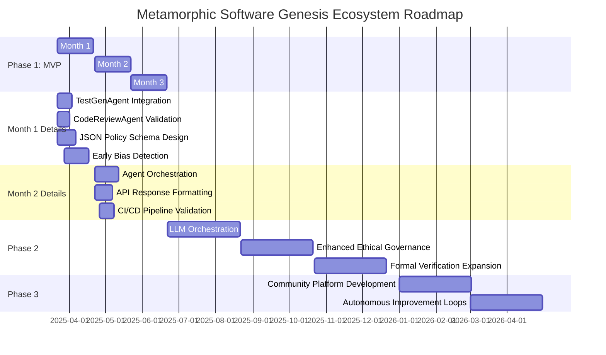

# Metamorphic Software Genesis Ecosystem 🚀

[](https://github.com/tomwolfe/metamorphic-core/actions/workflows/ci.yml)
[](LICENSE)

**Version ∞: An ever-evolving framework for software excellence (MVP - Phase 1 under development)**

**Phase 1 MVP Roadmap**: Drive autonomous code analysis, ethical validation, and security scanning capabilities with AI. **Not for production use**—focus remains on core MVP milestones.

## Vision
Create a self-refining framework that generates, maintains, and evolves software through AI, ensuring ethical governance and continuous improvement.

---

## Key Features

- 🔍 **AI-Driven Analysis**: Static code analysis with Flake8/Bandit
- 🖥️ **Ethical Validation**: Policy-configurable ethical checks, quantum-inspired risk analysis
- 🔒 **Security Scans**: OWASP ZAP, Bandit integrations
- ♻️ **Self-Enhancement**: Recommends improvements via analysis-of-analysis feedback loop

---

## Gantt Chart: Phase 1 MVP Roadmap


---

## Current Phase 1 Capabilities

### Key Milestones Achieved:
- Operational `/genesis/analyze-ethical` API endpoint with:
  – Basic code quality assessment (API v1.1)
  – Gamma-level ethical analysis backbone
  – Placeholder test-generation proof-of-concept

### Technical Foundations Live:
- **LLM Orchestration Layer** (Gemini/Hugging Face)
- **Security Scanning Integration** (OWASP ZAP 2.12+)
- **Knowledge Graph** (Central repository of >500 ethical code patterns)

---

## Installation & Quickstart

### System Requirements:
- **Python**: 3.11+
- **Docker**: Optional (Redis caching/OWASP ZAP)
- **API Keys**:
  - Gemini API Key (Required)
  - Hugging Face API Key (Optional)

### Quickstart Guide

#### 1. Clone Repository
```bash
git clone https://github.com/tomwolfe/metamorphic-core.git
cd metamorphic-core
```

#### 2. Configure Environment
```bash
cp .env.example .env
```
Adjust critical parameters like:
```env
GEMINI_API_KEY=your-production-key
ETHICAL_THRESHOLD=90  # Higher = stricter policies
```

#### 3. Setup Virtual Environment
```bash
python -m venv venv
source venv/bin/activate  # Linux/macOS
venv\Scripts\activate     # Windows
```

#### 4. Install Dependencies
```bash
pip install -r requirements/base.txt
```

#### 5. Run Server
```bash
cd src/api
python server.py
```

Visit `http://0.0.0.0:50000/` for live API status.

---

## Core API Endpoints
<details>
<summary>Phase 1 MVP API Overview</summary>

| Endpoint                          | Method | Status             | Description |
|-----------------------------------|--------|--------------------|-------------|
| **/genesis/health**               | GET    | Working            | Basic liveness check (healthcheck response) |
| **/genesis/analyze-ethical**      | POST   | Alpha              | Full code analysis including: <br> • Grammar/Quality (Flake8) <br> • Basic ethics assessment (Beta) <br> • Test placeholder generation (v1.1) |
| /genesis/solve-math               | POST   | MVP Baseline       | LLM-powered mathematical problem solving demo |
| /genesis/ethical/audit/{state_id} | GET    | To Be Implemented  | Future ethics audit history access |
| /genesis/ethical/visualize/*      | ALL    | Coming Soon        | Maturity visualizations (API v1.3+) |

*Example Request:*
```bash
curl -X POST \
  http://0.0.0.0:50000/genesis/analyze-ethical \
  -H "Content-Type: application/json" \
  -d '{"code": "def gcd(a,b): return a if b==0 else gcd(b,a%b)"}'
```
</details>

---

## Contribution
- **Start Contributing:** Begin with issues labeled **"Good First Issue"** in our repo. **A recommended first contribution is extracting documentation from code comments to enhance Phase 1 APIs.**
- Verify implementation against the Phase 1 MVP Roadmap Actionable Steps.

**Want visibility**? Our contributor acknowledgment badge initiative will be launched in Phase 2.

---

## License and Compliance
**Developed under AGPLv3**: See `LICENSE`.

This project adheres to **OECD AI Principles** and leverages policy schemas compliant with GPDR/Brexit specifications.

---

For inquiries, contact: **tomwolfe@gitproject.devices** (please avoid sensitive information in emails)

## Disclaimer

**This project is in early MVP development and not intended for production use.** Functionality is limited to the features outlined in the Phase 1 Roadmap and is subject to change. API endpoints and responses are under active development and may evolve.  **We are actively working towards the Phase 1 MVP outlined in the Roadmap below.**
