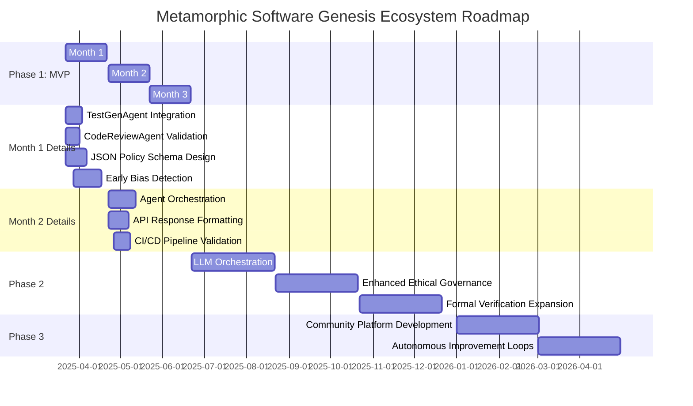

# Metamorphic Software Genesis Ecosystem 🚀

[](https://github.com/tomwolfe/metamorphic-core/actions/workflows/ci.yml)
[](LICENSE)
[](https://github.com/tomwolfe/metamorphic-core/milestones?direction=asc&sort=due_date&state=open)

**Version ∞: An ever-evolving framework for software excellence (MVP - Phase 1 under development)** ✨

**Phase 1 MVP Roadmap**: Drive autonomous code analysis, ethical validation, and security scanning capabilities with AI. **Not for production use**—focus remains on core MVP milestones.

**Driven by AI and guided by a comprehensive high-level specification and roadmap, the Metamorphic Software Genesis Ecosystem is redefining software development through self-evolving, ethical, and secure solutions.**

---

**⚠️ Roadblock Alert:**  Progress on the **Ethical Policy Engine (JSON Configurable)** is currently behind schedule (Status: Not Implemented, Dev %: 30%).  This is a critical component for the MVP. We are actively focusing on resolving this to ensure MVP delivery.  See "Phase 1 MVP - Internal Metrics Tracking" for details.

---

**Key Features**

- 🔍 **AI-Driven Analysis**: Static code analysis with Flake8/Bandit
- 🖥️ **Ethical Validation**: Policy-configurable ethical checks, quantum-inspired risk analysis
- 🔒 **Security Scans**: OWASP ZAP, Bandit integrations
- ♻️ **Self-Enhancement**: Recommends improvements via analysis-of-analysis feedback loop

---

**Table of Contents**
* [Vision](#vision)
* [Key Objectives](#key-objectives)
* [Envisioned Workflow: From Concept to Code](#envisioned-workflow-from-concept-to-code)
* [Current Status](#current-status)
* [Key Highlights of Current Capabilities](#key-highlights-of-current-capabilities)
* [Roadmap Update - Phase 1 MVP](#roadmap-update---phase-1-mvp)
    * [Phase 1 MVP Definition](#phase-1-mvp-definition)
    * [Phase 1 Deliverables](#phase-1-deliverables)
    * [Phase 1 Actionable Steps (Version 1.3 - Revised 3 - *Final Revision*)](#phase-1-actionable-steps-version-13---revised-3---final-revision)
        * [Month 1: Refine Agents & Ethical Engine Foundation](#month-1-refine-agents--ethical-engine-foundation)
        * [Month 2: Integrate Agents & API Endpoint](#month-2-integrate-agents--api-endpoint)
        * [Month 3: MVP Refinement & Documentation](#month-3-mvp-refinement--documentation)
    * [Phase 1 MVP - Internal Metrics Tracking](#phase-1-mvp---internal-metrics-tracking)
    * [Gantt Chart: Phase 1 MVP Roadmap](#gantt-chart-phase-1-mvp-roadmap)
* [Getting Started](#getting-started)
    * [Prerequisites](#prerequisites)
    * [Installation](#installation)
    * [Running the API Server](#running-the-api-server)
    * [Quickstart Guide](#quickstart-guide)
    * [System Requirements](#system-requirements)
* [API Endpoints](#api-endpoints)
    * [Sample MVP Request/Response - `/genesis/analyze-ethical`](#sample-mvp-requestresponse---genesisanalyze-ethical)
    * [Core API Endpoints](#core-api-endpoints)
* [Contributing](#contributing)
* [License](#license)
* [License and Compliance](#license-and-compliance)
* [Contact](#contact)
* [Disclaimer](#disclaimer)
* [Troubleshooting](#troubleshooting)
* [Terminology Footnotes](#terminology-footnotes)

---

## Vision <a name="vision"></a>

To create a self-refining, AI-driven framework capable of independently generating, maintaining, and evolving high-quality software solutions, operating as a perpetual engine of innovation and improvement.

## Key Objectives <a name="key-objectives"></a>

- **Autonomous Software Development**: Enable independent creation of complete software applications from high-level specifications
- **Ethical Assurance**: Integrate robust ethical governance to ensure compliance with defined principles
- **Continuous Quality**: Automate testing, code review, and security analysis
- **Self-Enhancement**: Enable the ecosystem to learn, adapt, and improve through feedback

## Envisioned Workflow: From Concept to Code <a name="envisioned-workflow-from-concept-to-code"></a>

1. **User Input**: Provide a high-level description of the desired software in natural language or via a future cloud interface
2. **Specification Refinement**: AI agents enhance input, clarifying ambiguities and identifying potential issues
3. **Design & Planning**: Generate a comprehensive software architecture
4. **Code Generation**: Produce code across multiple languages, adhering to best practices
5. **Testing & Validation**: Conduct thorough testing, including:
   - Unit, integration, and end-to-end tests
   - Code quality analysis with Flake8
   - Ethical assessment using rule-based engine and quantum-inspired analysis<a href="#footnote-quantum-inspired"><sup>1</sup></a>
   - Security scans with OWASP ZAP and Bandit
6. **Continuous Integration**: Integrate seamlessly into CI/CD pipelines using GitHub Actions
7. **Self-Improvement**: Evolve capabilities through learning and adaptation

## Current Status <a name="current-status"></a>

The ecosystem is actively under development and demonstrating core functionalities as an **advanced AI-powered code analysis, ethical validation, and security scanning framework.** While full autonomous software generation is still under development, the current status showcases significant progress in key areas:

**Current Phase 1 Capabilities**

### Key Milestones Achieved:
- Operational `/genesis/analyze-ethical` API endpoint with:
  – Basic code quality assessment (API v1.1)
  – Gamma-level ethical analysis backbone
  – Placeholder test-generation proof-of-concept

### Technical Foundations Live:
- **LLM Orchestration Layer** (Gemini/Hugging Face)
- **Security Scanning Integration** (OWASP ZAP 2.12+)
- **Knowledge Graph** (Central repository of >500 ethical code patterns)

- **Ethical Validation Framework**: Mechanisms for ethical assessment are in place, leveraging a rule-based engine and quantum-inspired state analysis for ethical insights.  Policy configuration via JSON is under development.
- **Code Analysis Agents**: Code review capabilities are implemented using static analysis tools like Flake8 and Bandit, providing detailed code quality and security vulnerability assessments. Basic pytest placeholder test generation is implemented but not yet fully integrated into the API workflow.
- **Managing Long AI Contexts**: Initial mechanisms for managing long AI contexts through smart LLM selection, context chunking, and summarization are implemented.
- **LLM Orchestration Layer**: Robust infrastructure for managing interactions with multiple LLMs, currently supporting Google Gemini and Hugging Face models. The system intelligently routes tasks, manages context, and optimizes costs. Phase 1.4 development is ongoing, with focus on enhanced context management and ethical policy engine integration.
- **Knowledge Graph**: A dynamic knowledge graph is operational, serving as a central repository for ethical principles, code analysis findings, security vulnerabilities, and system knowledge, enabling informed decision-making and continuous learning.
- **CI/CD Integration**: Automated CI workflows using GitHub Actions are established, ensuring code quality, running tests (including generated tests), performing security scans, and building Docker images upon code changes.
- **Security Scanning**: Integration with OWASP ZAP for dynamic application security testing (DAST) is functional, enabling baseline scans to detect web application vulnerabilities, particularly for APIs. The system actively scans API endpoints and reports high-risk issues. Baseline security scanning with Bandit is also integrated.
- **Formal Verification**: Initial integration of formal verification using Coq is in place, with compiled proofs included in the CI pipeline, starting with core modules like boundary detection.

## Key Highlights of Current Capabilities <a name="key-highlights-of-current-capabilities"></a>

- **Advanced Code Analysis**: Static analysis with Flake8 and Bandit, providing detailed code quality and security insights accessible via API. We aim to align with the latest stable versions of Flake8 and Bandit rules for up-to-date analysis.
- **OWASP ZAP Integration**: Automated security scanning for web applications and APIs, with vulnerability reporting and scan history caching.
- **Ethical Code Assessment**: Rule-based ethical assessment engine with quantum-inspired analysis<a href="#footnote-quantum-inspired"><sup>1</sup></a> providing ethical insights on code. Policy configuration via JSON is under development.
- **LLM Powered Features**:  Leveraging Gemini and Hugging Face models for code analysis, test generation (placeholder tests), and problem-solving.
- **CI/CD Pipeline**: Automated testing, security scanning, and build processes via GitHub Actions, including Coq proof compilation.
- **Knowledge Graph Backbone**: Centralized storage and retrieval of system knowledge, analysis data, and ethical guidelines.

**Note**: While the system is not yet capable of fully autonomous software generation, it currently functions as an advanced AI-powered code analysis and ethical assessment framework with basic security scanning capabilities.

## Roadmap Update - Phase 1 MVP <a name="roadmap-update---phase-1-mvp"></a> 🚧

**Roadmap for Completion (Optimized for Existing Codebase - Iterative MVP Approach)**

#### Phase 1 MVP Definition <a name="phase-1-mvp-definition"></a>

A functional API endpoint (`/genesis/analyze-ethical`) capable of:

1.  **Analyzing Python Code for Ethical Concerns:** Using a configurable policy engine (enforcing BiasRisk, TransparencyScore, and Safety Boundary constraints, configurable via JSON).
2.  **Providing Basic Code Quality Assessment:**  Leveraging `CodeReviewAgent` (Flake8 output reporting via API).
3.  **Generating Placeholder Tests:** Utilizing `TestGenAgent` to create basic pytest placeholder tests for Python code.
4.  **API Access:**  Providing a functional `/genesis/analyze-ethical` API endpoint that integrates ethical analysis and code quality checks.

#### Phase 1 Deliverables <a name="phase-1-deliverables"></a>

1. Functional API endpoint (`/genesis/analyze-ethical`) for ethical code analysis.
2. Basic Ethical Policy Engine enforcing BiasRisk, TransparencyScore, and Safety Boundary constraints, with policies configurable via JSON.

#### Phase 1 Actionable Steps (Version 1.3 - Revised 3 - *Final Revision*) <a name="phase-1-actionable-steps-version-13---revised-3---final-revision"></a>

##### Month 1: Refine Agents & Ethical Engine Foundation <a name="month-1-refine-agents--ethical-engine-foundation"></a>
* **Month 1: Refine Agents & Ethical Engine Foundation**
    1.  **Refine TestGenAgent:** Integrate into API endpoint workflow, add unit tests.
    2.  **Refine CodeReviewAgent:** Verify API integration, update unit tests.
    3.  **Design JSON Schema:** Create `ethical_policy_schema.json` file.
    4.  **Implement Ethical Policy Engine:** JSON configuration loading, basic enforcement, unit tests.
    5.  **GDPR/COPPA Placeholder API:** Verify API routes, document interfaces.
    6.  **Bias Detection Module:** Integrate starter library, basic text analysis.

##### Month 2: Integrate Agents & API Endpoint <a name="month-2-integrate-agents--api-endpoint"></a>
* **Month 2: Integrate Agents & API Endpoint**
    1.  **Integrate Specification Analysis Agent:** API endpoint integration, JSON output, basic ethical engine use.
    2.  **Refine API Endpoint (`/genesis/analyze-ethical`):**
        *   **2a. Orchestrate Agents:** Integrate `CodeReviewAgent`, `EthicalPolicyEngine`, `SpecificationAnalyzer`, `BiasDetectionMitigationModule`.
        *   **2b. Format JSON Response:** Structure output from agents and engine into MVP-defined JSON format.
        *   **2c. Integration Tests:** Write integration tests for the complete `/genesis/analyze-ethical` endpoint flow.
    3.  **(Step Removed - Redundant)**
    4.  **CI/CD Integration:** Extend CI pipeline for MVP endpoint integration tests.

##### Month 3: MVP Refinement & Documentation <a name="month-3-mvp-refinement--documentation"></a>
* **Month 3: MVP Refinement & Documentation**
    1.  **Polish MVP API Endpoint:** Refine error handling, response formatting, performance.
    2.  **Document MVP API Endpoint:** Update `README.md` with usage instructions, examples.
    3.  **Initial MVP Release:** Prepare minimal MVP release, update `INSTALL.md`/`README.md`.
    4.  **Gather MVP Feedback:** Collect feedback from internal/alpha testers.

#### Phase 1 MVP - Internal Metrics Tracking <a name="phase-1-mvp---internal-metrics-tracking"></a>

**Contribution Sprint Queue (Phase 1 MVP - Top 3 Tasks):**

1. **Ethical Policy Engine - JSON Configuration Loading & Enforcement:** Implement the ability to load ethical policies from JSON files and enforce these policies within the `EthicalPolicyEngine`.  This is crucial for configurable ethical assessments. (See: "Month 1, Step 4: Implement Ethical Policy Engine").
2. **`/genesis/analyze-ethical` API Endpoint - Agent Orchestration & JSON Response:** Refine the API endpoint to orchestrate all relevant agents (`CodeReviewAgent`, `EthicalPolicyEngine`, `TestGenAgent`, `BiasDetectionMitigationModule`) and structure their outputs into a well-defined JSON response format. (See: "Month 2, Step 2b: Format JSON Response").
3. **Integration Tests for `/genesis/analyze-ethical` Endpoint:** Write comprehensive integration tests for the `/genesis/analyze-ethical` API endpoint to ensure the entire workflow, including agent orchestration and ethical policy enforcement, functions correctly. (See: "Month 2, Step 2c: Integration Tests").


<details>
<summary>Click to expand Phase 1 MVP Internal Metrics Tracking Table</summary>

| Roadmap Item                                  | Effort Completed (Dev %) | Functionality Validated (MVP %) | Status (Roadmap)      | Next Steps                                                                                                                              |
| :-------------------------------------------- | :-----------------------: | :-----------------------------: | :-------------------- | :-------------------------------------------------------------------------------------------------------------------------------------- |
| MVP Deliverable 1: API Endpoint              |            90%            |               85%               | Implemented           | 1. Write integration tests 2. Polish error handling                                                                                   |
| MVP Deliverable 2: Configurable Policy Engine |            30%            |               5%                | **Not Implemented**   | 1. Design `ethical_policy_schema.json` 2. Implement JSON loading in `EthicalPolicyEngine` 3. Implement `/ethical/policy/load` endpoint 4. Implement `/ethical/policy/view` endpoint |
| TestGenAgent Refinement                       |            80%            |               50%               | Partially Implemented | 1. Integrate into API workflow 2. Activate in endpoint 3. Write integration tests                                                                    |
| CodeReviewAgent Refinement                      |            95%            |               90%               | Implemented           | 1. Write integration tests (if needed) 2. Minor polish                                                                                       |
| JSON Schema Design                             |             0%            |                0%               | Not Implemented       | 1. Design and create `ethical_policy_schema.json` file                                                                                     |
| Ethical Policy Engine (JSON Configurable)      |            30%            |                5%               | Not Implemented       | 1. Implement JSON loading 2. Implement `/ethical/policy/load` endpoint 3. Implement `/ethical/policy/view` endpoint 4. Integrate into workflow 5. Write tests 6. MVP constraints |
| GDPR/COPPA Placeholder API                     |            70%            |               60%               | Partially Implemented | 1. Document API endpoints in README/Swagger                                                                                            |
| Bias Detection Module Integration             |            20%            |               10%               | Not Implemented       | 1. Integrate starter bias detection library 2. Basic text analysis 3. Placeholder integration in workflow                                 |
| **API Endpoint Integration Task**              |            60%            |               50%               | Partially Implemented | 1. Refine agent orchestration 2. Implement JSON response formatting 3. Write integration tests                                                            |

</details>

#### Gantt Chart: Phase 1 MVP Roadmap <a name="gantt-chart-phase-1-mvp-roadmap"></a>


## Getting Started <a name="getting-started"></a>

### System Requirements <a name="system-requirements"></a>
- **Python**: 3.11+
- **Docker**: Optional (Redis caching/OWASP ZAP)
- **API Keys**:
  - Gemini API Key (Required)
  - Hugging Face API Key (Optional)

### Prerequisites <a name="prerequisites"></a>

- Python 3.11+
- Docker and Docker Compose (optional, for Redis caching and advanced OWASP ZAP features)
- Google Gemini API Key (Required for Gemini LLM Provider)
- Hugging Face API Key (Optional, for Hugging Face LLM Provider)
- GitHub API Key (Optional, for future GitHub integrations)
- OWASP ZAP API Key (Optional, for advanced OWASP ZAP security scan configurations)

### Installation <a name="installation"></a>

1. **Clone the Repository**:

```bash
git clone https://github.com/tomwolfe/metamorphic-core.git
cd metamorphic-core
```

2. **Set Up Environment Variables**:

```bash
cp .env.example .env
```

Modify `.env` with your API keys and desired configurations.  Ensure you set at least `GEMINI_API_KEY` if using the default Gemini LLM provider.

```env
LLM_PROVIDER=gemini # or huggingface
GEMINI_API_KEY=your_key_here
# HUGGING_FACE_API_KEY=your_hf_api_key # Required if LLM_PROVIDER=huggingface
# YOUR_GITHUB_API_KEY=your_github_token # Optional
# ZAP_API_KEY=your_zap_api_key # Optional
# DOCKERHUB_USERNAME=your_dockerhub_username # Optional

# System configuration (adjust as needed)
SAFETY_MARGIN=5
QUANTUM_DEPTH=3
ETHICAL_THRESHOLD=90
PYTHONPATH=./src
```

3. **Start Redis and ZAP (Optional, using Docker Compose):**

If you want to use Redis for caching or utilize advanced features of OWASP ZAP security scans locally, you can start these services using Docker Compose:

```bash
docker-compose -f docker-compose.yml.example up -d redis zap
```

4. **Set Up Virtual Environment:**

```bash
python -m venv venv
source venv/bin/activate  # Linux/macOS
venv\Scripts\activate     # Windows
```

5. **Install Dependencies:**

```bash
pip install --upgrade pip
pip install -r requirements/base.txt
pip install -r requirements/dev.txt # Optional: for development dependencies (testing, linting)
```

### Running the API Server <a name="running-the-api-server"></a>

```bash
cd src/api
python server.py
```

The API server will be available at http://0.0.0.0:50000/.

### Quickstart Guide <a name="quickstart-guide"></a>

#### 1. Clone Repository
```bash
git clone https://github.com/tomwolfe/metamorphic-core.git
cd metamorphic-core
```

#### 2. Configure Environment
```bash
cp .env.example .env
```
Adjust critical parameters like:
```env
GEMINI_API_KEY=your-production-key
ETHICAL_THRESHOLD=90  # Higher = stricter policies
```

#### 3. Setup Virtual Environment
```bash
python -m venv venv
source venv/bin/activate  # Linux/macOS
venv\Scripts\activate     # Windows
```

#### 4. Install Dependencies
```bash
pip install -r requirements/base.txt
```

#### 5. Run Server
```bash
cd src/api
python server.py
```

Visit `http://0.0.0.0:50000/` for live API status.

## API Endpoints <a name="api-endpoints"></a>

For detailed API documentation, see: [docs/api/api-endpoints.md](docs/api/api-endpoints.md) (Under development)

| Endpoint                      | Method | Description                                                                     |
|-------------------------------|--------|---------------------------------------------------------------------------------|
| `/genesis/health`             | GET    | Check API server status. Returns `{"status": "ready"}` if the server is running. |
| `/genesis/analyze-ethical`    | POST   | Analyzes Python code for ethical and code quality issues. **MVP Core Endpoint.**    |
| `/genesis/solve-math`        | POST   | Test endpoint for mathematical problem-solving (basic test).                     |
| `/genesis/ethical/audit/{state_id}`   | GET    | Retrieve audit trail data for a given `state_id` (not yet fully implemented).     |
| `/genesis/ethical/visualize/{state_id}` | GET    | Obtain visualization data for a given `state_id` (not yet fully implemented).   |

**Note:**  The API functionality is currently focused on the `/genesis/analyze-ethical` endpoint as part of the Phase 1 MVP.  Other endpoints are for testing or represent future functionality.

#### Sample MVP Request/Response - `/genesis/analyze-ethical` <a name="sample-mvp-requestresponse---genesisanalyze-ethical"></a>

**Request:**

```bash
curl --request POST \
  --url http://0.0.0.0:50000/genesis/analyze-ethical \
  --header 'Content-Type: application/json' \
  --data '{"code":"def hello_world():\n  print(\"Hello, world!\")"}'
```

**Response (Example):**
```json
{
  "status": "completed",
  "code_quality": "No Flake8 issues found.",
  "analysis": "Ethical analysis completed. No policy violations detected.",
  "test_generation": "Basic pytest placeholder tests generated."
}
```

#### Core API Endpoints <a name="core-api-endpoints"></a>
<details>
<summary>Phase 1 MVP API Overview</summary>

| Endpoint                          | Method | Status             | Description |
|-----------------------------------|--------|--------------------|-------------|
| **/genesis/health**               | GET    | Working            | Basic liveness check (healthcheck response) |
| **/genesis/analyze-ethical**      | POST   | Alpha              | Full code analysis including: <br> • Grammar/Quality (Flake8) <br> • Basic ethics assessment (Beta) <br> • Test placeholder generation (v1.1) |
| /genesis/solve-math               | POST   | MVP Baseline       | LLM-powered mathematical problem solving demo |
| /genesis/ethical/audit/{state_id} | GET    | To Be Implemented  | Future ethics audit history access |
| /genesis/ethical/visualize/*      | ALL    | Coming Soon        | Maturity visualizations (API v1.3+) |

*Example Request:*
```bash
curl -X POST \
  http://0.0.0.0:50000/genesis/analyze-ethical \
  -H "Content-Type: application/json" \
  -d '{"code": "def gcd(a,b): return a if b==0 else gcd(b,a%b)"}'
```
</details>

## Contributing <a name="contributing"></a>
- **Start Contributing:** Begin with issues labeled **"Good First Issue"** in our repo. **A recommended first contribution is extracting documentation from code comments to enhance Phase 1 APIs.**
- Verify implementation against the Phase 1 MVP Roadmap Actionable Steps.

**Want visibility**? Our contributor acknowledgment badge initiative will be launched in Phase 2.

## License <a name="license"></a>

This project is licensed under the GNU Affero General Public License v3.0 (AGPLv3). See `LICENSE` for details.

## License and Compliance <a name="license-and-compliance"></a>
**Developed under AGPLv3**: See `LICENSE`.

This project adheres to **OECD AI Principles** and leverages policy schemas compliant with GPDR/Brexit specifications.

## Contact <a name="contact"></a>

For inquiries, contact: tomwolfe@gitproject.devices

## Disclaimer <a name="disclaimer"></a>

**This project is in early MVP development and not intended for production use.** Functionality is limited to the features outlined in the Phase 1 Roadmap and is subject to change. API endpoints and responses are under active development and may evolve.  **We are actively working towards the Phase 1 MVP outlined in the Roadmap below.**

---


## Troubleshooting <a name="troubleshooting"></a>

**Common Issues & Solutions:**

* **LLM API Key Errors:** If you encounter errors related to LLM providers (Gemini, Hugging Face), ensure you have correctly set the API keys in your `.env` file and that the `LLM_PROVIDER` environment variable is set appropriately. Double-check for typos and ensure the keys are valid.
* **Docker Compose Issues (Redis/ZAP):** If you have problems starting Redis or ZAP with Docker Compose, ensure Docker is running correctly and that there are no port conflicts. Check the Docker logs for specific error messages using `docker-compose logs <service_name>`.
* **Python Dependency Errors:** If you encounter dependency-related errors during installation, ensure you are using Python 3.11+ and have activated the virtual environment correctly. Try upgrading `pip` and re-installing the requirements.

## Terminology Footnotes <a name="terminology-footnotes"></a>

**Quantum-inspired analysis**: <a name="footnote-quantum-inspired"></a><sup>1</sup> Leverages principles inspired by quantum computing to explore multiple ethical risk pathways and potential states within the ethical assessment engine.  In practice, this means the engine analyzes the code from various perspectives to determine potential ethical risk factors and outputs a state representing the overall ethical risk assessment.

---
