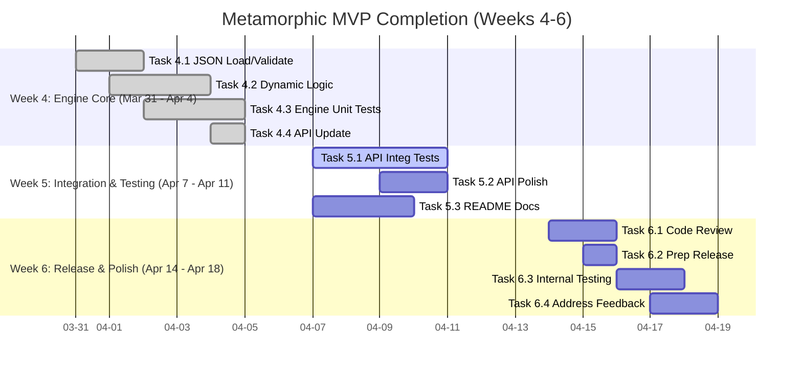

# Metamorphic Software Genesis Ecosystem 🚀

[](https://github.com/tomwolfe/metamorphic-core/actions/workflows/ci.yml)
[](LICENSE)
[](https://github.com/tomwolfe/metamorphic-core/milestones?direction=asc&sort=due_date&state=open)

**Version ∞: An Ever-Evolving Framework for Software Excellence** ✨

---

**🎯 CURRENT FOCUS:**

*   **Goal:** Complete Phase 1 MVP ASAP (Target: End of Week 6 - Mid-April 2025).
*   **Status:** Week 4 (Configurable Ethical Engine Core) **COMPLETE ✅**.
*   **Current Focus:** **Week 5 - API Integration & Testing**. Ensuring the dynamic ethical engine works correctly through the API endpoint and polishing the API behavior.
*   **See:** [Phase 1 MVP - Optimized Roadmap (Weeks 4-6)](#phase-1-mvp---optimized-roadmap-weeks-4-6) for immediate tasks (Week 5 & 6).

---

**Driven by AI and guided by a comprehensive high-level specification and roadmap, the Metamorphic Software Genesis Ecosystem is redefining software development through self-evolving, ethical, and secure solutions.**

**Table of Contents**
* [Vision](#vision)
* [Key Objectives](#key-objectives)
* [Envisioned Workflow: From Concept to Code](#envisioned-workflow-from-concept-to-code)
* [Current Status (MVP Progress)](#current-status-mvp-progress)
* [Key Highlights of Current Capabilities](#key-highlights-of-current-capabilities)
* [Roadmap: Phase 1 MVP (Optimized for ASAP Completion)](#roadmap-phase-1-mvp-optimized-for-asap-completion)
    * [Phase 1 MVP Definition](#phase-1-mvp-definition)
    * [Phase 1 Deliverables](#phase-1-deliverables)
    * [Phase 1 MVP - Optimized Roadmap (Weeks 4-6)](#phase-1-mvp---optimized-roadmap-weeks-4-6)
        * [Strategy Notes (MVP Focus)](#strategy-notes-mvp-focus)
        * [Week 4: Configurable Ethical Engine Core - *Dynamic Policy Enforcement*](#week-4-configurable-ethical-engine-core---dynamic-policy-enforcement)
        * [Week 5: API Integration & Testing - *Verify Dynamic Behavior*](#week-5-api-integration--testing---verify-dynamic-behavior)
        * [Week 6: MVP Polish & Internal Release - *Deliver & Iterate*](#week-6-mvp-polish--internal-release---deliver--iterate)
    * [Gantt Chart: Phase 1 MVP (Weeks 4-6)](#gantt-chart-phase-1-mvp-weeks-4-6)
    * [Beyond MVP (Future Iterations)](#beyond-mvp-future-iterations)
* [Competitive Landscape](#competitive-landscape)
* [Getting Started](#getting-started)
    * [Prerequisites](#prerequisites)
    * [Installation](#installation)
    * [Running the API Server](#running_the_api_server)
    * [Quickstart Guide](#quickstart_guide)
    * [System Requirements](#system-requirements)
* [API Endpoints](#api-endpoints)
    * [Sample MVP Request/Response - `/genesis/analyze-ethical`](#sample-mvp-requestresponse---genesisanalyze-ethical)
    * [Core API Endpoints](#core-api-endpoints)
* [Contributing](#contributing)
* [Full High-Level Specification (Detailed Vision)](#full-high-level-specification-detailed-vision)
* [License](#license)
* [License and Compliance](#license-and-compliance)
* [Contact](#contact)
* [Disclaimer](#disclaimer)
* [Troubleshooting](#troubleshooting)
* [Terminology Footnotes](#terminology-footnotes)

---

## Vision <a name="vision"></a>

To create an AI-driven framework that autonomously generates, maintains, and evolves **secure, ethical, and high-performance** software solutions **from high-level specifications**, continuously improving its own capabilities through feedback and self-refinement.

## Key Objectives <a name="key-objectives"></a>

-   **Autonomous Generation:** Generate functional software applications directly from natural language or structured specifications.
-   **Ethical Governance:** Integrate and enforce **configurable** ethical policies throughout the development lifecycle.
-   **Automated Quality & Security:** Implement continuous, automated testing (unit, integration, E2E), code review (style, logic, security vulnerabilities), and **formal verification**.
-   **Self-Improvement:** Enable the framework to learn from analysis results, user feedback, and performance metrics to enhance its generation, analysis, and ethical enforcement capabilities.

## Envisioned Workflow: From Concept to Code <a name="envisioned-workflow-from-concept-to-code"></a>

1.  **Input**: High-level software description (natural language, structured formats).
2.  **Refinement**: AI clarifies requirements, identifies ambiguities (`SpecificationAnalysisAgent`).
3.  **Design**: AI generates software architecture, potentially stored in KG.
4.  **Generation**: `CodeGenerationAgent` produces code (Python, Go, Rust, JS/TS planned) using LLMs managed by `LLMOrchestrator`.
5.  **Validation (Iterative Loop)**:
    *   **Code Quality & Static Analysis:** `CodeReviewAgent` (Flake8 now, Bandit/Semgrep later) analyzes code.
    *   **Ethical Assessment:** `EthicalGovernanceEngine` loads JSON policy, checks code against constraints (Bias, Transparency, Safety).
    *   **Security Scans:** `SecurityAgent` orchestrates ZAP DAST scans against running instances/APIs.
    *   **Testing:** `TestGenerationAgent` creates tests (placeholders in MVP); tests are executed in CI.
    *   **Formal Verification:** `FormalVerificationEngine` applies Coq/Isabelle proofs to critical components (limited in MVP).
    *   **Feedback:** Results feed back into KG and `ContinuousLearningCore` to refine future generation/analysis.
6.  **Integration**: Validated code integrated via Git workflow; CI/CD pipeline (GitHub Actions) runs checks, builds artifacts.
7.  **Improvement**: `ContinuousLearningCore` analyzes overall performance, ethical adherence, and feedback to adapt agents and processes. `SelfMonitoringAndAdaptiveHealing` detects and attempts recovery from runtime issues.

## Current Status (MVP Progress) <a name="current-status-mvp-progress"></a>

The ecosystem is actively under development, demonstrating core functionalities as an **AI-powered code analysis, ethical validation, and security scanning framework.**

**Phase 1 MVP Capabilities - Week 4 of Month 1 COMPLETE** ✅

The core logic for the **JSON-configurable `EthicalGovernanceEngine` is implemented and unit-tested**. The immediate focus shifts to integrating this dynamic engine fully into the API endpoint and writing comprehensive integration tests (Week 5).

<details>
<summary>Click to expand Completed MVP Task Details (Weeks 1-4)</summary>

#### Key Milestones Achieved (Week 1 Month 1):
- **[✅] Operational `/genesis/analyze-ethical` API endpoint:** Functional API endpoint live.
    * **[✅] Basic code quality assessment (API v1.1):** Flake8 integration complete.
    * **[✅] Initial rule-based ethical analysis backbone:** Fundamental rule-based ethical analysis integrated (basic rules in code).
    * **[✅] Placeholder test-generation proof-of-concept:** `TestGenAgent` wired, generating placeholder pytest code.
    * **[✅] Basic JSON response structure:** Defined API response structure implemented.
    * **[✅] Daily Integration Testing:** Automated integration tests established.

#### Key Milestones Achieved (Week 2 Month 1):
- **[✅] `CodeReviewAgent` MVP - Flake8 Integration:** `CodeReviewAgent` fully integrated with Flake8.
    * **[✅] Flake8 execution via `subprocess`:** Implemented Flake8 execution.
    * **[✅] Basic Flake8 output parsing:** Implemented basic parsing for structured reporting.
    * **[✅] Unit tests for `CodeReviewAgent` (Flake8 MVP):** Developed focused unit tests.
    * **[✅] API Endpoint Integration (`/genesis/analyze-ethical`):** Integrated `CodeReviewAgent` into the API endpoint.
    * **[✅] Expanded Daily Integration Testing:** Expanded tests to validate `code_quality` response section.

#### Key Milestones Achieved (Week 3 Month 1):
- **[✅] `EthicalPolicyEngine` MVP Foundation - JSON Policy Loading & Basic Enforcement:** Foundational work for the configurable ethical engine completed.
    * **[✅] Task 3.1: JSON Schema & Example Ethical Policies Definition:** Defined `ethical_policy_schema.json` and created example policy files (`policies/`).
    * **[✅] Task 3.2: `EthicalPolicyEngine` - Basic Loading & Enforcement Implementation:** Implemented basic `EthicalGovernanceEngine` class with `load_policy_from_json` and initial `enforce_policy` method (using simple rule-based checks).
    * **[✅] Task 3.3: `EthicalPolicyEngine` - Unit Testing (Loading & Basic Enforcement):** Wrote unit tests verifying JSON loading and basic enforcement logic.
    * **[✅] Task 3.4: API Integration - `EthicalPolicyEngine` into Endpoint:** Integrated the basic engine into `/genesis/analyze-ethical`, loading a default policy and adding `ethical_analysis` section to the response.
    * **[✅] (Daily Integration Testing - *Expand*):** Expanded integration tests to verify the presence and basic structure of the `ethical_analysis` section in the API response.

#### Key Milestones Achieved (Week 4 Month 1):
- **[✅] Configurable Ethical Engine Core - *Dynamic Policy Enforcement Complete***
    * **[✅] Task 4.1 (P1 - Engine): Implement Robust JSON Policy Loading & Validation:** Enhanced `EthicalGovernanceEngine.load_policy_from_json` with `jsonschema` validation and error handling.
    * **[✅] Task 4.2 (P1 - Engine): Implement Dynamic Enforcement Logic:** Refactored `EthicalGovernanceEngine.enforce_policy` to **dynamically** use thresholds/keywords/etc., from the loaded `policy_config`. Removed hardcoded rules.
    * **[✅] Task 4.3 (P2 - Testing): Write Comprehensive Engine Unit Tests:** Developed thorough unit tests for loading and dynamic enforcement. *(Self-Bootstrapping: Used `TestGenAgent` for test skeletons).*
    * **[✅] Task 4.4 (P2 - API): Update API Endpoint for Dynamic Policy Usage:** Modified `/genesis/analyze-ethical` to load/use policies dynamically and update the response accordingly (including overall status logic).

#### Technical Foundations Live:
- **LLM Orchestration Layer (Gemini/Hugging Face):** Operational infrastructure for managing LLM interactions.
- **Security Scanning Integration (OWASP ZAP 2.12+):** Baseline security scanning functional using OWASP ZAP.
- **Knowledge Graph:** Dynamic Knowledge Graph operational (initial phase, content expansion ongoing).
- **Ethical Validation Framework**: **JSON-configurable `EthicalGovernanceEngine` implemented**, capable of dynamic rule enforcement based on loaded policies. Quantum-inspired analysis placeholders exist.
- **Code Analysis Agents**: `CodeReviewAgent` provides Flake8 analysis. Bandit integration present but commented out for MVP. `TestGenAgent` generates placeholder pytest code.
- **Managing Long AI Contexts**: Initial mechanisms implemented (basic chunking).
- **LLM Orchestration Layer**: Robust infrastructure manages LLM interactions.
- **Knowledge Graph**: Centralized repository for system knowledge.
- **CI/CD Integration**: Automated CI workflows using GitHub Actions.
- **Security Scanning**: OWASP ZAP integration provides DAST. Bandit integration commented out for MVP.
- **Formal Verification**: Initial Coq integration with compiled proofs.

</details>

## Key Highlights of Current Capabilities <a name="key-highlights-of-current-capabilities"></a>

- **Code Analysis**: Static analysis with Flake8 via API (`CodeReviewAgent`).
- **Security Scanning**: Automated DAST via OWASP ZAP integration.
- **Ethical Assessment**: **JSON-configurable** rule-based engine (`EthicalGovernanceEngine`) capable of dynamic enforcement. Quantum-inspired analysis placeholders.
- **LLM Powered Features**: Core functionalities leverage Google Gemini and Hugging Face.
- **CI/CD Pipeline**: Fully automated via GitHub Actions (tests, security scans, builds).
- **Knowledge Graph Backbone**: Operational KG for system knowledge.

**Note**: MVP completion requires integration testing and polishing of the API endpoint using the now-configurable ethical engine (Week 5 & 6 tasks).

## Roadmap: Phase 1 MVP (Optimized for ASAP Completion) <a name="roadmap-phase-1-mvp-optimized-for-asap-completion"></a> 🚧

**Goal:** Complete the defined Phase 1 MVP (`/genesis/analyze-ethical` endpoint with a **fully JSON-configurable** Ethical Policy Engine, Flake8 code quality, and placeholder test generation) within the next 2 weeks (by mid-April 2025).

#### Phase 1 MVP Definition <a name="phase-1-mvp-definition"></a>

A functional API endpoint (`/genesis/analyze-ethical`) capable of:
1.  Analyzing Python code for ethical concerns using a **dynamically configurable JSON policy engine** (`EthicalGovernanceEngine`).
2.  Providing Flake8 code quality assessment (`CodeReviewAgent`).
3.  Generating placeholder pytest tests (`TestGenAgent`).
4.  Exposing this functionality via the API.

#### Phase 1 Deliverables <a name="phase-1-deliverables"></a>

1.  Functional `/genesis/analyze-ethical` API endpoint with **dynamically configurable ethical analysis**.
2.  **Fully JSON-Configurable** `EthicalGovernanceEngine` loading policies and dynamically enforcing constraints (BiasRisk, TransparencyScore, Safety Boundary).

#### Phase 1 MVP - Optimized Roadmap (Weeks 4-6) <a name="phase-1-mvp---optimized-roadmap-weeks-4-6"></a>

*(Weeks 1-4 Complete)*

##### Strategy Notes (MVP Focus) <a name="strategy-notes-mvp-focus"></a>
*   **Laser Focus:** Only the **JSON-configurable `EthicalGovernanceEngine`** is blocking the MVP. Defer everything else (Bandit, SpecAnalyzer, Bias Detection).
*   **Leverage Foundations:** Build on Week 1-4 work. Avoid unnecessary refactoring.
*   **Self-Bootstrapping:** Use `TestGenAgent` for engine test skeletons; use `CodeReviewAgent` for code quality.
*   **Parallelize:** Update docs concurrently (Week 5). Develop integration tests incrementally.
*   **TDD Mindset:** Write tests early (Unit Wk4, Integration Wk5).
*   **"Good Enough" MVP:** Focus on *correct* dynamic enforcement based on JSON; sophistication can come later.

##### Week 4: Configurable Ethical Engine Core - *Dynamic Policy Enforcement* <a name="week-4-configurable-ethical-engine-core---dynamic-policy-enforcement"></a> - **COMPLETE ✅**
*   **[✅] Task 4.1 (P1 - Engine): Implement Robust JSON Policy Loading & Validation:** Enhanced `EthicalGovernanceEngine.load_policy_from_json` with `jsonschema` validation and error handling.
*   **[✅] Task 4.2 (P1 - Engine): Implement Dynamic Enforcement Logic:** Refactored `EthicalGovernanceEngine.enforce_policy` to **dynamically** use thresholds/keywords/etc., from the loaded `policy_config`. Removed hardcoded rules.
*   **[✅] Task 4.3 (P2 - Testing): Write Comprehensive Engine Unit Tests:** Developed thorough unit tests for loading and dynamic enforcement. *(Self-Bootstrapping: Used `TestGenAgent` for test skeletons).*
*   **[✅] Task 4.4 (P2 - API): Update API Endpoint for Dynamic Policy Usage:** Modified `/genesis/analyze-ethical` to load/use policies dynamically and update the response accordingly (including overall status logic).

##### Week 5: API Integration & Testing - *Verify Dynamic Behavior* <a name="week-5-api-integration--testing---verify-dynamic-behavior"></a> - **CURRENT FOCUS**
*   **[ ] Task 5.1 (P1 - Testing): Write Comprehensive API Integration Tests:** Create integration tests verifying API behavior with different code snippets and *multiple dynamic policies*.
*   **[ ] Task 5.2 (P2 - API): Refine API Error Handling & Response:** Polish error handling (policy loading, engine errors) and response structure clarity.
*   **[ ] Task 5.3 (P3 - Docs - Concurrent): Update README API Documentation:** Update API examples and explanations in `README.md` to reflect dynamic policies and final response structure.

##### Week 6: MVP Polish & Internal Release - *Deliver & Iterate* <a name="week-6-mvp-polish--internal-release---deliver--iterate"></a>
*   **[ ] Task 6.1 (P1 - Quality): Final Code Review & Cleanup:** Review all MVP code. *(Self-Bootstrapping: Run `CodeReviewAgent` (Flake8) and address issues).*
*   **[ ] Task 6.2 (P1 - Release): Prepare MVP Internal Release Package:** Tag code, verify Docker build, write internal release notes.
*   **[ ] Task 6.3 (P2 - Testing): Conduct Internal MVP Testing:** Distribute MVP package internally, gather feedback.
*   **[ ] Task 6.4 (P2 - Polish): Address Critical MVP Feedback:** Fix critical bugs/usability issues found in internal testing.

#### Gantt Chart: Phase 1 MVP (Weeks 4-6) <a name="gantt-chart-phase-1-mvp-weeks-4-6"></a>
*(Week 4 starts March 31, 2025)*

*(Note: Post-MVP phases removed from this chart for clarity)*

#### Beyond MVP (Future Iterations) <a name="beyond-mvp-future-iterations"></a>

*   Iterate on MVP feedback.
*   Enhance Ethical Engine (sophistication, more constraints).
*   Activate Deferred Features (Bandit, SpecAnalyzer, Bias Detection, GDPR/COPPA).
*   Improve Test Generation (`TestGenAgent` beyond placeholders).
*   Expand Formal Verification (Coq/Z3 integration).
*   Enhance Knowledge Graph usage.
*   Begin detailed Phase 2 planning (referencing the [Full High-Level Specification](#full-high-level-specification-detailed-vision)).

## Competitive Landscape <a name="competitive-landscape"></a>

<details>
<summary>Click to expand the Competitive Landscape Analysis</summary>

Understanding the competitive terrain is crucial. While no single entity perfectly mirrors the Metamorphic Software Genesis Ecosystem's integrated vision, the landscape features numerous players addressing parts of the software development lifecycle.

### 1. AI-Augmented Code Generation

*   **a) Inline AI Code Completion/Snippet Tools:**
    *   *Examples:* GitHub Copilot, Tabnine, JetBrains AI Assistant, CodiumAI, Replit Ghostwriter.
    *   *Focus:* Developer productivity enhancement, code completion, boilerplate reduction.
    *   *Metamorphic Differentiation:* Ecosystem-centric vs. developer-centric. Metamorphic aims for full SDLC automation with integrated ethics and verification, not just inline assistance.
    *   *Intensity:* Very High. Becoming standard developer tooling.

*   **b) AI-Powered Code Synthesis/Function Generation:**
    *   *Examples:* Specific features within larger platforms (e.g., Gemini Code Assist), research projects.
    *   *Focus:* Automating generation of specific functions or translating between languages.
    *   *Metamorphic Differentiation:* Aims for autonomous generation of *complete applications* from specs, not just isolated functions.
    *   *Intensity:* High and Growing.

### 2. Low-Code/No-Code Platforms

*   **a) Visual App Builders:**
    *   *Examples:* Salesforce Platform, Microsoft PowerApps, OutSystems, Mendix, Retool.
    *   *Focus:* Empowering citizen developers and accelerating development for specific business applications, often with visual interfaces.
    *   *Metamorphic Differentiation:* Targets complex, potentially mission-critical software requiring professional development standards, deep ethical considerations, and formal verification, rather than simpler visual builds.
    *   *Intensity:* High within their target market.

*   **b) "Code-Optional" & Intelligent Automation:**
    *   *Examples:* Platforms integrating AI suggestions within low-code environments.
    *   *Focus:* Blurring the lines between low-code and AI assistance.
    *   *Metamorphic Differentiation:* Strong emphasis on verifiable ethics, security, and formal methods, often lacking in these platforms.
    *   *Intensity:* Moderate but Increasing Rapidly.

### 3. MLOps/DevOps with AI Integration

*   **a) AI-Enhanced DevOps Automation:**
    *   *Examples:* GitLab AI features, Harness IO, Datadog AI monitoring, Dynatrace.
    *   *Focus:* Optimizing CI/CD pipelines, deployment strategies, monitoring, and incident response using AI.
    *   *Metamorphic Differentiation:* Focuses on the *creation* and *validation* phases preceding deployment, integrating these deeply rather than optimizing post-creation workflows.
    *   *Intensity:* High. AI is becoming integral to DevOps.

*   **b) AI for Software Quality & Testing:**
    *   *Examples:* Testim.io, Applitools, Diffblue, Functionize.
    *   *Focus:* Automating test creation, execution, visual regression, and bug detection.
    *   *Metamorphic Differentiation:* Quality and ethics are "built-in" via generation, review, and verification, not just "tested-in" after the fact. Includes formal methods beyond traditional testing.
    *   *Intensity:* Moderate to High.

### 4. Academic & Research Initiatives

*   **a) Advanced Program Synthesis & Automated Reasoning:**
    *   *Examples:* Research groups at major universities (MIT, Stanford, CMU, Berkeley, etc.) focusing on formal methods, program synthesis from specs, and automated theorem proving.
    *   *Focus:* Theoretical foundations and cutting-edge algorithms.
    *   *Metamorphic Differentiation:* Aims to *industrialize* and *integrate* these advanced concepts into a practical, usable ecosystem, bridging the gap between research and real-world software development.
    *   *Intensity:* Not directly competitive in the market, but a vital source of innovation and potential future collaborators/competitors.

### Strategic Takeaways for Metamorphic

1.  **Emphasize the "Genesis Ecosystem":** Highlight the unique, holistic, end-to-end integration across the entire SDLC.
2.  **Highlight Ethical & Verification Pillars:** These are strong, defensible differentiators against purely productivity-focused tools.
3.  **Showcase Long-Context & Complexity Handling:** Demonstrate capability beyond simple functions or apps.
4.  **Build a Strong Open-Source Community:** Leverage the AGPLv3 license and community focus as a strategic asset.
5.  **Target High-Value Domains:** Focus on industries where quality, security, ethics, and verifiability are paramount (e.g., finance, healthcare, critical infrastructure).

</details>

## Getting Started <a name="getting-started"></a>

### System Requirements <a name="system-requirements"></a>
- **Python**: 3.11+ is required for optimal performance and compatibility.
- **Docker**: Optional, but recommended for running Redis caching and OWASP ZAP security scanning services.
- **API Keys**:
  - **Gemini API Key (Required):** Essential for utilizing the default Gemini Language Model provider.
  - **Hugging Face API Key (Optional):** Required if you intend to use the Hugging Face Language Model provider.

### Prerequisites <a name="prerequisites"></a>

- **Python 3.11+**: Ensure you have Python 3.11 or a later version installed on your system.
- **Docker and Docker Compose (Optional):** Docker is recommended for easily setting up Redis and OWASP ZAP. Install Docker and Docker Compose if you plan to use these services.
- **Google Gemini API Key (Required for Gemini LLM Provider):** Obtain an API key from Google AI Studio ([https://ai.google.dev/](https://ai.google.dev/)) to use the Gemini LLM provider.
- **Hugging Face API Key (Optional, for Hugging Face LLM Provider):** If you wish to use Hugging Face models, obtain an API key from Hugging Face ([https://huggingface.co/](https://huggingface.co/)).
- **GitHub API Key (Optional, for future GitHub integrations):** Required for future integrations with GitHub, such as repository analysis and code generation workflows.
- **OWASP ZAP API Key (Optional, for advanced OWASP ZAP security scan configurations):** Needed for advanced configurations and programmatic control of OWASP ZAP security scans.

### Installation <a name="installation"></a>

1.  **Clone the Repository**:

    ```bash
    git clone https://github.com/tomwolfe/metamorphic-core.git
    cd metamorphic-core
    ```

2.  **Set Up Environment Variables**:

    ```bash
    cp .env.example .env
    ```

    Modify the `.env` file with your API keys and desired configurations. At a minimum, set `GEMINI_API_KEY` if you are using the default Gemini LLM provider.

    ```env
    LLM_PROVIDER=gemini # or huggingface
    GEMINI_API_KEY=your_key_here
    # HUGGING_FACE_API_KEY=your_hf_api_key # Required if LLM_PROVIDER=huggingface
    # YOUR_GITHUB_API_KEY=your_github_token # Optional
    # ZAP_API_KEY=your_zap_api_key # Optional
    # DOCKERHUB_USERNAME=your_dockerhub_username # Optional

    # System configuration (adjust as needed)
    SAFETY_MARGIN=5
    QUANTUM_DEPTH=3
    ETHICAL_THRESHOLD=90
    PYTHONPATH=./src
    ```

3.  **Start Redis and ZAP (Optional, using Docker Compose):**

    If you intend to utilize Redis for caching or leverage advanced features of OWASP ZAP security scans locally, start these services using Docker Compose:

    ```bash
    # Ensure you have docker-compose.yml
    docker-compose up -d redis zap
    ```

4.  **Set Up Virtual Environment:**

    ```bash
    python -m venv venv
    source venv/bin/activate  # Linux/macOS
    venv\Scripts\activate     # Windows
    ```

5.  **Install Dependencies:**

    ```bash
    pip install --upgrade pip
    pip install -r requirements/base.txt
    pip install -r requirements/dev.txt # Optional: for development dependencies (testing, linting)
    ```

### Running the API Server <a name="running_the_api_server"></a>

```bash
# Ensure your .env file is configured
# Activate your virtual environment if not already active
# source venv/bin/activate

python src/api/server.py
```

The API server will be accessible at [http://127.0.0.1:5000/](http://127.0.0.1:5000/) or [http://0.0.0.0:5000/](http://0.0.0.0:5000/).

### Quickstart Guide <a name="quickstart_guide"></a>

#### 1. Clone Repository
```bash
git clone https://github.com/tomwolfe/metamorphic-core.git
cd metamorphic-core
```

#### 2. Configure Environment
```bash
cp .env.example .env
# Edit .env and add your GEMINI_API_KEY (required) and other optional keys
```

#### 3. Setup Virtual Environment
```bash
python -m venv venv
source venv/bin/activate  # Linux/macOS
# venv\Scripts\activate     # Windows
```

#### 4. Install Dependencies
```bash
pip install --upgrade pip
pip install -r requirements/base.txt
# pip install -r requirements/dev.txt # If running tests/dev tools
```

#### 5. Run Server
```bash
python src/api/server.py
```

Visit `http://127.0.0.1:5000/genesis/health` in your browser or using `curl` to check the live API status.

Send a POST request to `http://127.0.0.1:5000/genesis/analyze-ethical` with JSON `{"code": "def hello():\n print('world')"}` to test the MVP endpoint.

## API Endpoints <a name="api-endpoints"></a>

For detailed API documentation (under development), refer to: [docs/api/api-endpoints.md](docs/api/api-endpoints.md)

| Endpoint                      | Method | Description                                                                     | Status (MVP)        |
| :---------------------------- | :----- | :------------------------------------------------------------------------------ | :------------------ |
| `/genesis/health`             | GET    | Check API server status. Returns `{"status": "ready"}`.                         | ✅ Working          |
| `/genesis/analyze-ethical`    | POST   | Analyzes Python code for ethical considerations (configurable) & code quality. | 🚧 **MVP Core Endpoint** (Configurable Engine Complete; API Integration Wk 5) |
| `/genesis/solve-math`         | POST   | Test endpoint for demonstrating basic LLM math capabilities.                    | ✅ Working (Test)   |
| `/genesis/ethical/audit/{state_id}`   | GET    | Retrieve audit trail data (planned).                                            | ❌ Not Implemented |
| `/genesis/ethical/visualize/{state_id}` | GET    | Obtain visualization data (planned).                                      | ❌ Not Implemented |

**Note:** API functionality is primarily focused on the `/genesis/analyze-ethical` endpoint as part of the Phase 1 MVP. Integration testing and API polishing are the main focus for Week 5.

#### Sample MVP Request/Response - `/genesis/analyze-ethical` <a name="sample-mvp-requestresponse---genesisanalyze-ethical"></a>

**Request (Example using curl):**

```bash
curl --request POST \
  --url http://127.0.0.1:5000/genesis/analyze-ethical \
  --header 'Content-Type: application/json' \
  --data '{"code":"import os\ndef potentially_unsafe():\n  os.system(\"echo unsafe\")"}'
```

**Response (Example - *Reflecting Completed Week 4 Logic*):**
```json
{
  "status": "rejected", // Status determined dynamically by policy enforcement
  "code_quality": { // Populated by CodeReviewAgent (Flake8) - Placeholder for MVP
    "output": "Flake8 analysis placeholder - Integrate CodeReviewAgent",
    "static_analysis": []
  },
  "ethical_analysis": { // Populated by EthicalGovernanceEngine (Dynamic)
    "policy_name": "Strict Bias Risk Policy", // Name of the policy applied (default)
    "description": "Zero tolerance for biased language",
    "overall_status": "rejected", // Overall status from engine
    "BiasRisk": {
      "status": "compliant", // Dynamically determined
      "threshold": 0.1,
      "enforcement_level": 3,
      "details": "No violating keywords found."
    },
    "TransparencyScore": {
      "status": "violation", // Dynamically determined (missing docstring)
      "threshold": 0.5,
      "enforcement_level": 2,
      "details": "No top-level or function/class docstring found."
    },
    "SafetyBoundary": {
      "status": "violation", // Dynamically determined (due to os.system)
      "threshold": 0.8,
      "enforcement_level": 2,
      "details": "Found unsafe operations: ['os.system']"
    }
  },
  "generated_tests_placeholder": "import pytest\n# Placeholder tests - Integrate TestGenAgent" // Populated by TestGenAgent - Placeholder for MVP
}
```

#### Core API Endpoints <a name="core-api-endpoints"></a>
<details>
<summary>Phase 1 MVP API Overview</summary>

| Endpoint                          | Method | Status (Optimized MVP) | Description |
| :-------------------------------- | :----- | :--------------------- | :---------- |
| **/genesis/health**               | GET    | ✅ Working             | Basic liveness check endpoint. |
| **/genesis/analyze-ethical**      | POST   | 🚧 **MVP Core**        | Core MVP endpoint: <br> • Flake8 Code Quality (`CodeReviewAgent` - *Basic Integration*). <br> • **Configurable** Ethics Assessment (`EthicalGovernanceEngine` - **Logic Complete, API Integ Wk 5**). <br> • Placeholder Test Generation (`TestGenAgent` - *Basic Integration*). |
| /genesis/solve-math               | POST   | ✅ Working (Test)      | Basic LLM integration demo. |
| /genesis/ethical/audit/{state_id} | GET    | ❌ Not Implemented     | Future endpoint for ethics audit history. |
| /genesis/ethical/visualize/*      | ALL    | ❌ Not Implemented     | Future endpoint for maturity visualizations. |

*Example Request (using curl):*
```bash
curl -X POST \
  http://127.0.0.1:5000/genesis/analyze-ethical \
  -H "Content-Type: application/json" \
  -d '{"code": "def gcd(a,b): return a if b==0 else gcd(b,a%b)"}'
```
</details>

## Contributing <a name="contributing"></a>
- **Focus:** Contributions should align with the **Phase 1 MVP - Optimized Roadmap (Weeks 5-6)**, primarily focusing on API integration testing, API polishing, and documentation.
- **Good First Issues:** Look for tasks related to writing integration tests (Task 5.1) or updating documentation (Task 5.3).
- Verify implementation details against the optimized roadmap.

**Want visibility for your contributions**? Our contributor acknowledgment badge initiative will be launched in Phase 2 to recognize and highlight community contributions.

## Full High-Level Specification (Detailed Vision) <a name="full-high-level-specification-detailed-vision"></a>

<details>
<summary>Click to expand the Full High-Level Specification (Detailed Vision - Iteration 3)</summary>

**Adaptive Software Genesis Ecosystem (Version 1.0): High-Level Specification (AGPLv3 Licensed)**
**Detailed Version (Community-Driven & Passion-Project Focused)**

**Executive Summary:**

The Adaptive Software Genesis Ecosystem (ASGE) is a transformative open-source platform (AGPLv3) designed to revolutionize software development through **ethical actionability, adaptive learning, and human-AI symbiosis.** As a community-driven passion project, it aims for exceptional software quality, efficiency, and ethical responsibility by synergistically combining advanced AI with human expertise. Envisioned for creating robust software, especially for complex, long-context tasks, ASGE prioritizes verifiable reliability, resource efficiency, and transparent ethical operations, aligning with frameworks like the **EU AI Act, GDPR, and COPPA.** Long-term sustainability is fostered through vibrant community contribution, resourceful operation, and a commitment to open knowledge. This document outlines the core design, architecture, high-level post-MVP roadmap, technical specifications, and KPIs for Version 1.0. While this specification details the long-term vision, the **current development focus is on delivering the Phase 1 MVP** as outlined in the main roadmap section – establishing the foundational configurable ethical analysis capability.

**I. Foundational Design Principles:**

1.  **Human-AI Symbiosis**: Balancing AI automation with essential human oversight for strategy, nuance, and ethics.
    *   *Mechanism:* AI handles efficiency (code generation, analysis); humans provide strategic direction (specifications, feedback) and ethical judgment (ERB, overrides).
    *   *Oversight:* Ethical Review Board (ERB, 5+ members, quarterly reviews, 3-vote majority for overrides) provides expert governance. User-friendly interfaces (web UI planned) enable stakeholder interaction. Open contribution processes manage community input.

2.  **Ethical Actionability**: Embedding demonstrable and enforceable ethics into every component.
    *   *Mechanism:* Ethics integrated by design. The **`EthicalGovernanceEngine`** uses configurable JSON policies (aligned with EU AI Act, GDPR, COPPA) to enforce constraints during validation. Policies are version-controlled and community-vetted. Monthly audits by ERB ensure accountability.
    *   *Modules:* Proactive **Bias Detection & Mitigation Module** analyzes code/outputs. **Transparency & Explainability Module** (planned) will provide APIs to query LLM rationale (e.g., "Why was this code flagged?"). Clear Human Override pathways exist via the ERB interface (planned). Continuous AI self-assessment against policies generates compliance reports.

3.  **Adaptive Learning Fabric**: Intelligently designed for continuous improvement.
    *   *Mechanism:* Data-driven adaptation using performance metrics (KPIs), agent feedback (e.g., code review results), and user input.
    *   *Modules:* **Continuous Learning & Adaptation Core** uses ML techniques (e.g., reinforcement learning from agent feedback, A/B testing of generation strategies) to enhance agent performance and ethical alignment. **Self-Monitoring & Adaptive Healing Subsystem** uses health checks (API latency, resource usage) and error logs to trigger automated recovery procedures (e.g., restarting agents, rolling back configurations). **Predictive Risk Assessment Module** uses historical data and modeling (e.g., `QuantumRiskPredictor`) to forecast potential issues.

4.  **Cyber-Physical Resilience & Resource Efficiency**: Prioritizing security, robustness, and sustainability.
    *   *Mechanism:* Formal verification (**Coq** proofs compiled in CI for core logic like boundary detection; **Isabelle/HOL** planned for critical algorithms) provides mathematical guarantees. Strategic use of memory-safe **Rust** for safety-critical modules (e.g., verification components, policy engine core) and high-performance **Go** for concurrent agents (e.g., API handlers, parallel analysis tasks). Proactive error handling (e.g., retries, graceful degradation) built into agents and orchestration. Core focus on resource optimization (caching, efficient algorithms, potential serverless components).
    *   *Targets:* 25% resource reduction, 40% performance improvement (12 months post-Phase 2 completion).

5.  **Knowledge-Based Problem Solving**: Leveraging and evolving knowledge for advanced software genesis.
    *   *Mechanism:* The **Dynamic Knowledge Graph (KG)** acts as the central "memory," storing semantic representations of code, specifications, ethical rules, security findings, performance data, and community feedback. The **Intelligent LLM Orchestration Layer** queries the KG for relevant context before prompting LLMs (Gemini, Hugging Face, others planned). It manages long contexts using techniques like **semantic chunking** (`SemanticChunker`) and **recursive summarization** (`RecursiveSummarizer`). It routes tasks to appropriate LLMs based on capability/cost and handles API failover. Specialized **AI Agents** query the KG and LLM Orchestrator to perform their tasks (analysis, generation, review).

6.  **Open Innovation & Global Accessibility**: Fostering a vibrant community and broad usability.
    *   *Mechanism:* Actively manage community contributions via **GitHub** (primary repository). Adhere to open standards (OpenAPI for APIs) and prioritize FOSS tools (Python, Go, Rust, Coq, ZAP, etc.).
    *   *Future:* Develop a **Community Contribution Platform** (web UI). Implement localization (10+ languages). Support diverse open-source LLMs (Alpa, StarCoder) to reduce vendor lock-in and improve global accessibility.

**II. System Architecture & Core Workflow:**

```
+------------------------------+      +------------------------+      +---------------------------+      +---------------------------+
| Human Input/API Gateways     |----->| Ethical Governance Layer |----->| Metamorphic Core          |----->| Software Artifacts/Reports|
| (Specs, Feedback, Overrides) |      | (Policy Engine, Bias   |      | (LLM Orch, KG, Agents)    |      | (Code, Tests, Docs, KPIs) |
| (Community Contributions)    |<-----| Detection, Transparency)|<-----| (Resource Mgmt)           |<-----| (ISO/IEC 25010 Metrics)   |
+------------------------------+      +------------------------+      +---------------------------+      +---------------------------+
          ^                                      ^                             ^
          |--------------------------------------|-----------------------------|---(Feedback Loops, Monitoring, Validation)
```

*   **Core Workflow Example (Code Analysis):**
    1.  User submits code via API (`/genesis/analyze-ethical`).
    2.  API Gateway routes request.
    3.  `Metamorphic Core` receives request.
    4.  `Ethical Governance Layer` (`EthicalGovernanceEngine`) loads the relevant JSON policy.
    5.  `Metamorphic Core` invokes `CodeReviewAgent` (Flake8) and `TestGenAgent` (placeholders).
    6.  `CodeReviewAgent` analyzes code, results stored temporarily/sent back.
    7.  `EthicalGovernanceEngine` enforces loaded policy against the code and analysis results.
    8.  Results (Flake8 output, ethical status, placeholder tests) are aggregated by the `Metamorphic Core`.
    9.  Results potentially stored in KG.
    10. Formatted JSON response returned via API Gateway.
    11. (Parallel/Async) `SecurityAgent` might trigger ZAP scan if applicable.
    12. (Post-MVP) Feedback loops update KG and `ContinuousLearningCore`.

*   **Key Components (Detailed):**
    *   **Human Input & Oversight Interface:** (Planned Web UI) Secure portal for spec submission (text, later diagrams), configuration, feedback, ethical guidance input, ERB overrides, progress dashboards.
    *   **Metamorphic Core (Adaptive AI Orchestration):**
        *   *Dynamic Knowledge Graph:* Neo4j or similar graph DB storing nodes (code chunks, specs, policies, vulnerabilities, tests, metrics) and semantic relationships. Enables complex querying for context retrieval and pattern analysis.
        *   *Intelligent LLM Orchestration Layer:* Manages API calls to multiple LLMs (Gemini, HF models via `InferenceClient`, potentially OpenAI). Implements context window management (semantic chunking, summarization), cost/latency optimization (model selection based on task complexity), robust retries, and failover logic. Uses `TokenAllocator` for budget management.
        *   *Modular AI Agent Network:*
            *   `SpecificationAnalysisAgent`: Parses natural language/structured input into formal requirements, potentially using AST analysis and LLMs.
            *   `TestGenerationAgent`: Generates pytest tests (placeholders in MVP, meaningful tests using code/spec analysis later).
            *   `CodeGenerationAgent`: (Post-MVP) Generates code (Python, Go, Rust, JS/TS) based on specs from KG/LLM Orchestrator.
            *   `CodeReviewAgent`: Runs static analysis (Flake8 now; Bandit, Semgrep later). (Post-MVP) Uses LLMs for deeper semantic review.
            *   `SecurityAgent`: Orchestrates security tools (ZAP DAST now; SAST via Bandit/Semgrep later). Analyzes results, stores findings in KG.
            *   `PerformanceAnalysisAgent`: (Post-MVP) Integrates profiling tools (cProfile) and analyzes performance metrics.
            *   `FormalVerificationEngine`: Interfaces with Coq/Isabelle/Z3 to run proofs against code or specifications.
            *   `PredictiveRiskAssessmentModule`: Uses `QuantumRiskPredictor` (trained on historical KG data) to forecast ethical/security risks.
            *   `SelfMonitoringAndAdaptiveHealing`: Monitors system metrics (Prometheus), logs errors, triggers recovery actions.
            *   `ContinuousLearningCore`: Uses ML (RL, supervised learning) on KG data/feedback to update agent strategies and LLM prompts.
            *   `ResourceManagementOptimization`: (Post-MVP) Optimizes cloud resource usage, potentially using Kubernetes HPA based on Prometheus metrics.
    *   **Ethical Governance Framework:**
        *   *EthicalPolicyEngine (`EthicalGovernanceEngine`):* Loads JSON policies (`jsonschema` validation). `enforce_policy` method checks code/metadata against loaded constraints (regex, keyword checks, AST analysis, calls to Bias Detection Module). Returns compliance status.
        *   *BiasDetectionMitigationModule:* Uses NLP libraries (spaCy, Transformers) or fairness toolkits (Fairlearn) to analyze text (comments, docs) and potentially code structure for bias indicators. (Post-MVP) Implements mitigation strategies (e.g., suggesting alternative phrasing).
        *   *TransparencyExplainabilityModule:* (Planned) Provides API endpoints to retrieve justification for policy violations or agent decisions, potentially querying LLM logs or KG links.
        *   *HumanOverrideIntervention:* (Planned UI) Interface for ERB to review flagged cases and issue binding overrides recorded in the audit trail.
        *   *ContinuousEthicalSelfAssessment:* (Planned) Agent periodically runs analysis on generated artifacts/internal logs against policies, generating reports for ERB.
        *   *EthicalReviewBoardInterface:* (Planned UI) Secure portal for ERB members to view audits, manage policies (via Git PRs), vote on overrides.
    *   **Software Output & Data Repository:** Git (GitHub) for code/policies/docs. Potentially artifact repository (Nexus, Artifactory) for builds. Database/Object storage for logs, metrics, KG backups.

**III. High-Level Phased Plan (Post-Current MVP):**

*(Focuses on major milestones after the initial 3-week MVP completion)*

| **Phase**      | **Approx. Timeline** | **Key Deliverable & Milestone**                                    | **Illustrative Community Milestone**                                   | **Aligned KPI Target (Phase End)**                               |
|----------------|----------------------|-------------------------------------------------------------------|----------------------------------------------------------------------|--------------------------------------------------------------------|
| **Phase 2**    | Months 4–9           | Enhanced LLM Orchestration (Context Mgmt, Cost Opt); Advanced Agents (Code Review, Security); Basic Bias/Transparency Modules; Prometheus Monitoring Integrated (Month 6); Release First Functional Python/Go Output (Month 9)    | Grow Core Contributor Base; Hold First Community Workshop (Month 7-8) | Achieve 20% Perf. Improvement; 10% Resource Reduction (Month 9)     |
| **Phase 3**    | Months 10–15         | Advanced Bias/Transparency; Performance Agent; Predictive Risk (Initial); Self-Monitoring (Basic); Ethical Override UI Finalized (Month 12); Achieve 30% Vulnerability Reduction (Month 15) | Organize Community Contribution Drive (Month 11)                     | Demonstrate 30% Error & Vuln. Reduction from Baseline (Month 15)        |
| **Phase 4**    | Months 16+           | Community Platform (Basic); Initial Self-Improvement Loops (Test Gen, Perf Opt); Enhanced Formal Verification; Basic Accessibility Features; Advanced Monitoring UI; Community Contribution Platform Live (Month 18) | Launch Contributor Recognition Program (Month 17)                    | Reach 95% Formal Verification Coverage for Critical Components (Month 18) |

**IV. Technical Specifications & Key Performance Indicators (KPIs):**

1.  **KPI Anchoring & Measurement**:
    *   **Code Quality (Target: 97%+ ISO/IEC 25010):** *Baseline:* Measured via SonarQube analysis of the v0.1.0 MVP codebase upon release. *Tracked:* Continuously via SonarQube in CI/CD pipeline; periodic LLM-based assessment using standardized rubric (aligned with ISO 25010 attributes). *Target:* 97%+ (12 mo. post-Phase 2). 95% Formal Verification coverage (Coq/Isabelle) for critical components (Month 18).
    *   **Operational Efficiency (Target: 40% Perf.↑, 25% Res.↓):** *Baseline:* Benchmark key API endpoint latency (e.g., `/genesis/analyze-ethical`) and cloud resource consumption (CPU/memory hours per typical analysis task) on v0.1.0 MVP release. *Tracked:* Prometheus metrics, cloud provider monitoring (e.g., Azure Monitor). *Optimized:* Kubernetes autoscaling, Rust/Go agent performance tuning, caching strategies. *Target:* 40% perf↑, 25% res↓ (12 mo. post-Phase 2).
    *   **Error & Vulnerability Reduction (Target: 80%↓):** *Baseline:* Number and severity of issues identified by Flake8, ZAP, and manual review in the v0.1.0 MVP codebase. *Tracked:* % reduction in new critical/high severity issues per release cycle (normalized by code churn/complexity) compared to baseline. *Target:* 80%↓ (18 mo. post-Phase 3).
    *   **User Satisfaction & Ethical Trust (Target: 4.8/5 Rating):** *Tracked:* Regular (e.g., quarterly) surveys to internal testers, community contributors, and (future) users; sentiment analysis of forum discussions/GitHub issues.
    *   **Self-Improvement Rate (Target: 20+ Merges/Month):** *Tracked:* Number of validated, merged pull requests per month representing functional improvements, bug fixes, or ethical policy refinements (excluding simple maintenance). *Target:* Sustained 20+/month post-Phase 3.

2.  **Risk Mitigation Matrix (Example):**

    | Risk                               | Impact | Likelihood | Mitigation Strategy                                                                 | Owner/Actor                               | Monitoring Frequency |
    |------------------------------------|--------|------------|-------------------------------------------------------------------------------------|-------------------------------------------|----------------------|
    | Ethical Override Failure             | High   | Low        | ERB 3-vote majority; Immutable Audit Trails; Post-override review.                  | ERB - Policy & Audit Subcommittee         | Quarterly             |
    | Data Leakage/Privacy Violation     | High   | Moderate   | GDPR compliance checks; Rust `zeroize` for secrets; TLS encryption; Least privilege access. | Security Agent Team / Infra Lead          | Continuous/Monthly    |
    | LLM Bias Propagation                | Medium | Moderate   | Bias Detection Module (text analysis); Policy Engine constraints; Diverse datasets (future); Human spot-checks. | Bias Mitigation Analysis Team / ERB       | Continuous            |
    | Supply Chain Vulnerabilities (Deps) | Medium | Moderate   | Automated scanning (**Trivy** in CI); Dependency pinning; Regular audits (e.g., `cargo audit`). | Security Agent Infra Team / Dev Leads     | CI / Monthly          |
    | Community Contribution Quality     | Medium | Moderate   | Rigorous review (3 approvals for critical/policy); Automated testing (unit, integ, static analysis); Contribution guidelines. | Core Developer Team Leads / Maintainers | Per Contribution     |
    | Formal Verification Complexity       | High   | Moderate   | Target critical components only; Use proven libraries; Expert consultation (community/external). | Formal Verification Lead / Core Devs    | Per Feature/Module    |

3.  **Workflow Details:**
    *   **Version Control:** GitHub primary (`metamorphic-core`). Monthly **Trivy** scans in CI/CD.
    *   **Branching:** Gitflow-like: `main` (stable releases), `develop` (integration), feature branches (`feature/xxx`), release branches (`release/vx.y.z`), hotfix branches (`hotfix/xxx`).
    *   **Code Review:** Mandatory PRs to `develop`. 2+ approvals standard; **3+ for critical modules (e.g., `EthicalGovernanceEngine`, `LLMOrchestrator`, security components) or policy changes.** Automated checks (CI tests, linting, static analysis) must pass. Top contributors recognized (e.g., badges, leaderboard).

**V. Sustainability through Community & Resourcefulness:**

ASGE's longevity as an open, ethical AI resource relies on:
*   **Vibrant Community Contribution:** Actively fostering and managing contributions from developers, ethicists, researchers, and users is paramount. This collective effort drives innovation and maintenance.
*   **Resourceful Efficiency:** A core design principle. Optimizing algorithms (e.g., efficient graph traversals), infrastructure (e.g., serverless functions where appropriate, Kubernetes resource limits), and LLM usage (e.g., model cascading, caching) ensures long-term viability and minimizes operational costs.
*   **Shared Infrastructure Potential:** Exploring partnerships or community donations for computing resources (CI runners, hosting) as the project scales.
*   **Open Knowledge and Empowerment:** Creating comprehensive documentation, tutorials, and examples lowers the barrier to entry for contributors and users, ensuring knowledge is shared and the project is maintainable.
*   **Ethical Foundation as a Magnet:** The strong commitment to verifiable ethics attracts contributors passionate about responsible AI, fostering a dedicated and value-aligned community crucial for long-term health.

**VI. Conclusion & Invitation:**

ASGE 1.0 represents a community-driven endeavor to build a new paradigm for software development – one grounded in ethical actionability, continuous learning, and human-AI collaboration. This detailed specification outlines the vision, but the immediate focus remains on delivering the foundational **Phase 1 MVP**. We aim to create a valuable open resource for building trustworthy, efficient, and ethically sound AI systems.

**Join Our Passion Project: Build the Future of Ethical AI-Driven Software!**

*   **Developers:** Contribute to the core codebase (Python, Rust, Go). Check out the MVP tasks! [Contribution Portal - Coming Soon].
*   **Ethicists:** Lend your expertise to the Ethical Review Board. [MetaReview Portal - Coming Soon].
*   **Community Members:** Participate in discussions, share insights. [Community Forum - Coming Soon].

Source code available at [https://github.com/tomwolfe/metamorphic-core/](https://github.com/tomwolfe/metamorphic-core/). Let's build something extraordinary, together!

</details>

## License <a name="license"></a>

This project is licensed under the GNU Affero General Public License v3.0 (AGPLv3). See `LICENSE` file for full license text and details.

## License and Compliance <a name="license-and-compliance"></a>
**Developed under AGPLv3**: This project is open-source and licensed under the AGPLv3 license. Refer to the `LICENSE` file for comprehensive license terms.

This project is designed to adhere to **OECD AI Principles** and leverages policy schemas that are intended to be compliant with GPDR/Brexit specifications, focusing on ethical and responsible AI development.

## Contact <a name="contact"></a>

For project-related inquiries, please contact: tomwolfe@gitproject.devices

## Disclaimer <a name="disclaimer"></a>

**This project is currently in its active MVP development phase and is not intended for production use.** Functionality is intentionally limited to the features explicitly outlined in the **Phase 1 MVP - Optimized Roadmap**. The primary focus for the remaining MVP work is **API integration testing, polishing, and documentation (Weeks 5-6)**. API endpoints and response formats may evolve. Ethical analysis and test generation capabilities are foundational and will be enhanced post-MVP.

---

## Troubleshooting <a name="troubleshooting"></a>

**Common Issues & Solutions:**

*   **LLM API Key Errors:** Verify API keys in `.env` and the `LLM_PROVIDER` setting. Ensure keys are valid and active. Check for typos.
*   **Docker Compose Issues (Redis/ZAP):** Ensure Docker is running, check for port conflicts (`docker ps`), and examine logs (`docker-compose logs redis` or `docker-compose logs zap`). Make sure `docker-compose.yml` exists and is configured.
*   **Python Dependency Errors:** Ensure Python 3.11+ is used and the virtual environment (`venv`) is activated. Try `pip install --upgrade pip` then `pip install -r requirements/base.txt` (and `dev.txt` if needed).
*   **API Connection Errors:** Ensure the Flask server (`python src/api/server.py`) is running. Check the host/port (usually `http://127.0.0.1:5000`). If using Docker, ensure the container is running and ports are mapped correctly. Check firewall settings.
*   **Ethical Policy Errors:** Ensure policy files exist in the `policies/` directory and conform to `ethical_policy_schema.json`. Check file paths used in `src/api/routes/ethical_endpoints.py` (e.g., `load_default_policy`). Verify JSON syntax.

## Terminology Footnotes <a name="terminology-footnotes"></a>

**Quantum-inspired analysis**: <a name="footnote-quantum-inspired"></a><sup>1</sup> Refers to analytical methodologies that leverage principles inspired by quantum computing (like superposition and entanglement) to explore multiple ethical risk pathways and potential system states simultaneously within the ethical assessment engine. In practical terms for this project, it involves using quantum circuit representations (simulated) to model the interplay of different ethical factors (bias, safety, transparency) and assess the overall ethical posture, drawing inspiration from quantum state exploration concepts rather than requiring actual quantum hardware at this stage.

---
