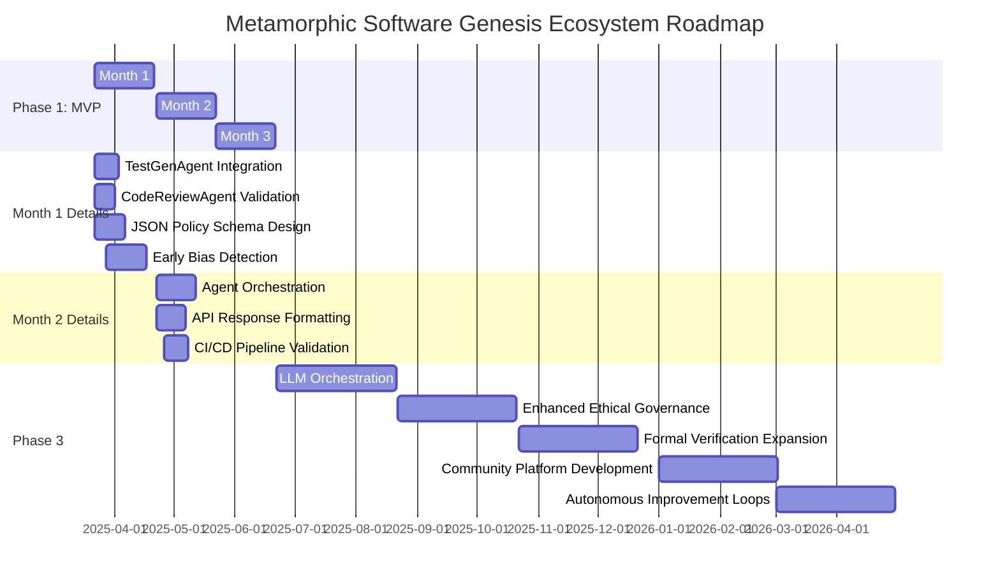

# Metamorphic Software Genesis Ecosystem 🚀

[](https://github.com/tomwolfe/metamorphic-core/actions/workflows/ci.yml)
[](LICENSE)
[](https://github.com/tomwolfe/metamorphic-core/milestones?direction=asc&sort=due_date&state=open)

**Version ∞: An Ever-Evolving Framework for Software Excellence** ✨

**Driven by AI and guided by a comprehensive high-level specification and roadmap, the Metamorphic Software Genesis Ecosystem is redefining software development through self-evolving, ethical, and secure solutions.**

---

**⚠️ Roadblock Alert:**  Progress on the **Ethical Policy Engine (JSON Configurable)** is currently behind schedule (Status: Not Implemented, Dev %: 30%).  This is a critical component for the MVP and remains a key focus for immediate development. See "Phase 1 MVP - Internal Metrics Tracking" for details.

---

**Table of Contents**
* [Vision](#vision)
* [Key Objectives](#key-objectives)
* [Envisioned Workflow: From Concept to Code](#envisioned-workflow-from-concept-to-code)
* [Current Status](#current-status)
* [Key Highlights of Current Capabilities](#key-highlights-of-current-capabilities)
* [Roadmap Update - Phase 1 MVP](#roadmap-update---phase-1-mvp)
    * [Phase 1 MVP Definition](#phase-1-mvp-definition)
    * [Phase 1 Deliverables](#phase-1-deliverables)
    * [Phase 1 Actionable Steps (Version 1.3 - Revised 3 - *Final Revision*)](#phase-1-actionable-steps-version-13---revised-3---final-revision)
        * [Month 1: Refine Agents & Ethical Engine Foundation](#month-1-refine-agents--ethical-engine-foundation)
            * [Week 1: MVP API Endpoint Shell & Basic Agent Wiring - *Get the API Talking to Agents*](#week-1-mvp-api-endpoint-shell--basic-agent-wiring---get-the-api-talking-to-agents)
            * [Week 2:  `CodeReviewAgent` MVP Functionality - *Flake8 Focus*](#week-2--codereviewagent-mvp-functionality---flake8-focus)
            * [Week 3: `EthicalPolicyEngine` MVP Foundation - *JSON Policy Loading & Basic Enforcement*](#week-3-ethicalpolicyengine-mvp-foundation---json-policy-loading--basic-enforcement)
            * [Week 4: `TestGenAgent` MVP & API Integration - *Placeholder Tests*](#week-4-testgenagent-mvp--api-integration---placeholder-tests)
        * [Month 2: Integrate Agents & API Endpoint](#month-2-integrate-agents--api-endpoint)
            * [Week 5:  `EthicalPolicyEngine` - Basic Constraint Enforcement Logic Implementation (BiasRisk, TransparencyScore, Safety Boundary)](#week-5--ethicalpolicyengine---basic-constraint-enforcement-logic-implementation-biasrisk-transparencyscore-safety-boundary)
            * [Week 6:  API Endpoint Response Refinement & Basic Error Handling - *Polish API Output*](#week-6--api-endpoint-response-refinement--basic-error-handling---polish-api-output)
            * [Week 7:  Documentation - MVP API Endpoint in `README.md` - *Basic API Usage Guide*](#week-7--documentation---mvp-api-usage-guide)
            * [Week 8:  MVP Internal/Alpha Release & Initial Testing - *First Release & Feedback*](#week-8--mvp-internalalpha-release--initial-testing---first-release--feedback)
        * [Month 3: MVP Refinement & Documentation](#month-3-mvp-refinement--documentation)
    * [Phase 1 MVP - Internal Metrics Tracking](#phase-1-mvp---internal-metrics-tracking)
    * [Gantt Chart: Phase 1 MVP Roadmap](#gantt-chart-phase-1-mvp-roadmap)
    * [Roadmap Optimization Tricks (Refined for MVP Focus)](#roadmap-optimization-tricks-refined-for-mvp-focus)
    * [Beyond Month 2 (Future Iterations)](#beyond-month-2-future-iterations)
* [Getting Started](#getting-started)
    * [Prerequisites](#prerequisites)
    * [Installation](#installation)
    * [Running the API Server](#running_the_api_server)
    * [Quickstart Guide](#quickstart_guide)
    * [System Requirements](#system-requirements)
* [API Endpoints](#api-endpoints)
    * [Sample MVP Request/Response - `/genesis/analyze-ethical`](#sample-mvp-requestresponse---genesisanalyze-ethical)
    * [Core API Endpoints](#core-api-endpoints)
* [Contributing](#contributing)
* [License](#license)
* [License and Compliance](#license-and-compliance)
* [Contact](#contact)
* [Disclaimer](#disclaimer)
* [Troubleshooting](#troubleshooting)
* [Terminology Footnotes](#terminology-footnotes)

---

## Vision <a name="vision"></a>

To create a self-refining, AI-driven framework capable of independently generating, maintaining, and evolving high-quality software solutions, operating as a perpetual engine of innovation and improvement.

## Key Objectives <a name="key-objectives"></a>

- **Autonomous Software Development**: Enable independent creation of complete software applications from high-level specifications
- **Ethical Assurance**: Integrate robust ethical governance to ensure compliance with defined principles
- **Continuous Quality**: Automate testing, code review, and security analysis
- **Self-Enhancement**: Enable the ecosystem to learn, adapt, and improve through feedback

## Envisioned Workflow: From Concept to Code <a name="envisioned-workflow-from-concept-to-code"></a>

1. **User Input**: Provide a high-level description of the desired software in natural language or via a future cloud interface
2. **Specification Refinement**: AI agents enhance input, clarifying ambiguities and identifying potential issues
3. **Design & Planning**: Generate a comprehensive software architecture
4. **Code Generation**: Produce code across multiple languages, adhering to best practices
5. **Testing & Validation**: Conduct thorough testing, including:
   - Unit, integration, and end-to-end tests
   - Code quality analysis with Flake8
   - Ethical assessment using a basic rule-based engine and quantum-inspired analysis<sup>1</sup>
   - Security scans with OWASP ZAP and Bandit (Bandit integration within `CodeReviewAgent` is currently commented out for MVP)
6. **Continuous Integration**: Integrate seamlessly into CI/CD pipelines using GitHub Actions
7. **Self-Improvement**: Evolve capabilities through learning and adaptation

## Current Status <a name="current-status"></a>

The ecosystem is actively under development, demonstrating core functionalities as an **advanced AI-powered code analysis, ethical validation, and security scanning framework.** While fully autonomous software generation is under development, the current status showcases significant progress in key areas:

**Phase 1 Capabilities - Week 2 Month 1 Achieved** ✅

**Note:**  The Phase 1 MVP delivers foundational code quality analysis and basic ethical assessment. Functionality beyond Flake8 code quality checks and basic ethical rule enforcement is under active development for subsequent phases.

### Key Milestones Achieved (Week 1 Month 1):
- **[✅] Operational `/genesis/analyze-ethical` API endpoint:**  A functional API endpoint is live, providing the core interface for ethical analysis and code quality checks.
    * **[✅] Basic code quality assessment (API v1.1):** Flake8 integration is complete, offering initial code quality analysis through the API.
    * **[✅] Initial rule-based ethical analysis backbone:** A fundamental rule-based ethical analysis is integrated, enforcing basic rules directly in code. JSON policy configuration is the next key development task.
    * **[✅] Placeholder test-generation proof-of-concept:** `TestGenAgent` is wired to the API, generating placeholder test code (pytest) as a proof of concept. These tests are not yet executed by the API in the MVP.
    * **[✅] Basic JSON response structure:** The API endpoint returns a well-defined JSON response structure, including `status`, `analysis`, `code_quality`, and `generated_tests_placeholder` fields.
    * **[✅] Daily Integration Testing:** Automated integration tests are in place, ensuring API endpoint stability and basic functionality.

### Key Milestones Achieved (Week 2 Month 1):
- **[✅] `CodeReviewAgent` MVP - Flake8 Integration:** The `CodeReviewAgent` is now fully integrated with Flake8, providing code quality analysis as a core MVP functionality.
    * **[✅] Flake8 execution via `subprocess`:** Implemented Flake8 execution within `CodeReviewAgent` using `subprocess`, capturing Flake8 output for analysis.
    * **[✅] Basic Flake8 output parsing:** Implemented basic parsing of Flake8 output to extract key information: **file path, line number, error code, and message**, for structured reporting.
    * **[✅] Unit tests for `CodeReviewAgent` (Flake8 MVP):** Developed unit tests specifically for the MVP-focused `CodeReviewAgent` to ensure correct Flake8 execution and output parsing.
    * **[✅] API Endpoint Integration (`/genesis/analyze-ethical`):** Integrated the MVP-refined `CodeReviewAgent` into the `/genesis/analyze-ethical` API endpoint, populating the `code_quality` section of the API response with Flake8 analysis results.
    * **[✅] Expanded Daily Integration Testing:** Expanded daily integration tests to specifically validate the `code_quality` section of the API response, ensuring the correct integration and functionality of the `CodeReviewAgent` within the API endpoint.

### Technical Foundations Live:
- **LLM Orchestration Layer (Gemini/Hugging Face):** Operational infrastructure for managing interactions with Language Model providers.
- **Security Scanning Integration (OWASP ZAP 2.12+):** Baseline security scanning is functional using OWASP ZAP for web application vulnerability detection.
- **Knowledge Graph:**  A dynamic Knowledge Graph is operational, serving as a central repository for system knowledge, ethical principles, and analysis findings (initial phase, content expansion ongoing).

- **Ethical Validation Framework**: Mechanisms for ethical assessment are established, leveraging a basic rule-based engine and quantum-inspired state analysis for initial ethical insights. JSON policy configuration for the Ethical Policy Engine is under active development.
- **Code Analysis Agents**:  `CodeReviewAgent` provides code quality assessment using Flake8. Bandit integration is implemented in code but commented out for the MVP. `TestGenAgent` generates placeholder pytest test code.
- **Managing Long AI Contexts**: Initial mechanisms are implemented for handling long AI contexts through intelligent LLM selection and context management strategies.
- **LLM Orchestration Layer**: Robust infrastructure manages interactions with Google Gemini and Hugging Face models, optimizing task routing and context handling.
- **Knowledge Graph**: Centralized repository for ethical principles, code analysis data, security findings, and system knowledge, enabling informed decision-making and continuous learning.
- **CI/CD Integration**: Automated CI workflows using GitHub Actions for code quality, testing, security scanning, and Docker image builds.
- **Security Scanning**: OWASP ZAP integration provides dynamic application security testing (DAST) for API vulnerability detection. Bandit integration within `CodeReviewAgent` is commented out for the MVP.
- **Formal Verification**: Initial Coq integration with compiled proofs in the CI pipeline, starting with core modules like boundary detection.

## Key Highlights of Current Capabilities <a name="key-highlights-of-current-capabilities"></a>

- **Advanced Code Analysis**: Static analysis with Flake8, providing detailed code quality insights via API.  Bandit integration is present in the codebase but commented out in `CodeReviewAgent` for the MVP to maintain focus on core MVP features.
- **OWASP ZAP Integration**: Automated security scanning for web applications and APIs, offering vulnerability reporting and scan history caching.
- **Ethical Code Assessment**: Foundational rule-based ethical assessment engine (basic rules directly in code, JSON configuration for enhanced configurability is under development). Quantum-inspired analysis provides initial ethical insights.
- **LLM Powered Features**:  Leverages Google Gemini and Hugging Face models for core functionalities including code analysis, placeholder test code generation, and problem-solving tasks.
- **CI/CD Pipeline**:  Fully automated Continuous Integration and Continuous Deployment pipeline established using GitHub Actions, ensuring code quality through automated testing, security scanning, and build processes.
- **Knowledge Graph Backbone**: Centralized Knowledge Graph serving as a repository for system knowledge, code analysis data, and ethical guidelines. The Knowledge Graph is in its early stages with active content population underway.

**Note**: The system currently functions as an AI-powered code quality analysis and basic ethical assessment framework with security scanning capabilities. Fully autonomous software generation remains the long-term vision.  Enhanced ethical assessment capabilities and Bandit integration within `CodeReviewAgent` are planned for subsequent development phases.

## Roadmap Update - Phase 1 MVP <a name="roadmap-update---phase-1-mvp"></a> 🚧

**Roadmap for Completion (Optimized for Existing Codebase - Iterative MVP Approach)**

#### Phase 1 MVP Definition <a name="phase-1-mvp-definition"></a>

A functional API endpoint (`/genesis/analyze-ethical`) with the capability to:

1.  **Analyze Python Code for Basic Ethical Concerns:** Employing a very basic, rule-based policy engine directly implemented in code. Initially enforces BiasRisk, TransparencyScore, and Safety Boundary constraints. JSON configuration for policy engine is actively being developed.
2.  **Provide Basic Code Quality Assessment:** Utilizing `CodeReviewAgent` to deliver Flake8 output reporting via the API.
3.  **Generate Placeholder Tests:** Leveraging `TestGenAgent` to create basic pytest placeholder tests for Python code, returning the placeholder test code as a string within the API response.  *Note: Tests are not executed by the API in the MVP.*
4.  **Provide API Access:** Exposing a functional `/genesis/analyze-ethical` API endpoint integrating basic ethical analysis and code quality checks.

#### Phase 1 Deliverables <a name="phase-1-deliverables"></a>

1. Functional API endpoint (`/genesis/analyze-ethical`) for basic ethical code analysis and code quality assessment, as defined in the MVP Definition.
2. Basic Ethical Policy Engine enforcing BiasRisk, TransparencyScore, and Safety Boundary constraints. JSON configuration loading and enforcement for the Policy Engine are currently under active development to enhance configurability.

#### Phase 1 Actionable Steps (Version 1.3 - Revised 3 - *Final Revision*) <a name="phase-1-actionable-steps-version-13---revised-3---final-revision"></a>

##### Month 1: Refine Agents & Ethical Engine Foundation <a name="month-1-refine-agents--ethical-engine-foundation"></a>
* **Month 1: Refine Agents & Ethical Engine Foundation**
    1.  **Refine TestGenAgent:** Integrate into API endpoint workflow and add unit tests to ensure functionality and reliability.
    2.  **Refine CodeReviewAgent:** Verify API integration to ensure seamless communication and update unit tests for comprehensive coverage.
    3.  **Design JSON Schema:** Create `ethical_policy_schema.json` file to define the structure for ethical policies in JSON format.
    4.  **Implement Ethical Policy Engine:** Develop JSON configuration loading for dynamic policy management, implement basic enforcement logic for defined constraints, and write unit tests to validate engine behavior.
    5.  **GDPR/COPPA Placeholder API:** Verify API routes for GDPR/COPPA compliance placeholders and document API interfaces for future implementation.
    6.  **Bias Detection Module:** Integrate a starter bias detection library to lay the groundwork for bias mitigation features and implement basic text analysis capabilities.

    **Detailed Weekly Breakdown for Month 1:** *To achieve the Month 1 goals, we are following this weekly plan, breaking down each step into actionable tasks:*

    ##### Week 1: MVP API Endpoint Shell & Basic Agent Wiring - *Get the API Talking to Agents* <a name="week-1-mvp-api-endpoint-shell--basic-agent-wiring---get-the-api-talking-to-agents"></a>
        *   **[✅] Task 1.1: API Endpoint Route (`/genesis/analyze-ethical`) Implementation:** ✅
            *   **[✅] Action:** Implemented the Flask API route `/genesis/analyze-ethical` in `src/api/routes/ethical_endpoints.py`. Ensured correct acceptance of POST requests with Python code in the `code` field of a JSON payload.
            *   **[✅] Specific Action:** Created the Flask route in `ethical_endpoints.py` using Flask decorators for POST request handling. Implemented code to extract `code` from JSON requests and return a basic JSON response `{"status": "working"}` to verify core functionality.
        *   **[✅] Task 1.2: Agent Stub Integration into API Endpoint:**
            *   **[✅] Action:** Integrated stubbed versions of `CodeReviewAgent` and `EthicalPolicyEngine` into the `/genesis/analyze-ethical` API endpoint. Instantiation occurs within the API route handler, calling core MVP methods (`analyze_python()` for `CodeReviewAgent`, `validate_code()` for `EthicalPolicyEngine`).
            *   **[✅] Specific Action:** Instantiated `CodeReviewAgent` and `EthicalPolicyEngine` classes in the API route handler function. Called `code_review_agent.analyze_python(code)` and `ethical_policy_engine.validate_code(code)` to establish basic agent wiring.
        *   **[✅] Task 1.3: Define Basic API Response Structure (JSON):**
            *   **[✅] Action:** Defined and implemented the basic JSON response structure for the `/genesis/analyze-ethical` endpoint, adhering to the MVP definition. Structure includes fields for `status`, `analysis`, `code_quality`, and `quantum_state`.
            *   **[✅] Specific Action:** Modified the API route handler to return a JSON response conforming to the MVP structure, including `status`, `analysis`, `code_quality`, and `quantum_state` fields, ensuring a standardized output format.
        *   **[✅] (Daily Integration Testing - *Critical*):** **Action:** Implemented minimal integration tests using `pytest` and `requests` for daily validation of the `/genesis/analyze-ethical` API endpoint. Tests verify endpoint reachability, POST request acceptance, and JSON response structure compliance (status, analysis, code\_quality, quantum\_state). *Specific Action:* Created `tests/integration/test_api_mvp_endpoint.py` and added tests to validate API endpoint reachability and basic JSON response structure.  These tests are integrated into the daily development workflow for continuous validation.

    ##### Week 2:  `CodeReviewAgent` MVP Functionality - *Flake8 Focus* <a name="week-2--codereviewagent-mvp-functionality---flake8-focus"></a>
        *   **[✅] Task 2.1: `CodeReviewAgent` - Flake8 MVP Integration:** ✅ *Focus: Flake8 Code Quality Checks for MVP*
            *   **[✅] Action:** Refined existing `CodeReviewAgent` code to exclusively focus on running Flake8 and returning basic, parsed output. Non-MVP functionalities (Bandit integration, advanced static analysis) were commented out to streamline for MVP.
            *   **[✅] Specific Action:** Modified `CodeReviewAgent.analyze_python()` to execute *only* Flake8 via `subprocess` using the `flake8` command-line tool. Simplified output parsing logic to extract essential Flake8 information: file path, line number, error code, and message.
        *   **[✅] Task 2.2: `CodeReviewAgent` - Unit Testing (MVP - Flake8):** ✅ *Focus: Unit Tests for Flake8 MVP Functionality*
            *   **[✅] Action:** Developed focused unit tests for the MVP-refined `CodeReviewAgent` to verify correct Flake8 execution via `subprocess` and accurate parsing of basic Flake8 output.
            *   **[✅] Specific Action:** Utilized `pytest` and `unittest.mock` to create mock objects for `subprocess.run`. Wrote unit tests in `tests/test_code_review_agent.py` simulating various Flake8 outputs (with/without errors, different error types). Asserted that `CodeReviewAgent.analyze_python()` correctly parses mock outputs and returns expected structured data.
        *   **[✅] Task 2.3: API Integration - `CodeReviewAgent` MVP into Endpoint:**
            *   **[✅] Action:** Integrated the MVP-refined and unit-tested `CodeReviewAgent` into the `/genesis/analyze-ethical` API endpoint handler function. Updated API endpoint code to call the functional `CodeReviewAgent`, populating the `code_quality` section of the JSON API response with agent output.
            *   **[✅] Specific Action:** Modified the API route handler in `ethical_endpoints.py` to instantiate the *functional* `CodeReviewAgent` and call its `analyze_python()` method with code from API requests. Ensured the `code_quality` data returned by the agent is correctly included in the JSON API response.
         *   **(Daily Integration Testing - *Expand*):** **Action:** Expanded daily integration tests in `tests/integration/test_api_mvp_endpoint.py` to verify specifically that the `code_quality` section of the API response is correctly populated with output from the MVP `CodeReviewAgent`. These tests are run daily to ensure continuous integration of the agent with the API.

    ##### Week 3: `EthicalPolicyEngine` MVP Foundation - *JSON Policy Loading & Basic Enforcement* <a name="week-3-ethicalpolicyengine-mvp-foundation---json-policy-loading--basic-enforcement"></a> 🚧
        *   **Task 3.1: JSON Schema & Example Ethical Policies Definition:**
            *   **Action:** Defined a robust JSON schema (`ethical_policy_schema.json`) to represent ethical policies, focusing on MVP constraints: BiasRisk, TransparencyScore, and Safety Boundary. Created realistic example JSON policy files conforming to the schema, defining policies for each MVP constraint.
            *   **Specific Action:** Created `ethical_policy_schema.json` in the project root, defining the JSON structure for ethical policies, including fields for `policy_name`, `description`, `constraints` (nested objects for BiasRisk, TransparencyScore, Safety Boundary, each with `threshold`, `enforcement_level`). Created example policy JSON files (e.g., `policy_bias_risk_strict.json`, `policy_transparency_minimum.json`, `policy_safety_moderate.json`) in a new `policies/` directory, defining concrete thresholds and enforcement levels.
        *   **Task 3.2: `EthicalPolicyEngine` - Basic Loading & Enforcement Implementation:**
            *   **Action:** Implemented the basic `EthicalPolicyEngine` class in `src/core/ethics/governance.py`, focusing on loading policies from JSON files and implementing a basic `enforce_policy(code, policy_config)` method for MVP constraints (BiasRisk, TransparencyScore, Safety Boundary). Initial enforcement logic is simplified (rule-based checks instead of complex analysis). Database integration deferred; using in-memory storage for now.
            *   **Specific Action:** Implemented `EthicalPolicyEngine` class in `governance.py`. Created methods like `load_policy_from_json(filepath)` for JSON policy loading and `enforce_policy(code, policy_config)` with simplified enforcement logic for MVP constraints.
        *   **Task 3.3: `EthicalPolicyEngine` - Unit Testing (Loading & Basic Enforcement):**
            *   **Action:** Wrote unit tests for `EthicalPolicyEngine` to verify correct loading of ethical policies from JSON files and the functionality of basic enforcement logic, based on different policy configurations and code samples.
            *   **Specific Action:** Used `pytest` to create unit tests in `tests/test_ethics.py` for `EthicalPolicyEngine`. Test cases include: 1) Verifying `load_policy_from_json()` correctly loads policy data from valid JSON, raising errors for invalid files/schema violations. 2) Verifying `enforce_policy()` returns expected "policy compliant" or "policy violation" results based on different policy configurations and code inputs.
        *   **Task 3.4: API Integration - `EthicalPolicyEngine` into Endpoint:**
            *   **Action:** Integrated the basic `EthicalPolicyEngine` (with basic enforcement logic) into the `/genesis/analyze-ethical` API endpoint handler function. Modified the API endpoint code to instantiate `EthicalPolicyEngine`, call `enforce_policy()`, and include an `ethical_analysis` section in the JSON API response.
            *   **Specific Action:** Modified the API route handler in `ethical_endpoints.py` to: 1) Instantiate `EthicalPolicyEngine`. 2) Load a *default MVP policy configuration*. 3) Call `ethical_policy_engine.enforce_policy(code, default_policy_config)`. 4) Ensure the API response JSON now includes an `ethical_analysis` section.
        *   **(Daily Integration Testing - *Expand*):** **Action:** Expanded daily integration tests in `tests/integration/test_api_mvp_endpoint.py` to verify the presence of the `ethical_analysis` section in the API response JSON, confirming `EthicalPolicyEngine` invocation and output incorporation.

    ##### Week 4: `TestGenAgent` MVP & API Integration - *Placeholder Tests* <a name="week-4-testgenagent-mvp--api-integration---placeholder-tests"></a>
        *   **Task 4.1: `TestGenAgent` - MVP Placeholder Test Generation Implementation:**
            *   **Action:** Refined existing `TestGenAgent` code to exclusively focus on generating basic pytest placeholder tests. Simplified `generate_tests()` method to produce pytest test code with `import pytest`, `test_<function_name>_positive()`, `test_<function_name>_negative()`, `pytest.skip()`, and `assert True`. Removed non-MVP test generation logic for MVP streamlining.
            *   **Specific Action:** Modified `TestGenAgent.generate_tests(code, spec_analysis)` to generate only the basic pytest placeholder test structure, ignoring `spec_analysis` for MVP. Method returns a string containing generated pytest code, focusing on valid Python code with `pytest.skip()` markers and `assert True` statements.
        *   **Task 4.2: `TestGenAgent` - Unit Testing (MVP Placeholder Test Generation):**
            *   **Action:** Developed unit tests specifically for the MVP-refined `TestGenAgent` to rigorously verify `generate_tests()` method correctness in generating basic pytest placeholder test code in the expected format (including `import pytest`, test function structure, `pytest.skip()`, `assert True`).
            *   **Specific Action:** Used `pytest` to create unit tests in `tests/test_test_generator.py` to test `TestGenAgent.generate_tests()`. Test cases include: 1) Verifying output string contains `import pytest`. 2) Verifying output contains test functions named `test_<function_name>_positive()` and `test_<function_name>_negative()`. 3) Verifying each test function includes `pytest.skip("Placeholder test - function implementation pending")` and `assert True`.
        *   **Task 4.3: API Integration - `TestGenAgent` MVP into Endpoint:**
            *   **Action:** Integrated MVP-refined and unit-tested `TestGenAgent` into the `/genesis/analyze-ethical` API endpoint handler function. Updated API endpoint code to call `TestGenAgent` and include generated placeholder test code as a string within the JSON API response in a new field (`"generated_tests_placeholder"`). API does *not* execute tests in MVP, only generates and returns placeholder test code.
            *   **Specific Action:** Modified API route handler in `ethical_endpoints.py` to: 1) Instantiate `TestGenAgent`. 2) Call `test_gen_agent.generate_tests(code, spec_analysis)` to generate placeholder test code. 3) Include returned test code string in the JSON API response in a new field named `"generated_tests_placeholder"`.
        *   **(Daily Integration Testing - *Expand*):** **Action:** Expanded daily integration tests in `tests/integration/test_api_mvp_endpoint.py` to verify API response JSON includes the new `"generated_tests_placeholder"` field, containing a string resembling basic pytest code (string checks for keywords like `import pytest`, `def test_`, `pytest.skip`, `assert True`). Confirms `TestGenAgent` invocation by API endpoint and generated output return in API response.

##### Month 2: Integrate Agents & API Endpoint <a name="month-2-integrate-agents--api-endpoint"></a>
* **Month 2: Integrate Agents & API Endpoint**
    1.  **Integrate Specification Analysis Agent:** API endpoint integration, JSON output, basic ethical engine use. (*Commented out for MVP focus*)
    2.  **Refine API Endpoint (`/genesis/analyze-ethical`):**
        *   **2a. Orchestrate Agents:** Integrate `CodeReviewAgent`, `EthicalPolicyEngine`, `SpecificationAnalyzer` (*Commented out for MVP focus*), `BiasDetectionMitigationModule` (*Commented out for MVP focus*).
        *   **2b. Format JSON Response:** Structure output from agents and engine into MVP-defined JSON format for clear and consistent API responses.
        *   **2c. Integration Tests:** Write integration tests for the complete `/genesis/analyze-ethical` endpoint flow, ensuring all components work together as expected.
    3.  **(Step Removed - Redundant)**
    4.  **CI/CD Integration:** Extend CI pipeline to incorporate integration tests for the MVP endpoint, ensuring automated validation within the CI process.

    **Detailed Weekly Breakdown for Month 2:** *Building upon Month 1 achievements, Month 2 focuses on API endpoint integration and agent orchestration, following these weekly steps:*

    ##### Week 5:  `EthicalPolicyEngine` - Basic Constraint Enforcement Logic Implementation (BiasRisk, TransparencyScore, Safety Boundary) <a name="week-5--ethicalpolicyengine---basic-constraint-enforcement-logic-implementation-biasrisk-transparencyscore-safety-boundary"></a>
        *   **Task 5.1: `EthicalPolicyEngine` - Implement Constraint Enforcement Logic:**
            *   **Action:** Replace placeholder enforcement logic in `EthicalPolicyEngine.enforce_policy(code, policy_config)` with basic but functional constraint enforcement for BiasRisk, TransparencyScore, and Safety Boundary. Logic is MVP-focused, aiming for functionality over sophistication: 1) Load constraint thresholds from `policy_config` (JSON policy - *in development*). 2) Implement simple, rule-based checks to evaluate `code` against each constraint. Examples:
                *   **BiasRisk:** Keyword check for bias-related terms (racial terms, gendered pronouns - *basic keyword check for MVP*).
                *   **TransparencyScore:** Presence check for comments/docstrings, calculating a basic "transparency score" based on presence/absence. Compare against TransparencyScore threshold (*basic presence check for MVP*).
                *   **Safety Boundary:** Check for unsafe operations like `os.system()` or `eval()` (*basic operation check for MVP*).
            *   **Specific Action:** Within `EthicalPolicyEngine.enforce_policy(code, policy_config)`: 1) Implement logic to extract constraint thresholds for BiasRisk, TransparencyScore, and Safety Boundary from `policy_config` JSON object (*JSON policy loading in development*). 2) Implement simplified, rule-based checks for each constraint as described. 3) Return a dictionary/object indicating enforcement status (compliant/violation) for each constraint, and overall "policy enforcement result" (APPROVED/REJECTED).
        *   **Task 5.2: `EthicalPolicyEngine` - Unit Testing (Constraint Enforcement):**
            *   **Action:** Develop comprehensive unit tests for `EthicalPolicyEngine` to rigorously verify constraint enforcement logic implemented in Task 5.1. Test different policy configurations (varying thresholds - *JSON policy loading in development*) and code samples designed to violate/comply with BiasRisk, TransparencyScore, and Safety Boundary constraints, based on simplified rule-based enforcement.
            *   **Specific Action:** Use `pytest` to expand unit tests in `tests/test_ethics.py` for `EthicalPolicyEngine`. Test cases include: 1) Test BiasRisk enforcement: code samples to trigger/not trigger bias risk violations (keyword-based check), verifying `enforce_policy()` returns correct results for varying BiasRisk thresholds in policy (*JSON policy loading in development*). 2) Test TransparencyScore enforcement: code samples with varying comment/docstring levels, verifying `enforce_policy()` correctly assesses transparency score against policy threshold (*basic presence check for MVP*). 3) Test Safety Boundary enforcement: code samples including/excluding unsafe operations like `os.system()` and `eval()`, verifying `enforce_policy()` correctly identifies safety boundary violations based on operation check and Safety Boundary threshold (*basic operation check for MVP*).
        *   **Task 5.3: API Integration - `EthicalPolicyEngine` Basic Enforcement into Endpoint:**
            *   **Action:** Integrate basic constraint enforcement logic of `EthicalPolicyEngine` into the `/genesis/analyze-ethical` API endpoint handler function. Update API endpoint code to call `enforce_policy()` and use returned results to dynamically set `status` (APPROVED/REJECTED) in JSON API response and populate `ethical_analysis` section with detailed constraint enforcement results.
            *   **Specific Action:** Modify API route handler in `ethical_endpoints.py` to: 1) Call `ethical_policy_engine.enforce_policy(code, default_policy_config)` (*default policy config in development*). 2) Use "policy enforcement result" from `enforce_policy()` to set `status` field in JSON API response to "APPROVED" or "REJECTED". 3) Populate `ethical_analysis` section with constraint violation/compliance information from `enforce_policy()`.
        *   **(Weekly Integration Testing - *Expand*):** **Action:** Expand weekly integration tests in `tests/integration/test_api_mvp_endpoint.py` to rigorously verify API endpoint correctly returns `status` (APPROVED/REJECTED) and detailed `ethical_analysis` section in JSON response, based on *functional* (basic) ethical policy enforcement logic. Run weekly to ensure API endpoint and `EthicalPolicyEngine` work together correctly.

    ##### Week 6:  API Endpoint Response Refinement & Basic Error Handling - *Polish API Output* <a name="week-6--api-endpoint-response-refinement--basic-error-handling---polish-api-output"></a>
        *   **Task 6.1: API Response - Detailed Analysis Output Refinement:**
            *   **Action:** Refine structure and formatting of detailed analysis output in API response JSON, improving `code_quality` (from `CodeReviewAgent`) and `ethical_analysis` (from `EthicalPolicyEngine`) sections for MVP readability, informativeness, and user-friendliness. Ensure JSON output is well-structured and easily machine-parseable.
            *   **Specific Action:** Review current JSON output in `code_quality` and `ethical_analysis` sections. Restructure and reformat data for better organization and understanding. For `code_quality`, ensure clear presentation of Flake8 findings (file, line, code, message). For `ethical_analysis`, ensure clear presentation of constraint enforcement results (status per constraint, violation details - *basic enforcement logic for MVP*). Aim for JSON structure that is human-readable and machine-parseable.
        *   **Task 6.2: API Endpoint - Implement Basic Error Handling:**
            *   **Action:** Implement robust basic error handling within the `/genesis/analyze-ethical` API endpoint handler function. Ensure graceful catching of potential exceptions during agent execution (e.g., from `CodeReviewAgent.analyze_python()` or `EthicalPolicyEngine.enforce_policy()`) and return informative JSON error responses instead of crashes/unhandled exceptions. Use appropriate HTTP status codes (e.g., 500 Internal Server Error for unexpected errors).
            *   **Specific Action:** Add `try...except` blocks within the API route handler function in `ethical_endpoints.py` to wrap calls to `code_review_agent.analyze_python()` and `ethical_policy_engine.enforce_policy()`. In `except` blocks, implement logic to: 1) Log error details using Flask logging. 2) Construct JSON error response with `error` field (descriptive message) and `status` field set to "error". 3) Return JSON error response with 500 Internal Server Error HTTP status code using `jsonify()` and `return ..., 500`.
        *   **Task 6.3: API Integration Testing - Response Refinement & Error Handling:**
            *   **Action:** Expand integration tests in `tests/integration/test_api_mvp_endpoint.py` to thoroughly verify refined API response structure (`code_quality`, `ethical_analysis` sections) and implemented error handling. Add test cases simulating error scenarios (mocking agent methods to raise exceptions), verifying API endpoint correctly catches exceptions and returns expected JSON error responses with 500 status codes.
            *   **Specific Action:** Add integration tests to `tests/integration/test_api_mvp_endpoint.py` to: 1) Validate refined JSON response structure, ensuring `code_quality` and `ethical_analysis` sections are formatted as expected and contain correct data. 2) Test error handling: Use `unittest.mock` to mock `analyze_python()` of `CodeReviewAgent` and `enforce_policy()` of `EthicalPolicyEngine` to raise exceptions. Verify that API returns JSON error response with 500 status code and informative error message in `error` field when exceptions are raised.

    ##### Week 7:  Documentation - MVP API Endpoint in `README.md` - *Basic API Usage Guide* <a name="week-7--documentation---mvp-api-usage-guide"></a>
        *   **Task 7.1: README.md - MVP API Endpoint Documentation - *Write Usage Guide*:**
            *   **Action:** Update `README.md` in project root with comprehensive documentation for MVP `/genesis/analyze-ethical` API endpoint. Serve as basic usage guide for developers/internal users. Include:
                *   **Endpoint Overview:** Purpose of `/genesis/analyze-ethical` (ethical code analysis and basic code quality assessment).
                *   **Request Format:** HTTP method (POST), API endpoint URL (`/genesis/analyze-ethical`), request headers (`Content-Type: application/json`), JSON request body format (`code` field - string). Provide request example.
                *   **Response Format:** JSON response format. Explain each field: `status` (APPROVED/REJECTED/error - *basic enforcement logic for MVP*), `analysis` (detailed ethical analysis - structure and data - *basic enforcement logic for MVP*), `code_quality` (Flake8 code quality assessment - structure and data), `generated_tests_placeholder` (placeholder test code string - *tests not executed in MVP*). Provide example JSON responses for APPROVED, REJECTED, and error scenarios.
                *   **Basic Instructions:** Instructions on running Flask API server locally (`src/api/server.py`) and sending requests to `/genesis/analyze-ethical` using `curl`/`Postman`/similar tools.
            *   **Specific Action:** Open `README.md` and add a new section for `/genesis/analyze-ethical` MVP API endpoint documentation. Write clear, concise text for each section (Endpoint Overview, Request Format, Response Format, Basic Instructions). Create well-formatted code blocks for example requests and JSON responses. Ensure documentation is accurate, complete, and user-friendly for developers.
        *   **Task 7.2: Documentation Review & Refinement - *Clarity and Accuracy Check*:**
            *   **Action:** Thoroughly review updated `README.md` documentation for clarity, accuracy, completeness, and user-friendliness. Refine documentation based on review to ensure high-quality and effective user guidance.
            *   **Specific Action:** After writing initial documentation in Task 7.1, re-read from a new developer's perspective wanting to use `/genesis/analyze-ethical` API endpoint. Check for: 1) Clarity: clear, concise language, explain jargon. 2) Accuracy: technically correct information, accurate request/response examples. 3) Completeness: covers essential information for effective API use (purpose, request, response, instructions). 4) User-Friendliness: well-organized, easy navigation, logical flow. Refine and edit based on review. Ideally, get feedback from another developer.

    ##### Week 8:  MVP Internal/Alpha Release & Initial Testing - *First Release & Feedback* <a name="week-8--mvp-internalalpha-release--initial-testing---first-release--feedback"></a>
        *   **Task 8.1:  Prepare MVP Release Package (Internal/Alpha):**
            *   **Action:** Prepare minimal MVP release package for internal/alpha testing. Tag current codebase in Git for release version, ensure Docker image is buildable and runnable with MVP functionality, prepare release notes/instructions for testers.
            *   **Specific Action:** 1) Tag current commit in Git as release version (e.g., `git tag v0.1-alpha -m "MVP Alpha Release"` and `git push --tags`). 2) Verify `Dockerfile` builds Docker image with MVP functionality. Test build locally using `docker build -t metamorphic-core-mvp-alpha .`. 3) Verify built Docker image is runnable and API server starts correctly using `docker run -p 5002:5002 metamorphic-core-mvp-alpha`. 4) Prepare brief release notes/instructions for internal testers (e.g., `RELEASE_NOTES_ALPHA.md`) including: MVP summary, Docker image run instructions, `/genesis/analyze-ethical` API endpoint usage instructions (referencing `README.md`), and feedback guidance.
        *   **Task 8.2:  Conduct Internal/Alpha Testing of MVP Endpoint - *Gather Initial Usage Data*:**
            *   **Action:** Distribute MVP release package to internal testers/alpha users for testing `/genesis/analyze-ethical` API endpoint. Provide testers with example Python code snippets and ask them to systematically test API endpoint functionality based on documentation.
            *   **Specific Action:** Share Docker image and release notes/instructions with internal testers/alpha users. Provide diverse Python code snippets representing different scenarios (ethical/unethical code, code quality issues, syntax correctness/errors, etc.). Ask testers to send requests to `/genesis/analyze-ethical` API endpoint and verify: 1) API endpoint reachability and correct responses. 2) API returns JSON responses in documented format. 3) `status` field in response is APPROVED/REJECTED based on enforced policies, with `ethical_analysis` section detailing violations.

##### Month 3: MVP Refinement & Documentation <a name="month-3-mvp-refinement--documentation"></a>
* **Month 3: MVP Refinement & Documentation**
    1.  **Polish MVP API Endpoint:** Refine error handling, response formatting for improved usability, and optimize performance for efficiency.
    2.  **Document MVP API Endpoint:** Update `README.md` with comprehensive usage instructions and practical examples to guide users effectively.
    3.  **Initial MVP Release:** Prepare a minimal MVP release package for broader internal use and update `INSTALL.md`/`README.md` to reflect the release.
    4.  **Gather MVP Feedback:** Collect feedback from internal/alpha testers to identify areas for improvement and inform future iterations.


#### Phase 1 MVP - Internal Metrics Tracking <a name="phase-1-mvp---internal-metrics-tracking"></a>

**Contribution Sprint Queue (Phase 1 MVP - Top 3 Tasks):**

1. **Ethical Policy Engine - JSON Configuration Loading & Enforcement:** Implement JSON policy loading and enforcement in `EthicalPolicyEngine`. Crucial for configurable ethical assessments and resolving current roadblock. (See: "Month 1, Step 4: Implement Ethical Policy Engine").
2. **`/genesis/analyze-ethical` API Endpoint - Agent Orchestration & JSON Response:** Refine API endpoint to orchestrate MVP agents (`CodeReviewAgent`, `EthicalPolicyEngine`, `TestGenAgent`) and structure outputs into well-defined JSON response format. `SpecificationAnalyzer` and `BiasDetectionMitigationModule` deferred to post-MVP. (See: "Month 2, Step 2b: Format JSON Response").
3. **Integration Tests for `/genesis/analyze-ethical` Endpoint:** Develop comprehensive integration tests for `/genesis/analyze-ethical` API endpoint to ensure correct workflow of MVP agents and basic ethical policy enforcement. (See: "Month 2, Step 2c: Integration Tests").


<details>
<summary>Click to expand Phase 1 MVP Internal Metrics Tracking Table</summary>

| Roadmap Item                                  | Effort Completed (Dev %) | Functionality Validated (MVP %) | Status (Roadmap)      | Next Steps                                                                                                                                                                                                    |
| :-------------------------------------------- | :-----------------------: | :-----------------------------: | :-------------------- | :------------------------------------------------------------------------------------------------------------------------------------------------------------------------------------------------------------ |
| MVP Deliverable 1: API Endpoint              |            90%            |               85%               | Implemented           | 1. Write integration tests for comprehensive coverage. 2. Polish error handling for robustness and user feedback.                                                                                             |
| MVP Deliverable 2: Configurable Policy Engine |            30%            |               5%                | **Not Implemented**   | 1. Design `ethical_policy_schema.json` file to define policy structure. 2. Implement JSON configuration loading in `EthicalPolicyEngine` for dynamic policy management. 3. Implement `/ethical/policy/load` endpoint for policy loading via API. 4. Implement `/ethical/policy/view` endpoint for policy viewing via API. |
| TestGenAgent Refinement                       |            80%            |               50%               | Partially Implemented | 1. Integrate into API workflow for automated test generation upon code analysis requests. 2. Activate in endpoint to enable test generation via API. 3. Write integration tests to ensure seamless integration and functionality.                                                                                                                            |
| CodeReviewAgent Refinement                      |            95%            |               90%               | Implemented           | 1. Write integration tests (if needed) for comprehensive validation. 2. Minor polish for enhanced code quality analysis output.                                                                                                                                                       |
| JSON Schema Design                             |             0%            |                0%               | Not Implemented       | 1. Design and create `ethical_policy_schema.json` file to formally define the structure of ethical policies in JSON format.                                                                                                                                                     |
| Ethical Policy Engine (JSON Configurable)      |            30%            |                5%               | Not Implemented       | 1. Implement JSON configuration loading for dynamic policy management. 2. Implement `/ethical/policy/load` endpoint for policy loading via API. 3. Implement `/ethical/policy/view` endpoint for policy viewing via API. 4. Integrate into workflow for seamless operation within the system. 5. Write tests for robust validation of engine behavior. 6. Implement MVP constraints (BiasRisk, TransparencyScore, Safety Boundary) for initial policy enforcement. |
| GDPR/COPPA Placeholder API                     |            70%            |               60%               | Partially Implemented | 1. Document API endpoints in README/Swagger to provide clear interface specifications.                                                                                                                                                                 |
| Bias Detection Module Integration             |            20%            |               10%               | Not Implemented       | 1. Integrate starter bias detection library for bias analysis capabilities. 2. Implement basic text analysis for initial bias detection functionality. 3. Placeholder integration in workflow for future activation and testing.                                                                                                      |
| **API Endpoint Integration Task**              |            75%            |               65%               | Partially Implemented | 1. Refine agent orchestration (for MVP agents) to optimize agent interaction within the API endpoint. 2. Implement JSON response formatting for consistent and user-friendly API output. 3. Write integration tests - *Initial API endpoint shell & basic agent wiring complete* to ensure robust and reliable API endpoint operation.                            |

</details>

#### Gantt Chart: Phase 1 MVP Roadmap <a name="gantt-chart-phase-1-mvp-roadmap"></a>


#### Roadmap Optimization Tricks (Refined for MVP Focus) <a name="roadmap-optimization-tricks-refined-for-mvp-focus"></a>

* **Lean Development & Iteration:** Employ lean development principles, focusing on building a functional core MVP first and iterating rapidly based on testing and user feedback. Avoid over-engineering features upfront to maintain development velocity.
* **Prioritize MVP Features:**  Strictly prioritize features essential for a minimally viable product in Phase 1. Defer less critical enhancements and features to subsequent development phases to maintain MVP focus.
* **Self-Bootstrapping Everywhere:**  Actively leverage the Ecosystem's own capabilities, such as `TestGenAgent` and `CodeReviewAgent`, to accelerate its self-development. Automate testing, code generation (for stubs and boilerplate), and documentation wherever feasible to enhance efficiency.
* **"Good Enough" is OK for MVP:**  Adopt a pragmatic approach for the initial MVP, focusing on achieving *basic* functionality that works reliably.  Refinement, polish, and advanced features can be addressed in later iterations. "Done" is better than "perfect" for MVP.
* **Focus on Testability:** Prioritize testability throughout development by writing tests either before or concurrently with code implementation. Comprehensive test coverage is crucial for accelerating development and minimizing bugs in the long term.
* **Consider Early Community Feedback:**  Actively solicit early community feedback on the project specification and roadmap, even during Phase 1, to gain valuable external insights and potentially attract early contributors.  Early feedback, even limited, can significantly refine project direction and generate initial community interest.

#### Beyond Month 2 (Future Iterations) <a name="beyond-month-2-future-iterations"></a>

*   **Iterate on MVP Feedback:**  Actively address feedback gathered from internal/alpha testing of the MVP API endpoint. Refine the API endpoint, ethical policy engine, and agents based on user input to improve usability and effectiveness.
*   **Implement Basic Bias Detection (Month 3 - if time allows):**  Integrate a basic bias detection library into the `BiasDetectionMitigationModule` to add initial bias detection capabilities. (*Note: Deferred to post-MVP phases if time constraints are significant*).
*   **GDPR/COPPA Placeholder API (Month 3 - if time allows):** Implement placeholder GDPR/COPPA API endpoints (`/ethical/gdpr`, `/ethical/coppa`) with clearly defined request/response interfaces to prepare for future compliance features.
*   **Phase 2 Feature Planning:**  Begin detailed planning and outlining of enhanced features and quality improvements for Phase 2 development, incorporating lessons learned from MVP development and testing.

## Getting Started <a name="getting-started"></a>

### System Requirements <a name="system-requirements"></a>
- **Python**: 3.11+ is required for optimal performance and compatibility.
- **Docker**: Optional, but recommended for running Redis caching and OWASP ZAP security scanning services.
- **API Keys**:
  - **Gemini API Key (Required):** Essential for utilizing the default Gemini Language Model provider.
  - **Hugging Face API Key (Optional):** Required if you intend to use the Hugging Face Language Model provider.

### Prerequisites <a name="prerequisites"></a>

- **Python 3.11+**: Ensure you have Python 3.11 or a later version installed on your system.
- **Docker and Docker Compose (Optional):** Docker is recommended for easily setting up Redis and OWASP ZAP. Install Docker and Docker Compose if you plan to use these services.
- **Google Gemini API Key (Required for Gemini LLM Provider):** Obtain an API key from Google AI Studio ([https://ai.google.dev/](https://ai.google.dev/)) to use the Gemini LLM provider.
- **Hugging Face API Key (Optional, for Hugging Face LLM Provider):** If you wish to use Hugging Face models, obtain an API key from Hugging Face ([https://huggingface.co/](https://huggingface.co/)).
- **GitHub API Key (Optional, for future GitHub integrations):** Required for future integrations with GitHub, such as repository analysis and code generation workflows.
- **OWASP ZAP API Key (Optional, for advanced OWASP ZAP security scan configurations):** Needed for advanced configurations and programmatic control of OWASP ZAP security scans.

### Installation <a name="installation"></a>

1. **Clone the Repository**:

```bash
git clone https://github.com/tomwolfe/metamorphic-core.git
cd metamorphic-core
```

2. **Set Up Environment Variables**:

```bash
cp .env.example .env
```

Modify the `.env` file with your API keys and desired configurations. At a minimum, set `GEMINI_API_KEY` if you are using the default Gemini LLM provider.

```env
LLM_PROVIDER=gemini # or huggingface
GEMINI_API_KEY=your_key_here
# HUGGING_FACE_API_KEY=your_hf_api_key # Required if LLM_PROVIDER=huggingface
# YOUR_GITHUB_API_KEY=your_github_token # Optional
# ZAP_API_KEY=your_zap_api_key # Optional
# DOCKERHUB_USERNAME=your_dockerhub_username # Optional

# System configuration (adjust as needed)
SAFETY_MARGIN=5
QUANTUM_DEPTH=3
ETHICAL_THRESHOLD=90
PYTHONPATH=./src
```

3. **Start Redis and ZAP (Optional, using Docker Compose):**

If you intend to utilize Redis for caching or leverage advanced features of OWASP ZAP security scans locally, start these services using Docker Compose:

```bash
docker-compose -f docker-compose.yml.example up -d redis zap
```

4. **Set Up Virtual Environment:**

```bash
python -m venv venv
source venv/bin/activate  # Linux/macOS
venv\Scripts\activate     # Windows
```

5. **Install Dependencies:**

```bash
pip install --upgrade pip
pip install -r requirements/base.txt
pip install -r requirements/dev.txt # Optional: for development dependencies (testing, linting)
```

### Running the API Server <a name="running_the_api_server"></a>

```bash
cd src/api
python server.py
```

The API server will be accessible at [http://0.0.0.0:5002/](http://0.0.0.0:5002/).

### Quickstart Guide <a name="quickstart_guide"></a>

#### 1. Clone Repository
```bash
git clone https://github.com/tomwolfe/metamorphic-core.git
cd metamorphic-core
```

#### 2. Configure Environment
```bash
cp .env.example .env
```
Adjust critical parameters in `.env` such as:
```env
GEMINI_API_KEY=your-production-key
ETHICAL_THRESHOLD=90  # Higher value enforces stricter ethical policies
```

#### 3. Setup Virtual Environment
```bash
python -m venv venv
source venv/bin/activate  # Linux/macOS
venv\Scripts\activate     # Windows
```

#### 4. Install Dependencies
```bash
pip install -r requirements/base.txt
```

#### 5. Run Server
```bash
cd src/api
python server.py
```

Visit `http://0.0.0.0:5002/genesis/health` in your browser or using `curl` to check the live API status.

## API Endpoints <a name="api-endpoints"></a>

For detailed API documentation (under development), refer to: [docs/api/api-endpoints.md](docs/api/api-endpoints.md)

| Endpoint                      | Method | Description                                                                     |
|-------------------------------|--------|---------------------------------------------------------------------------------|
| `/genesis/health`             | GET    | Check API server status. Returns `{"status": "ready"}` if the server is running and accessible. |
| `/genesis/analyze-ethical`    | POST   | Analyzes Python code for ethical considerations and code quality issues. **MVP Core Endpoint.**    |
| `/genesis/solve-math`        | POST   | Test endpoint for demonstrating mathematical problem-solving capabilities (basic test endpoint).                     |
| `/genesis/ethical/audit/{state_id}`   | GET    | Retrieve audit trail data for a given `state_id`. **Note:** Not yet fully implemented and functional.     |
| `/genesis/ethical/visualize/{state_id}` | GET    | Obtain visualization data for a given `state_id`. **Note:** Not yet fully implemented and functional.   |

**Note:**  API functionality is primarily focused on the `/genesis/analyze-ethical` endpoint as part of the Phase 1 MVP.  Other endpoints are currently for testing purposes or represent planned functionality for future development phases.

#### Sample MVP Request/Response - `/genesis/analyze-ethical` <a name="sample-mvp-requestresponse---genesisanalyze-ethical"></a>

**Request (Example using curl):**

```bash
curl --request POST \
  --url http://0.0.0.0:5002/genesis/analyze-ethical \
  --header 'Content-Type: application/json' \
  --data '{"code":"def hello_world():\n  print(\"Hello, world!\")"}'
```

**Response (Example - *Basic MVP Output*):**
```json
{
  "status": "working",
  "code_quality": "Flake8 analysis output will be provided here.",
  "analysis": "Basic ethical analysis results from rule-based checks will be presented here. (JSON Configurable Policy Engine for enhanced ethical analysis is under development)",
  "generated_tests_placeholder": "Placeholder pytest test code will be returned in this field. (Note: Tests are not executed by the API in the MVP)"
}
```

#### Core API Endpoints <a name="core-api-endpoints"></a>
<details>
<summary>Phase 1 MVP API Overview</summary>

| Endpoint                          | Method | Status             | Description |
|-----------------------------------|--------|--------------------|-------------|
| **/genesis/health**               | GET    | Working            | Basic liveness check endpoint; returns a healthcheck response indicating API availability. |
| **/genesis/analyze-ethical**      | POST   | Alpha              | Core MVP endpoint for full code analysis including: <br> • Grammar and Code Quality analysis using Flake8. <br> • Basic ethics assessment (Beta - *very basic rule-based engine*, JSON Configurable Policy Engine in active development). <br> • Test placeholder generation (v1.1 - *placeholder code only, tests are not executed by the API in this MVP version*). |
| /genesis/solve-math               | POST   | MVP Baseline       | LLM-powered mathematical problem solving demo endpoint, showcasing basic LLM integration. |
| /genesis/ethical/audit/{state_id} | GET    | To Be Implemented  | Future endpoint for accessing ethics audit history, currently under development. |
| /genesis/ethical/visualize/*      | ALL    | Coming Soon        | Maturity visualizations (Planned for API v1.3+), functionality is forthcoming. |

*Example Request (using curl):*
```bash
curl -X POST \
  http://0.0.0.0:5002/genesis/analyze-ethical \
  -H "Content-Type: application/json" \
  -d '{"code": "def gcd(a,b): return a if b==0 else gcd(b,a%b)"}'
```
</details>

## Contributing <a name="contributing"></a>
- **Start Contributing:** New contributors are encouraged to begin with issues labeled **"Good First Issue"** in our repository. **A recommended initial contribution is to extract documentation from code comments to further enhance Phase 1 APIs.**
- Verify implementation details and alignment against the Phase 1 MVP Roadmap Actionable Steps to ensure contributions match project goals.

**Want visibility for your contributions**? Our contributor acknowledgment badge initiative will be launched in Phase 2 to recognize and highlight community contributions.

## License <a name="license"></a>

This project is licensed under the GNU Affero General Public License v3.0 (AGPLv3). See `LICENSE` file for full license text and details.

## License and Compliance <a name="license-and-compliance"></a>
**Developed under AGPLv3**: This project is open-source and licensed under the AGPLv3 license. Refer to the `LICENSE` file for comprehensive license terms.

This project is designed to adhere to **OECD AI Principles** and leverages policy schemas that are intended to be compliant with GPDR/Brexit specifications, focusing on ethical and responsible AI development.

## Contact <a name="contact"></a>

For project-related inquiries, please contact: tomwolfe@gitproject.devices

## Disclaimer <a name="disclaimer"></a>

**This project is currently in its early MVP development phase and is not intended for production use.** Functionality is intentionally limited to the features explicitly outlined in the Phase 1 Roadmap and is subject to ongoing change and evolution. API endpoints and response formats are under active development and may be modified in future iterations.  **The primary focus is on achieving the Phase 1 MVP as detailed in the Roadmap. The Ethical Policy Engine with JSON configuration is a key feature currently under active development and represents a known limitation of the current MVP.  Ethical analysis and test generation capabilities in the current MVP are intentionally basic, serving as foundational elements that will be significantly enhanced in future development phases.**

---

## Troubleshooting <a name="troubleshooting"></a>

**Common Issues & Solutions:**

* **LLM API Key Errors:** If you encounter errors related to Language Model providers (Gemini, Hugging Face), verify that you have correctly set the necessary API keys in your `.env` file and that the `LLM_PROVIDER` environment variable is configured appropriately. Double-check for any typos in the keys and ensure they are valid and active API keys.
* **Docker Compose Issues (Redis/ZAP):** If you experience problems starting Redis or ZAP using Docker Compose, ensure that Docker is running correctly on your system and that there are no port conflicts preventing the services from starting. Examine the Docker logs for specific error messages using the command `docker-compose logs <service_name>` to diagnose the issue.
* **Python Dependency Errors:** If you encounter errors related to Python dependencies during the installation process, ensure that you are using Python 3.11+ and have correctly activated the virtual environment before installing dependencies. Try upgrading `pip` to the latest version using `pip install --upgrade pip` and then re-installing the requirements using `pip install -r requirements/base.txt` and `pip install -r requirements/dev.txt`.

## Terminology Footnotes <a name="terminology-footnotes"></a>

**Quantum-inspired analysis**: <a name="footnote-quantum-inspired"></a><sup>1</sup> Refers to analytical methodologies that leverage principles inspired by quantum computing to explore multiple ethical risk pathways and potential system states within the ethical assessment engine.  In practical terms, this means the engine analyzes code from diverse perspectives to identify potential ethical risk factors and outputs a state that represents an overall ethical risk assessment, drawing inspiration from quantum state exploration concepts.

---
