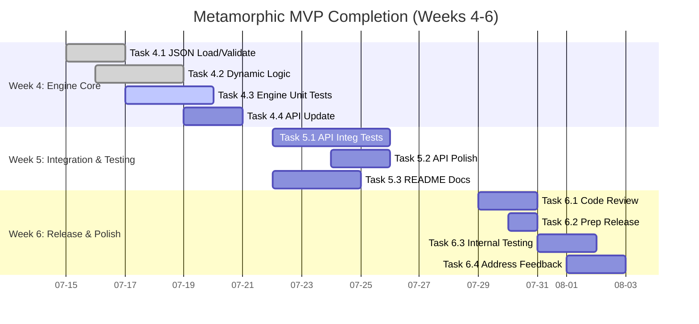

# Metamorphic Software Genesis Ecosystem 🚀

[](https://github.com/tomwolfe/metamorphic-core/actions/workflows/ci.yml)
[](LICENSE)
[](https://github.com/tomwolfe/metamorphic-core/milestones?direction=asc&sort=due_date&state=open)

**Version ∞: An Ever-Evolving Framework for Software Excellence** ✨

---

**🎯 CURRENT FOCUS & ROADBLOCK:**

*   **Goal:** Complete Phase 1 MVP ASAP (Target: End of Week 6).
*   **Critical Path:** Implementing the **fully JSON-configurable dynamic logic** within the `EthicalGovernanceEngine`. This is the **sole remaining major feature** for the MVP.
*   **Status:** Foundation laid (JSON loading, basic enforcement). Dynamic logic implementation is **IN PROGRESS (Week 4)**.
*   **See:** [Phase 1 MVP - Optimized Roadmap (Weeks 4-6)](#phase-1-mvp---optimized-roadmap-weeks-4-6) for immediate tasks.

---

**Driven by AI and guided by a comprehensive high-level specification and roadmap, the Metamorphic Software Genesis Ecosystem is redefining software development through self-evolving, ethical, and secure solutions.**

**Table of Contents**
* [Vision](#vision)
* [Key Objectives](#key-objectives)
* [Envisioned Workflow: From Concept to Code](#envisioned-workflow-from-concept-to-code)
* [Current Status (MVP Progress)](#current-status-mvp-progress)
* [Key Highlights of Current Capabilities](#key-highlights-of-current-capabilities)
* [Roadmap: Phase 1 MVP (Optimized for ASAP Completion)](#roadmap-phase-1-mvp-optimized-for-asap-completion)
    * [Phase 1 MVP Definition](#phase-1-mvp-definition)
    * [Phase 1 Deliverables](#phase-1-deliverables)
    * [Phase 1 MVP - Optimized Roadmap (Weeks 4-6)](#phase-1-mvp---optimized-roadmap-weeks-4-6)
        * [Strategy Notes (MVP Focus)](#strategy-notes-mvp-focus)
        * [Week 4: Configurable Ethical Engine Core - *Dynamic Policy Enforcement*](#week-4-configurable-ethical-engine-core---dynamic-policy-enforcement)
        * [Week 5: API Integration & Testing - *Verify Dynamic Behavior*](#week-5-api-integration--testing---verify-dynamic-behavior)
        * [Week 6: MVP Polish & Internal Release - *Deliver & Iterate*](#week-6-mvp-polish--internal-release---deliver--iterate)
    * [Gantt Chart: Phase 1 MVP (Weeks 4-6)](#gantt-chart-phase-1-mvp-weeks-4-6)
    * [Beyond MVP (Future Iterations)](#beyond-mvp-future-iterations)
* [Getting Started](#getting-started)
    * [Prerequisites](#prerequisites)
    * [Installation](#installation)
    * [Running the API Server](#running_the_api_server)
    * [Quickstart Guide](#quickstart_guide)
    * [System Requirements](#system-requirements)
* [API Endpoints](#api-endpoints)
    * [Sample MVP Request/Response - `/genesis/analyze-ethical`](#sample-mvp-requestresponse---genesisanalyze-ethical)
    * [Core API Endpoints](#core-api-endpoints)
* [Contributing](#contributing)
* [License](#license)
* [License and Compliance](#license-and-compliance)
* [Contact](#contact)
* [Disclaimer](#disclaimer)
* [Troubleshooting](#troubleshooting)
* [Terminology Footnotes](#terminology-footnotes)

---

## Vision <a name="vision"></a>

To create an AI-driven framework that autonomously generates, maintains, and evolves **secure, ethical, and high-performance** software solutions **from high-level specifications**, continuously improving its own capabilities through feedback and self-refinement.

## Key Objectives <a name="key-objectives"></a>

-   **Autonomous Generation:** Generate functional software applications directly from natural language or structured specifications.
-   **Ethical Governance:** Integrate and enforce **configurable** ethical policies throughout the development lifecycle.
-   **Automated Quality & Security:** Implement continuous, automated testing (unit, integration, E2E), code review (style, logic, security vulnerabilities), and **formal verification**.
-   **Self-Improvement:** Enable the framework to learn from analysis results, user feedback, and performance metrics to enhance its generation, analysis, and ethical enforcement capabilities.

## Envisioned Workflow: From Concept to Code <a name="envisioned-workflow-from-concept-to-code"></a>

1.  **Input**: High-level software description.
2.  **Refinement**: AI clarifies requirements.
3.  **Design**: Generate software architecture.
4.  **Generation**: Produce code adhering to best practices.
5.  **Validation (MVP Focus)**:
    *   Unit/Integration/E2E Tests (Placeholder Gen - `TestGenAgent`).
    *   Code Quality (Flake8 - `CodeReviewAgent`).
    *   Ethical Assessment (**Configurable Engine** - `EthicalGovernanceEngine` - **MVP Core Task**).
    *   Security Scans (ZAP DAST; Bandit static analysis deferred post-MVP).
6.  **Integration**: CI/CD via GitHub Actions.
7.  **Improvement**: Learn and adapt.

## Current Status (MVP Progress) <a name="current-status-mvp-progress"></a>

The ecosystem is actively under development, demonstrating core functionalities as an **AI-powered code analysis, ethical validation, and security scanning framework.**

**Phase 1 MVP Capabilities - Week 3 of Month 1 COMPLETE** ✅

The primary remaining task for the MVP is implementing the **fully JSON-configurable dynamic enforcement logic** within the `EthicalGovernanceEngine` (currently in progress - Week 4).

<details>
<summary>Click to expand Completed MVP Task Details (Weeks 1-3)</summary>

#### Key Milestones Achieved (Week 1 Month 1):
- **[✅] Operational `/genesis/analyze-ethical` API endpoint:** Functional API endpoint live.
    * **[✅] Basic code quality assessment (API v1.1):** Flake8 integration complete.
    * **[✅] Initial rule-based ethical analysis backbone:** Fundamental rule-based ethical analysis integrated (basic rules in code).
    * **[✅] Placeholder test-generation proof-of-concept:** `TestGenAgent` wired, generating placeholder pytest code.
    * **[✅] Basic JSON response structure:** Defined API response structure implemented.
    * **[✅] Daily Integration Testing:** Automated integration tests established.

#### Key Milestones Achieved (Week 2 Month 1):
- **[✅] `CodeReviewAgent` MVP - Flake8 Integration:** `CodeReviewAgent` fully integrated with Flake8.
    * **[✅] Flake8 execution via `subprocess`:** Implemented Flake8 execution.
    * **[✅] Basic Flake8 output parsing:** Implemented basic parsing for structured reporting.
    * **[✅] Unit tests for `CodeReviewAgent` (Flake8 MVP):** Developed focused unit tests.
    * **[✅] API Endpoint Integration (`/genesis/analyze-ethical`):** Integrated `CodeReviewAgent` into the API endpoint.
    * **[✅] Expanded Daily Integration Testing:** Expanded tests to validate `code_quality` response section.

#### Key Milestones Achieved (Week 3 Month 1):
- **[✅] `EthicalPolicyEngine` MVP Foundation - JSON Policy Loading & Basic Enforcement:** Foundational work for the configurable ethical engine completed.
    * **[✅] Task 3.1: JSON Schema & Example Ethical Policies Definition:** Defined `ethical_policy_schema.json` and created example policy files (`policies/`).
    * **[✅] Task 3.2: `EthicalPolicyEngine` - Basic Loading & Enforcement Implementation:** Implemented basic `EthicalGovernanceEngine` class with `load_policy_from_json` and initial `enforce_policy` method (using simple rule-based checks).
    * **[✅] Task 3.3: `EthicalPolicyEngine` - Unit Testing (Loading & Basic Enforcement):** Wrote unit tests verifying JSON loading and basic enforcement logic.
    * **[✅] Task 3.4: API Integration - `EthicalPolicyEngine` into Endpoint:** Integrated the basic engine into `/genesis/analyze-ethical`, loading a default policy and adding `ethical_analysis` section to the response.
    * **[✅] (Daily Integration Testing - *Expand*):** Expanded integration tests to verify the presence and basic structure of the `ethical_analysis` section in the API response.

#### Technical Foundations Live:
- **LLM Orchestration Layer (Gemini/Hugging Face):** Operational infrastructure for managing LLM interactions.
- **Security Scanning Integration (OWASP ZAP 2.12+):** Baseline security scanning functional using OWASP ZAP.
- **Knowledge Graph:** Dynamic Knowledge Graph operational (initial phase, content expansion ongoing).
- **Ethical Validation Framework**: Mechanisms established, leveraging a basic rule-based engine (with JSON loading foundation) and quantum-inspired state analysis. **Fully JSON-configurable policy enforcement is under active development.**
- **Code Analysis Agents**: `CodeReviewAgent` provides Flake8 analysis. Bandit integration present but commented out for MVP. `TestGenAgent` generates placeholder pytest code.
- **Managing Long AI Contexts**: Initial mechanisms implemented.
- **LLM Orchestration Layer**: Robust infrastructure manages LLM interactions.
- **Knowledge Graph**: Centralized repository for system knowledge.
- **CI/CD Integration**: Automated CI workflows using GitHub Actions.
- **Security Scanning**: OWASP ZAP integration provides DAST. Bandit integration commented out for MVP.
- **Formal Verification**: Initial Coq integration with compiled proofs.

</details>

## Key Highlights of Current Capabilities <a name="key-highlights-of-current-capabilities"></a>

- **Code Analysis**: Static analysis with Flake8 via API (`CodeReviewAgent`).
- **Security Scanning**: Automated DAST via OWASP ZAP integration.
- **Ethical Assessment**: Foundational rule-based engine with JSON loading (`EthicalGovernanceEngine`). **Configurable logic is the current focus.** Quantum-inspired analysis for initial insights.
- **LLM Powered Features**: Core functionalities leverage Google Gemini and Hugging Face.
- **CI/CD Pipeline**: Fully automated via GitHub Actions (tests, security scans, builds).
- **Knowledge Graph Backbone**: Operational KG for system knowledge.

**Note**: The immediate focus is completing the **JSON-configurable Ethical Policy Engine** for the MVP.

## Roadmap: Phase 1 MVP (Optimized for ASAP Completion) <a name="roadmap-phase-1-mvp-optimized-for-asap-completion"></a> 🚧

**Goal:** Complete the defined Phase 1 MVP (`/genesis/analyze-ethical` endpoint with a **fully JSON-configurable** Ethical Policy Engine, Flake8 code quality, and placeholder test generation) within the next 3 weeks.

#### Phase 1 MVP Definition <a name="phase-1-mvp-definition"></a>

A functional API endpoint (`/genesis/analyze-ethical`) capable of:
1.  Analyzing Python code for ethical concerns using a **dynamically configurable JSON policy engine** (`EthicalGovernanceEngine`).
2.  Providing Flake8 code quality assessment (`CodeReviewAgent`).
3.  Generating placeholder pytest tests (`TestGenAgent`).
4.  Exposing this functionality via the API.

#### Phase 1 Deliverables <a name="phase-1-deliverables"></a>

1.  Functional `/genesis/analyze-ethical` API endpoint with **dynamically configurable ethical analysis**.
2.  **Fully JSON-Configurable** `EthicalGovernanceEngine` loading policies and dynamically enforcing constraints (BiasRisk, TransparencyScore, Safety Boundary).

#### Phase 1 MVP - Optimized Roadmap (Weeks 4-6) <a name="phase-1-mvp---optimized-roadmap-weeks-4-6"></a>

*(Assumes Weeks 1-3 are complete)*

##### Strategy Notes (MVP Focus) <a name="strategy-notes-mvp-focus"></a>
*   **Laser Focus:** Only the **JSON-configurable `EthicalGovernanceEngine`** is blocking the MVP. Defer everything else (Bandit, SpecAnalyzer, Bias Detection).
*   **Leverage Foundations:** Build on Week 1-3 work. Avoid unnecessary refactoring.
*   **Self-Bootstrapping:** Use `TestGenAgent` for engine test skeletons; use `CodeReviewAgent` for code quality.
*   **Parallelize:** Update docs concurrently (Week 5). Develop integration tests incrementally.
*   **TDD Mindset:** Write tests early (Unit Wk4, Integration Wk5).
*   **"Good Enough" MVP:** Focus on *correct* dynamic enforcement based on JSON; sophistication can come later.

##### Week 4: Configurable Ethical Engine Core - *Dynamic Policy Enforcement* <a name="week-4-configurable-ethical-engine-core---dynamic-policy-enforcement"></a>
*   **[ ] Task 4.1 (P1 - Engine): Implement Robust JSON Policy Loading & Validation:** Enhance `EthicalGovernanceEngine.load_policy_from_json` with `jsonschema` validation and error handling.
*   **[ ] Task 4.2 (P1 - Engine): Implement Dynamic Enforcement Logic:** Refactor `EthicalGovernanceEngine.enforce_policy` to **dynamically** use thresholds/keywords/etc., from the loaded `policy_config`. Remove hardcoded rules.
*   **[ ] Task 4.3 (P2 - Testing): Write Comprehensive Engine Unit Tests:** Develop thorough unit tests for loading and dynamic enforcement. *(Self-Bootstrapping: Use `TestGenAgent` for test skeletons).*
*   **[ ] Task 4.4 (P2 - API): Update API Endpoint for Dynamic Policy Usage:** Modify `/genesis/analyze-ethical` to load/use policies dynamically and update the response accordingly.

##### Week 5: API Integration & Testing - *Verify Dynamic Behavior* <a name="week-5-api-integration--testing---verify-dynamic-behavior"></a>
*   **[ ] Task 5.1 (P1 - Testing): Write Comprehensive API Integration Tests:** Create integration tests verifying API behavior with different code snippets and *multiple dynamic policies*.
*   **[ ] Task 5.2 (P2 - API): Refine API Error Handling & Response:** Polish error handling (policy loading, engine errors) and response structure clarity.
*   **[ ] Task 5.3 (P3 - Docs - Concurrent): Update README API Documentation:** Update API examples and explanations in `README.md` to reflect dynamic policies and final response structure.

##### Week 6: MVP Polish & Internal Release - *Deliver & Iterate* <a name="week-6-mvp-polish--internal-release---deliver--iterate"></a>
*   **[ ] Task 6.1 (P1 - Quality): Final Code Review & Cleanup:** Review all MVP code. *(Self-Bootstrapping: Run `CodeReviewAgent` (Flake8) and address issues).*
*   **[ ] Task 6.2 (P1 - Release): Prepare MVP Internal Release Package:** Tag code, verify Docker build, write internal release notes.
*   **[ ] Task 6.3 (P2 - Testing): Conduct Internal MVP Testing:** Distribute MVP package internally, gather feedback.
*   **[ ] Task 6.4 (P2 - Polish): Address Critical MVP Feedback:** Fix critical bugs/usability issues found in internal testing.

#### Gantt Chart: Phase 1 MVP (Weeks 4-6) <a name="gantt-chart-phase-1-mvp-weeks-4-6"></a>
*(Assuming Week 4 starts 2024-07-15 for illustration)*


#### Beyond MVP (Future Iterations) <a name="beyond-mvp-future-iterations"></a>

*   Iterate on MVP feedback.
*   Enhance Ethical Engine (sophistication, more constraints).
*   Activate Deferred Features (Bandit, SpecAnalyzer, Bias Detection, GDPR/COPPA).
*   Improve Test Generation (`TestGenAgent` beyond placeholders).
*   Expand Formal Verification (Coq/Z3 integration).
*   Enhance Knowledge Graph usage.
*   Begin detailed Phase 2 planning.

## Getting Started <a name="getting-started"></a>

### System Requirements <a name="system-requirements"></a>
- **Python**: 3.11+ is required for optimal performance and compatibility.
- **Docker**: Optional, but recommended for running Redis caching and OWASP ZAP security scanning services.
- **API Keys**:
  - **Gemini API Key (Required):** Essential for utilizing the default Gemini Language Model provider.
  - **Hugging Face API Key (Optional):** Required if you intend to use the Hugging Face Language Model provider.

### Prerequisites <a name="prerequisites"></a>

- **Python 3.11+**: Ensure you have Python 3.11 or a later version installed on your system.
- **Docker and Docker Compose (Optional):** Docker is recommended for easily setting up Redis and OWASP ZAP. Install Docker and Docker Compose if you plan to use these services.
- **Google Gemini API Key (Required for Gemini LLM Provider):** Obtain an API key from Google AI Studio ([https://ai.google.dev/](https://ai.google.dev/)) to use the Gemini LLM provider.
- **Hugging Face API Key (Optional, for Hugging Face LLM Provider):** If you wish to use Hugging Face models, obtain an API key from Hugging Face ([https://huggingface.co/](https://huggingface.co/)).
- **GitHub API Key (Optional, for future GitHub integrations):** Required for future integrations with GitHub, such as repository analysis and code generation workflows.
- **OWASP ZAP API Key (Optional, for advanced OWASP ZAP security scan configurations):** Needed for advanced configurations and programmatic control of OWASP ZAP security scans.

### Installation <a name="installation"></a>

1.  **Clone the Repository**:

    ```bash
    git clone https://github.com/tomwolfe/metamorphic-core.git
    cd metamorphic-core
    ```

2.  **Set Up Environment Variables**:

    ```bash
    cp .env.example .env
    ```

    Modify the `.env` file with your API keys and desired configurations. At a minimum, set `GEMINI_API_KEY` if you are using the default Gemini LLM provider.

    ```env
    LLM_PROVIDER=gemini # or huggingface
    GEMINI_API_KEY=your_key_here
    # HUGGING_FACE_API_KEY=your_hf_api_key # Required if LLM_PROVIDER=huggingface
    # YOUR_GITHUB_API_KEY=your_github_token # Optional
    # ZAP_API_KEY=your_zap_api_key # Optional
    # DOCKERHUB_USERNAME=your_dockerhub_username # Optional

    # System configuration (adjust as needed)
    SAFETY_MARGIN=5
    QUANTUM_DEPTH=3
    ETHICAL_THRESHOLD=90
    PYTHONPATH=./src
    ```

3.  **Start Redis and ZAP (Optional, using Docker Compose):**

    If you intend to utilize Redis for caching or leverage advanced features of OWASP ZAP security scans locally, start these services using Docker Compose:

    ```bash
    # Ensure you have docker-compose.yml
    docker-compose up -d redis zap
    ```

4.  **Set Up Virtual Environment:**

    ```bash
    python -m venv venv
    source venv/bin/activate  # Linux/macOS
    # venv\Scripts\activate     # Windows
    ```

5.  **Install Dependencies:**

    ```bash
    pip install --upgrade pip
    pip install -r requirements/base.txt
    pip install -r requirements/dev.txt # Optional: for development dependencies (testing, linting)
    ```

### Running the API Server <a name="running_the_api_server"></a>

```bash
# Ensure your .env file is configured
# Activate your virtual environment if not already active
# source venv/bin/activate

python src/api/server.py
```

The API server will be accessible at [http://127.0.0.1:5000/](http://127.0.0.1:5000/) or [http://0.0.0.0:5000/](http://0.0.0.0:5000/).

### Quickstart Guide <a name="quickstart_guide"></a>

#### 1. Clone Repository
```bash
git clone https://github.com/tomwolfe/metamorphic-core.git
cd metamorphic-core
```

#### 2. Configure Environment
```bash
cp .env.example .env
# Edit .env and add your GEMINI_API_KEY (required) and other optional keys
```

#### 3. Setup Virtual Environment
```bash
python -m venv venv
source venv/bin/activate  # Linux/macOS
# venv\Scripts\activate     # Windows
```

#### 4. Install Dependencies
```bash
pip install --upgrade pip
pip install -r requirements/base.txt
# pip install -r requirements/dev.txt # If running tests/dev tools
```

#### 5. Run Server
```bash
python src/api/server.py
```

Visit `http://127.0.0.1:5000/genesis/health` in your browser or using `curl` to check the live API status.

Send a POST request to `http://127.0.0.1:5000/genesis/analyze-ethical` with JSON `{"code": "def hello():\n print('world')"}` to test the MVP endpoint.

## API Endpoints <a name="api-endpoints"></a>

For detailed API documentation (under development), refer to: [docs/api/api-endpoints.md](docs/api/api-endpoints.md)

| Endpoint                      | Method | Description                                                                     | Status (MVP)        |
| :---------------------------- | :----- | :------------------------------------------------------------------------------ | :------------------ |
| `/genesis/health`             | GET    | Check API server status. Returns `{"status": "ready"}`.                         | ✅ Working          |
| `/genesis/analyze-ethical`    | POST   | Analyzes Python code for ethical considerations (configurable) & code quality. | 🚧 **MVP Core Endpoint** (Configurable Engine in Progress - Wk 4) |
| `/genesis/solve-math`         | POST   | Test endpoint for demonstrating basic LLM math capabilities.                    | ✅ Working (Test)   |
| `/genesis/ethical/audit/{state_id}`   | GET    | Retrieve audit trail data (planned).                                            | ❌ Not Implemented |
| `/genesis/ethical/visualize/{state_id}` | GET    | Obtain visualization data (planned).                                      | ❌ Not Implemented |

**Note:** API functionality is primarily focused on the `/genesis/analyze-ethical` endpoint as part of the Phase 1 MVP. The **JSON-configurable ethical analysis** is the main feature currently under development (Week 4).

#### Sample MVP Request/Response - `/genesis/analyze-ethical` <a name="sample-mvp-requestresponse---genesisanalyze-ethical"></a>

**Request (Example using curl):**

```bash
curl --request POST \
  --url http://127.0.0.1:5000/genesis/analyze-ethical \
  --header 'Content-Type: application/json' \
  --data '{"code":"import os\ndef potentially_unsafe():\n  os.system(\"echo unsafe\")"}'
```

**Response (Example - *Target state after Week 4/5, using dynamic policy*):**
```json
{
  "status": "rejected",
  "code_quality": {
    "output": "",
    "static_analysis": []
  },
  "ethical_analysis": {
    "policy_name": "Strict Bias Risk Policy",
    "description": "Zero tolerance for biased language",
    "BiasRisk": {
      "status": "compliant",
      "threshold": 0.1,
      "enforcement_level": 3
    },
    "TransparencyScore": {
      "status": "violation",
      "threshold": 0.5,
      "enforcement_level": 2
    },
    "SafetyBoundary": {
      "status": "violation",
      "threshold": 0.8,
      "enforcement_level": 2
    }
  },
  "generated_tests_placeholder": "import pytest\n\ndef test_placeholder_function_positive():\n    pytest.skip(\"Placeholder test: Positive case\")\n    assert True\n\ndef test_placeholder_function_negative():\n    pytest.skip(\"Placeholder test: Negative case\")\n    assert True\n"
}
```

#### Core API Endpoints <a name="core-api-endpoints"></a>
<details>
<summary>Phase 1 MVP API Overview</summary>

| Endpoint                          | Method | Status (Optimized MVP) | Description |
| :-------------------------------- | :----- | :--------------------- | :---------- |
| **/genesis/health**               | GET    | ✅ Working             | Basic liveness check endpoint. |
| **/genesis/analyze-ethical**      | POST   | 🚧 **MVP Core**        | Core MVP endpoint: <br> • Flake8 Code Quality (`CodeReviewAgent`). <br> • **Configurable** Ethics Assessment (`EthicalGovernanceEngine` - **In Progress Wk 4**). <br> • Placeholder Test Generation (`TestGenAgent`). |
| /genesis/solve-math               | POST   | ✅ Working (Test)      | Basic LLM integration demo. |
| /genesis/ethical/audit/{state_id} | GET    | ❌ Not Implemented     | Future endpoint for ethics audit history. |
| /genesis/ethical/visualize/*      | ALL    | ❌ Not Implemented     | Future endpoint for maturity visualizations. |

*Example Request (using curl):*
```bash
curl -X POST \
  http://127.0.0.1:5000/genesis/analyze-ethical \
  -H "Content-Type: application/json" \
  -d '{"code": "def gcd(a,b): return a if b==0 else gcd(b,a%b)"}'
```
</details>

## Contributing <a name="contributing"></a>
- **Focus:** Contributions should align with the **Phase 1 MVP - Optimized Roadmap (Weeks 4-6)**, primarily focusing on the `EthicalGovernanceEngine` implementation and testing.
- **Good First Issues:** Look for tasks related to unit tests (Task 4.3) or integration tests (Task 5.1) for the ethical engine.
- Verify implementation details against the optimized roadmap.

**Want visibility for your contributions**? Our contributor acknowledgment badge initiative will be launched in Phase 2 to recognize and highlight community contributions.

## License <a name="license"></a>

This project is licensed under the GNU Affero General Public License v3.0 (AGPLv3). See `LICENSE` file for full license text and details.

## License and Compliance <a name="license-and-compliance"></a>
**Developed under AGPLv3**: This project is open-source and licensed under the AGPLv3 license. Refer to the `LICENSE` file for comprehensive license terms.

This project is designed to adhere to **OECD AI Principles** and leverages policy schemas that are intended to be compliant with GPDR/Brexit specifications, focusing on ethical and responsible AI development.

## Contact <a name="contact"></a>

For project-related inquiries, please contact: tomwolfe@gitproject.devices

## Disclaimer <a name="disclaimer"></a>

**This project is currently in its active MVP development phase and is not intended for production use.** Functionality is intentionally limited to the features explicitly outlined in the **Phase 1 MVP - Optimized Roadmap**. The **sole remaining major feature** for the MVP is the completion of the **JSON-configurable Ethical Policy Engine (Weeks 4-6)**. API endpoints and response formats may evolve. Ethical analysis and test generation capabilities are foundational and will be enhanced post-MVP.

---

## Troubleshooting <a name="troubleshooting"></a>

**Common Issues & Solutions:**

*   **LLM API Key Errors:** Verify API keys in `.env` and the `LLM_PROVIDER` setting. Ensure keys are valid and active. Check for typos.
*   **Docker Compose Issues (Redis/ZAP):** Ensure Docker is running, check for port conflicts (`docker ps`), and examine logs (`docker-compose logs redis` or `docker-compose logs zap`). Make sure `docker-compose.yml` exists and is configured.
*   **Python Dependency Errors:** Ensure Python 3.11+ is used and the virtual environment (`venv`) is activated. Try `pip install --upgrade pip` then `pip install -r requirements/base.txt` (and `dev.txt` if needed).
*   **API Connection Errors:** Ensure the Flask server (`python src/api/server.py`) is running. Check the host/port (usually `http://127.0.0.1:5000`). If using Docker, ensure the container is running and ports are mapped correctly. Check firewall settings.
*   **Ethical Policy Errors:** Ensure policy files exist in the `policies/` directory and conform to `ethical_policy_schema.json`. Check file paths used in `src/api/routes/ethical_endpoints.py` (e.g., `load_default_policy`). Verify JSON syntax.

## Terminology Footnotes <a name="terminology-footnotes"></a>

**Quantum-inspired analysis**: <a name="footnote-quantum-inspired"></a><sup>1</sup> Refers to analytical methodologies that leverage principles inspired by quantum computing (like superposition and entanglement) to explore multiple ethical risk pathways and potential system states simultaneously within the ethical assessment engine. In practical terms for this project, it involves using quantum circuit representations (simulated) to model the interplay of different ethical factors (bias, safety, transparency) and assess the overall ethical posture, drawing inspiration from quantum state exploration concepts rather than requiring actual quantum hardware at this stage.

---
