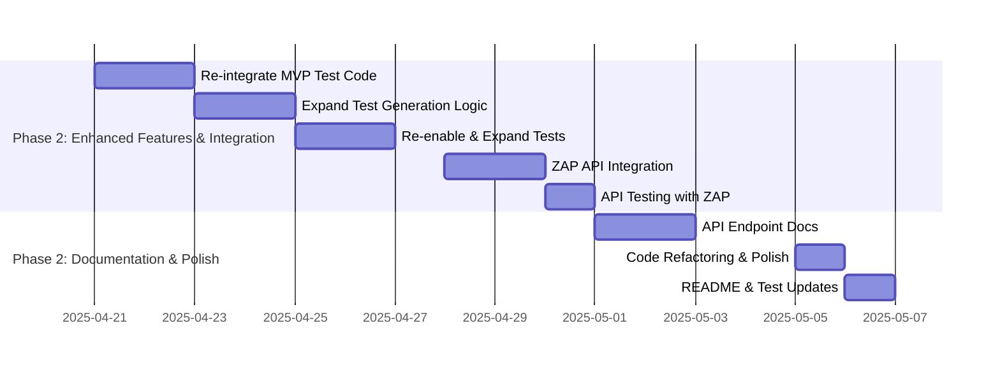

# Development Roadmap

This document outlines the development roadmap for the Metamorphic Software Genesis Ecosystem, focusing on the Phase 1 MVP and future iterations.

**🎯 CURRENT FOCUS (Week 7 - Start of Phase 2): Transition to Phase 2 - Planning & Initial Feature Enhancements - MVP RELEASED INTERNALLY ✅**

---

## Roadmap: Phase 2 - Iteration 1 (Weeks 7-9)  🚀

**Iteration Goal:** Deliver Enhanced Test Generation and Security Integration into the `/genesis/analyze-ethical` API, with detailed API documentation, by the end of Week 9.

**Success Metrics for Iteration 1:**
*   **Enhanced Test Generation:** Unit and integration tests for `TestGeneratorAgent` re-integrated and expanded, achieving >80% code coverage for the agent.
*   **Security Integration:** ZAP baseline scan integrated into `/genesis/analyze-ethical` API, with API response including a `security_analysis` section. ZAP scan completes successfully in CI pipeline without critical errors.
*   **API Documentation:** Detailed documentation for `/genesis/analyze-ethical` API endpoint completed and merged into `docs/api/api-endpoints.md`.

**Potential Risks & Mitigation (Iteration 1):**
* **Risk 1: Re-integration of MVP Test Code Complexity:**  Uncommenting and expanding MVP test code might reveal unexpected complexities or integration issues.
    * **Mitigation:** Start with a thorough code review of the commented-out sections. Re-integrate incrementally, testing each part before moving to the next. Allocate extra time in Week 7 for initial re-integration and debugging.
* **Risk 2: Security Agent API Integration Challenges:**  Integrating ZAP security scans into the API might encounter API compatibility issues or unexpected ZAP behavior within the Flask app context.
    * **Mitigation:** Start security integration early in Week 8. Prioritize synchronous implementation first to simplify initial integration.  Thoroughly test the API endpoint with ZAP integration in a dedicated testing environment before merging to `main`.
* **Risk 3: Documentation Delays:** API documentation can be time-consuming and might get delayed.
    * **Mitigation:** Start documentation in parallel with feature development in Week 7.  Assign documentation tasks to team members specifically. Use a documentation-generation tool (if applicable) to streamline the process.

**Phase 2 - Iteration 1 Focus:**

1. **Enhanced Test Generation (Week 7-8):**
   * **Task 1.1 (Week 7 - 1 day):** Code Review & Re-integrate MVP Test Code
   * **Task 1.2 (Week 7 - 2 days):** Basic Expansion of Test Generation Logic
   * **Task 1.3 (Week 8 - 2 days):** Re-enable & Expand Unit/Integration Tests
   * **Review Checkpoint (End of Week 7):** Review progress on test re-integration and expansion. Assess code coverage improvements.
   * **Target Deliverable:** Basic intelligent test generation for Python functions, re-integrated and tested.

2. **Security Integration (Week 8-9):**
   * **Task 2.1 (Week 8 - 2 days):** ZAP Security Agent API Integration (Synchronous)
   * **Task 2.2 (Week 9 - 1 day):** API Endpoint Testing with ZAP Integration
   * **CI Pipeline Integration Check (Throughout Week 8-9):** Continuously monitor and ensure the CI pipeline (ZAP Baseline Scan) remains functional and integrates with the new API changes.
   * **Review Checkpoint (Mid-Week 8):** Review initial API integration progress. Test ZAP scan triggering and data flow within the API endpoint.
   * **Target Deliverable:** Security Integration into `/genesis/analyze-ethical` API with synchronous ZAP baseline scans and basic reporting in API response.

3. **Documentation & Refactoring (Week 9):**
   * **Task 3.1 (Week 9 - 2 days):** Detailed `/genesis/analyze-ethical` API Documentation
   * **Task 3.2 (Week 9 - 1 day):** Code Refactoring & Flake8 Polish
   * **Task 3.3 (Week 9 - 1 day):** README & Integration Test Updates
   * **Final Review & Sign-off (End of Week 9):** Review all iteration deliverables against success metrics. Get sign-off for iteration completion.
   * **Target Deliverable:** Detailed API documentation, code refactoring, updated README and integration tests.

#### Implementation Details

- **Test Repurposing**: Use `CodeReviewAgent` (Flake8) to validate generated test quality (ongoing).
- **Self-Bootstrapping**: Use existing agents to improve new features (ongoing).
- **Resource Allocation**: Dev 1 (Person A) for Test Generation and Documentation (Tasks 1 & 3). Dev 2 (Person B) for Security Integration (Task 2).
- **Mid-Week Progress Review:** Schedule a brief progress review meeting mid-week (e.g., Wednesday afternoon) to check progress against tasks, identify any roadblocks, and make necessary adjustments to the plan for the rest of the week.

##### Week 9 Gantt Tasks

---

## High-Level Roadmap: Phase 2 and Beyond (Weeks 10+)  🔭

**Phase 2 - Iteration 2 (Weeks 10-12): Enhanced Agents & Knowledge Graph**
*   **Goal:** Improve agent intelligence and KG utilization.
    *   Tasks:  Implement advanced test generation logic, enhance `CodeReviewAgent` with Bandit and Semgrep, expand KG schema to store security findings and test cases, refine LLM orchestration for context management.
    *   Success Metrics:  Improved test coverage (target >90% for core modules), SAST integration functional, KG populated with security and test data, demonstrable improvement in LLM context handling.

**Phase 2 - Iteration 3 (Weeks 13-15):  Ethical Governance & API Expansion**
*   **Goal:**  Deepen ethical governance and expand API capabilities.
    *   Tasks: Implement Bias Detection & Mitigation Module, integrate Ethical Governance Engine more deeply into agents, expand API endpoints to include `/genesis/generate-code` (placeholder), `/genesis/security-scan` (placeholder).
    *   Success Metrics:  Bias detection module functional (initial version), Ethical Governance Engine integrated into `CodeGenerationAgent` (placeholder) and `SecurityAgent`, new API endpoints documented (placeholders implemented).

**Phase 3 (Weeks 16-20):  Self-Improvement & Formal Verification**
*   **Goal:** Enable self-improvement and integrate formal verification.
    *   Tasks: Implement Continuous Learning Core (basic version), integrate Formal Verification Engine (Coq proofs for critical logic), implement basic Self-Monitoring & Adaptive Healing Subsystem.
    *   Success Metrics:  Basic self-improvement loop demonstrated (e.g., agent performance metrics tracking), Coq proofs compiling in CI for core modules, Self-Monitoring subsystem logging basic metrics.

**Phase 4 (Long-Term Vision - Weeks 20+): Quantum Integration & Community Growth**
*   **Goal:** Explore quantum computing integration and foster community growth.
    *   Tasks: Research quantum algorithms for optimization and risk prediction, develop Community Contribution Platform (basic version), explore localization and multi-LLM support.
    *   Success Metrics:  Proof-of-concept quantum algorithm integration, Community Contribution Platform MVP launched, initial investigation into localization and multi-LLM support completed.

**Overall Project Success Metrics (Phase 4 Completion):**
*   **Software Quality & Security:** Achieve >99% test coverage for core modules, zero high-severity vulnerabilities detected in ZAP/SAST scans, initial formal verification proofs for critical logic.
*   **Development Efficiency & Speed:** Demonstrate a measurable improvement in development cycle time compared to baseline (TBD).
*   **Ethical Compliance & Transparency:** Achieve 100% adherence to defined ethical policies in generated code (automated checks), Transparency Score consistently above target threshold.
*   **Community Engagement:** Active community contributions (metrics TBD - e.g., number of contributors, pull requests).

---
