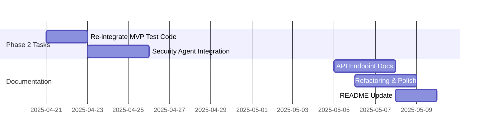

# Development Roadmap

This document outlines the development roadmap for the Metamorphic Software Genesis Ecosystem, focusing on the Phase 1 MVP and future iterations.

**🎯 CURRENT FOCUS (Week 7 - Start of Phase 2): Transition to Phase 2 - Planning & Initial Feature Enhancements - MVP RELEASED INTERNALLY ✅**

---

## Roadmap: Phase 1 MVP (Optimized for ASAP Completion)  🚧

**Goal:** Complete the defined Phase 1 MVP (`/genesis/analyze-ethical` endpoint with a **fully JSON-configurable** Ethical Policy Engine, **Flake8 code quality**, and placeholder test generation) **this week** (by end of Week 6 - Mid-April 2025).

#### Phase 1 MVP Definition 

A functional API endpoint (`/genesis/analyze-ethical`) capable of:
1. Analyzing Python code for ethical concerns using a **dynamically configurable JSON policy engine** (`EthicalGovernanceEngine`).
2. Providing **Flake8 code quality assessment** (`CodeReviewAgent`).
3. Generating placeholder pytest tests (`TestGenAgent`).
4. Exposing this functionality via the API.

#### Phase 1 Deliverables 

1. Functional `/genesis/analyze-ethical` API endpoint with **dynamically configurable ethical analysis** and **Flake8 code quality checks**.
2. **Fully JSON-Configurable** `EthicalGovernanceEngine` loading policies and dynamically enforcing constraints (BiasRisk, TransparencyScore, Safety Boundary).
3. Integrated `CodeReviewAgent` providing Flake8 results within the API response.

##### Strategy Notes (MVP Focus & Simplifications) 
* **Laser Focus:** Only the **JSON-configurable `EthicalGovernanceEngine`** integration, **`CodeReviewAgent` (Flake8) integration**, and testing are blocking the MVP. Defer everything else (Bandit, SpecAnalyzer, Bias Detection).
* **Leverage Foundations:** Build on Week 1-4 work. Avoid unnecessary refactoring.
* **Self-Bootstrapping:** Use `TestGenAgent` for engine test skeletons; use `CodeReviewAgent` for code quality.
* **Parallelize:** Update docs concurrently (Week 5). Develop integration tests incrementally.
* **TDD Mindset:** Write tests early (Unit Wk4, Integration Wk5/6).
* **"Good Enough" MVP:** Focus on *correct* dynamic enforcement based on JSON and basic Flake8 reporting; sophistication can come later.
* **Intentional Simplifications:** Certain non-critical features and complex test scenarios were intentionally *commented out* or *skipped*. These are explicitly noted as `COMMENT BLOCK START` and `pytest.mark.skip(...)`. Phase 2 will re-integrate these.
* **MVP Scope - Code Quality Focus:** Phase 1 prioritized core ethical policy engine and basic *code quality* reporting via Flake8. Security scanning (Bandit, ZAP) and test generation sophistication are deferred to future phases.

#### Week 4: Configurable Ethical Engine Core - *Dynamic Policy Enforcement*  - **COMPLETE ✅** (Completed 2025-04-04)
* [✅] Task 4.1: Policy loading/validation
* [✅] Task 4.2: Dynamic enforcement logic
* [✅] Task 4.3: Engine unit tests
* [✅] Task 4.4: API endpoint updates

#### Week 5: API Integration & Testing - *Verify Dynamic Behavior*  - **COMPLETE ✅** (Completed 2025-04-11)
* [✅] Task 5.1: Integration tests
* [✅] Task 5.2: Error handling
* [✅] Task 5.3: Documentation updates

#### Week 6: MVP Polish & Internal Release - *Deliver & Iterate*  - **COMPLETE ✅** (Completed 2025-04-18)
* Task 6.1-6.4: Code review, release prep, feedback incorporation

---

## Roadmap: Phase 2 - Iteration 1 (Weeks 7-9)  🚀

**Goal:** Enhance MVP capabilities through iterative improvements while establishing self-bootstrapping processes.

### Phase 2 - Iteration 1 Focus

1. **Enhanced Test Generation**:
   * Re-integrate and expand MVP test generation logic
   * Tasks include uncommenting code from `src/core/agents/test_generator.py` and re-enabling skipped tests
   * Target: Basic intelligent test generation for Python functions
   * Risk mitigation for code re-integration

2. **Security Integration**:
   * Integrate ZAP security scans into `/genesis/analyze-ethical` endpoint
   * API now includes `"security_analysis"` section with ZAP findings
   * Synchronous scan implementation first, with ASYNC in Phase 2.2
   * CI pipeline dependency considerations

3. **Documentation & Refactoring**:
   * Detailed `/genesis/analyze-ethical` API documentation
   * Flake8 refinements for new code
   * README and integration test updates

#### Implementation Details

- **Test Repurposing**: Use `CodeReviewAgent` (Flake8) to validate generated test quality
- **Self-Bootstrapping**: Use existing agents to improve new features
- **Resource Allocation**: Dev 1 for Tests and Docs, Dev 2 for Security

##### Week 9 Gantt Tasks

