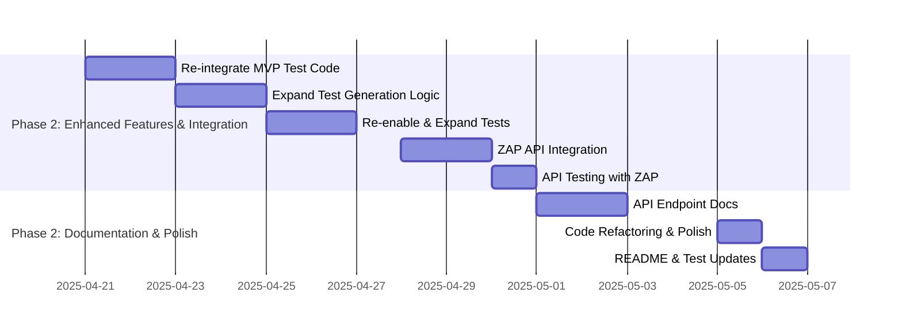

# Development Roadmap

This document outlines the development roadmap for the Metamorphic Software Genesis Ecosystem, focusing on the Phase 1 MVP and future iterations.

**🎯 CURRENT FOCUS (Week 7 - Start of Phase 2): Transition to Phase 2 - Planning & Initial Feature Enhancements - MVP RELEASED INTERNALLY ✅**

---

## Roadmap: Phase 2 - Iteration 1 (Weeks 7-9) 🚀

**Iteration Goal:** Deliver Enhanced Test Generation and Security Integration into the `/genesis/analyze-ethical` API, with detailed API documentation, by the end of Week 9.

**Success Metrics for Iteration 1:**
*   **Enhanced Test Generation:** Unit and integration tests for `TestGeneratorAgent` re-integrated and expanded, achieving >80% code coverage for the agent.
*   **Security Integration:** ZAP baseline scan integrated into `/genesis/analyze-ethical` API, with API response including a `security_analysis` section. ZAP scan completes successfully in CI pipeline without critical errors.
*   **API Documentation:** Detailed documentation for `/genesis/analyze-ethical` API endpoint completed and merged into `docs/api/api-endpoints.md`.

**--- LLM INSTRUCTION: TASK SELECTION ---**
**LLM INSTRUCTION: Identify the next smallest, actionable sub-task within "Phase 2 - Iteration 1". Prioritize tasks in the order they are listed. Focus on tasks that can be completed within a reasonable timeframe (e.g., a few hours).**
**--- END LLM INSTRUCTION ---**

**Phase 2 - Iteration 1 Focus:**

1. **Enhanced Test Generation (Week 7-8) - NEXT ACTIONABLE TASK - HIGH PRIORITY SUB-TASK:**
   * **Task 1.1 (Week 7 - 1 day):** Code Review & Re-integrate MVP Test Code - **SMALLEST ACTIONABLE SUB-TASK**
   * **Task 1.2 (Week 7 - 2 days):** Basic Expansion of Test Generation Logic
   * **Task 1.3 (Week 8 - 2 days):** Re-enable & Expand Unit/Integration Tests
   * **Review Checkpoint (End of Week 7):** Review progress on test re-integration and expansion. Assess code coverage improvements.
   * **Target Deliverable:** Basic intelligent test generation for Python functions, re-integrated and tested.

2. **Security Integration (Week 8-9):**
   * **Task 2.1 (Week 8 - 2 days):** ZAP Security Agent API Integration (Synchronous)
   * **Task 2.2 (Week 9 - 1 day):** API Endpoint Testing with ZAP Integration
   * **CI Pipeline Integration Check (Throughout Week 8-9):** Continuously monitor and ensure the CI pipeline (ZAP Baseline Scan) remains functional and integrates with the new API changes.
   * **Review Checkpoint (Mid-Week 8):** Review initial API integration progress. Test ZAP scan triggering and data flow within the API endpoint.
   * **Target Deliverable:** Security Integration into `/genesis/analyze-ethical` API with synchronous ZAP baseline scans and basic reporting in API response.

3. **Documentation & Refactoring (Week 9):**
   * **Task 3.1 (Week 9 - 2 days):** Detailed `/genesis/analyze-ethical` API Documentation
   * **Task 3.2 (Week 9 - 1 day):** Code Refactoring & Flake8 Polish
   * **Task 3.3 (Week 9 - 1 day):** README & Integration Test Updates
   * **Final Review & Sign-off (End of Week 9):** Review all iteration deliverables against success metrics. Get sign-off for iteration completion.
   * **Target Deliverable:** Detailed API documentation, code refactoring, updated README and integration tests.

#### Implementation Details

- **Test Repurposing**: Use `CodeReviewAgent` (Flake8) to validate generated test quality (ongoing).
- **Self-Bootstrapping**: Use existing agents to improve new features (ongoing).
- **Resource Allocation**: Dev 1 (Person A) for Test Generation and Documentation (Tasks 1 & 3). Dev 2 (Person B) for Security Integration (Task 2).
- **Mid-Week Progress Review:** Schedule a brief progress review meeting mid-week (e.g., Wednesday afternoon) to check progress against tasks, identify any roadblocks, and make necessary adjustments to the plan for the rest of the week.

##### Week 9 Gantt Tasks

---

## High-Level Roadmap: Phase 2 and Beyond (Weeks 10+)  🔭

**Phase 2 - Iteration 2 (Weeks 10-12): Enhanced Agents & Knowledge Graph**
*   **Goal:** Improve agent intelligence and KG utilization.
    *   Tasks:  Implement advanced test generation logic, enhance `CodeReviewAgent` with Bandit and Semgrep, expand KG schema to store security findings and test cases, refine LLM orchestration for context management.
    *   Success Metrics:  Improved test coverage (target >90% for core modules), SAST integration functional, KG populated with security and test data, demonstrable improvement in LLM context handling.

**Phase 2 - Iteration 3 (Weeks 13-15):  Ethical Governance & API Expansion**
*   **Goal:**  Deepen ethical governance and expand API capabilities.
    *   Tasks: Implement Bias Detection & Mitigation Module, integrate Ethical Governance Engine more deeply into agents, expand API endpoints to include `/genesis/generate-code` (placeholder), `/genesis/security-scan` (placeholder).
    *   Success Metrics:  Bias detection module functional (initial version), Ethical Governance Engine integrated into `CodeGenerationAgent` (placeholder) and `SecurityAgent`, new API endpoints documented (placeholders implemented).

**Phase 3 (Weeks 16-20):  Self-Improvement & Formal Verification**
*   **Goal:** Enable self-improvement and integrate formal verification.
    *   Tasks: Implement Continuous Learning Core (basic version), integrate Formal Verification Engine (Coq proofs for critical logic), implement basic Self-Monitoring & Adaptive Healing Subsystem.
    *   Success Metrics:  Basic self-improvement loop demonstrated (e.g., agent performance metrics tracking), Coq proofs compiling in CI for core modules, Self-Monitoring subsystem logging basic metrics.

**Phase 4 (Long-Term Vision - Weeks 20+): Quantum Integration & Community Growth**
*   **Goal:** Explore quantum computing integration and foster community growth.
    *   Tasks: Research quantum algorithms for optimization and risk prediction, develop Community Contribution Platform (basic version), explore localization and multi-LLM support.
    *   Success Metrics:  Proof-of-concept quantum algorithm integration, Community Contribution Platform MVP launched, initial investigation into localization and multi-LLM support completed.

**Overall Project Success Metrics (Phase 4 Completion):**
*   **Software Quality & Security:** Achieve >99% test coverage for core modules, zero high-severity vulnerabilities detected in ZAP/SAST scans, initial formal verification proofs for critical logic.
*   **Development Efficiency & Speed:** Demonstrate a measurable improvement in development cycle time compared to baseline (TBD).
*   **Ethical Compliance & Transparency:** Achieve 100% adherence to defined ethical policies in generated code (automated checks), Transparency Score consistently above target threshold.
*   **Community Engagement:** Active community contributions (metrics TBD - e.g., number of contributors, pull requests).

---

## Development Process & Methodology

### Iterative Grading for Quality-Driven Development

To ensure the highest levels of software quality, **verifiable ethics**, and to foster a culture of continuous improvement and reliability, we employ an **Iterative Grading Process** throughout the development lifecycle. This process is integral to executing each phase and iteration of the roadmap:

1.  **Task Implementation:** Development tasks, as defined in each roadmap iteration, are implemented by the assigned developer(s).
2.  **Multi-Dimensional Grading (by Reviewer/Lead - Potentially AI-Augmented):** Once a task is implemented, a designated reviewer (initially project lead, potentially augmented or even partially automated by AI-powered tools in the future) rigorously assesses the changes. This assessment results in a percentage grade, reflecting a **combined evaluation across multiple quality dimensions**, with a probability percentage assigned to each:
    *   **Probability of Non-Regression:**  *Estimate* (initially qualitative, potentially data-driven later) the likelihood that the changes have *not* introduced new bugs or broken existing functionality. Factors considered include code complexity, test coverage of the changes (especially unit and integration tests), and potential impact on core system components. **(Probability: \[Nearest Percent]%)**
    *   **Probability of Test Success:** *Estimate* the likelihood that *all* relevant automated tests (unit tests, integration tests, etc.) will pass *after* these changes are merged. This is based on the tests provided with the changes and the reviewer's understanding of the existing test suite. **(Probability: \[Nearest Percent]%)**
    *   **Code Style Compliance Probability:**  Estimate the probability that the code changes fully comply with the defined code style guidelines, measured by (e.g.) **Flake8 Issue Count** (lower is better, aiming for zero issues for 100% probability). **(Probability: \[Nearest Percent]%)**. **Example Feedback: "Flake8 compliance is excellent" (100% probability) or "Code Style Compliance Probability is 75% - Address Flake8 warnings in module X, particularly regarding line length to reach 100%".**
    *   **Ethical Policy Compliance Probability:** Estimate the probability that the code changes fully comply with the defined ethical policies, measured by (e.g.) **Ethical Policy Compliance Status** from the Ethical Governance Engine (status should be "compliant" for all relevant policies indicating 100% probability). **(Probability: \[Nearest Percent]%)**. **Example Feedback: "Ethical Policy Compliance Probability is 100% - Ethical Policy checks passed for all configured policies" or "Ethical Policy Compliance Probability is 60% - Ethical Policy 'BiasRisk' check failed - review and mitigate bias issues identified in section Y to reach 100%".**
    *   **Probability of Security Soundness:** *Estimate* (initially qualitative, potentially more quantitative in later phases with SAST/DAST integration) the likelihood that the changes do not introduce new security vulnerabilities. This is based on code review, understanding of security best practices, and consideration of potential attack vectors. **(Probability: \[Nearest Percent]%)**.  *(Note: Security Soundness Probability is initially a more qualitative assessment, aiming for increasing quantification in future roadmap phases.)*

    The **overall percentage grade represents a holistic judgment of quality and confidence**, combining these multi-dimensional probability estimates and qualitative assessments. *(Future iterations may explore more quantitative or AI-driven methods for calculating this overall score, potentially using weighted averages or more sophisticated aggregation techniques.)*
3.  **Actionable Feedback & Grade Report (Example):** The reviewer provides specific, actionable feedback alongside the percentage grade in a report. This feedback clearly identifies:
        *   **Strengths:** What aspects of the implementation are well-done and contribute to project goals (e.g., "Code is well-structured and clearly addresses task requirements, **Code Style Compliance Probability: 95% (Excellent, only minor Flake8 warnings remain)**, **Ethical Policy Compliance Probability: 100% (All checks passed)**, Probability of Non-Regression: 95% - Good test coverage for core logic"). *(Strengths examples now include probability percentages for style and ethics metrics)*
        *   **Areas for Improvement:** Concrete steps the developer can take to improve code quality, reduce risk, and increase the probability-based grade (e.g., "Add more unit tests to cover edge cases in function X to increase **Probability of Test Success** to 90%+", "Refactor function Y for better readability based on Flake8 recommendations to achieve **100% Code Style Compliance Probability**", "Address ethical policy violation related to BiasRisk in module Z to achieve **100% Ethical Policy Compliance Probability**", "Review section W for potential security vulnerabilities to increase **Probability of Security Soundness**"). This feedback is directly linked to increasing probability percentages across all quality dimensions.
4.  **Iterative Refinement & Re-Grading:** The developer uses the feedback to refine the implementation. This may involve code refactoring, adding more tests, clarifying documentation, or addressing specific concerns raised in the review. The revised work is then resubmitted for grading, initiating a new iteration of the process.
5.  **Targeting 100% Grade (and High Probability Percentages Across All Dimensions):** This iterative loop of implementation, grading, feedback, and refinement continues until the work achieves a grade of **100%** and demonstrates high probability percentages across *all* quality dimensions. A 100% grade signifies that the changes are deemed to meet the highest quality standards across all dimensions: minimal risk of regressions, high confidence in test success, excellent code style, full alignment with project ethics, and strong security soundness, based on the current assessment process.

**--- LLM INSTRUCTION: SOLUTION GENERATION & SELF-ASSESSMENT ---**
**LLM INSTRUCTION: For the selected task (e.g., "Code Review & Re-integrate MVP Test Code"), generate a proposed solution (code changes, documentation updates, etc.). After generating the solution, perform a self-assessment using the following metrics (refer to the "Iterative Grading Process" section above for metric definitions, and importantly, the "Multi-Dimensional Quality and Risk Assessment" in `CONTRIBUTING.md`):**

*   **Probability of Non-Regression:**  Estimate the probability (percentage) that the changes will not break existing functionality.
*   **Probability of Test Success:** Estimate the probability (percentage) that existing and newly written tests will pass after applying the changes.
*   **Code Style Compliance Probability:** Estimate the probability (percentage) that the generated code fully complies with PEP 8 and Flake8 guidelines.
*   **Ethical Policy Compliance Probability:**  Estimate the probability (percentage) that the generated code complies with the project's defined ethical policies (refer to SPECIFICATION.md and CONTRIBUTING.md for policy details).
*   **Probability of Task Completion:** Estimate the probability (percentage) that the proposed solution fully addresses the selected roadmap task.

**Assign a percentage grade for each metric (0-100%). Provide a brief justification for each grade. Then, calculate an overall percentage grade (you can use an average, or a weighted average if weights are defined elsewhere in the documentation).  Remember to consider the "Iterative Grading Process" from `CONTRIBUTING.md` as the benchmark for your assessment.**

**--- END LLM INSTRUCTION ---**

**--- LLM INSTRUCTION: USER ACTIONABLE STEPS ---**
**LLM INSTRUCTION: Generate a numbered list of "User Actionable Steps" that the user needs to perform to implement and verify your proposed solution.  These steps should include:**

1.  **Specific code modifications:**  Provide code snippets or diffs if applicable.
2.  **Testing instructions:**  Commands to run tests (e.g., `pytest tests/integration/test_api_mvp_endpoint.py`).
3.  **Code quality checks:**  Commands to run `flake8`.
4.  **Security checks:**  Instructions to run ZAP scan (if relevant to the task).
5.  **Ethical governance checks:**  Steps to manually review or automatically check ethical policy compliance (if applicable).
6.  **Documentation updates:**  Instructions to update relevant documentation files (e.g., `docs/api/api-endpoints.md`, `README.md`).

**Ensure the steps are clear, concise, and actionable for a developer to follow.  These steps are crucial for the user to *actually* implement and *verify* your proposed solution, ensuring it aligns with the project's standards.  Note that some of these steps, like running `flake8` or ZAP scans, could potentially be automated further in future iterations as part of the project's self-bootstrapping capabilities.**
**--- END LLM INSTRUCTION ---**

---