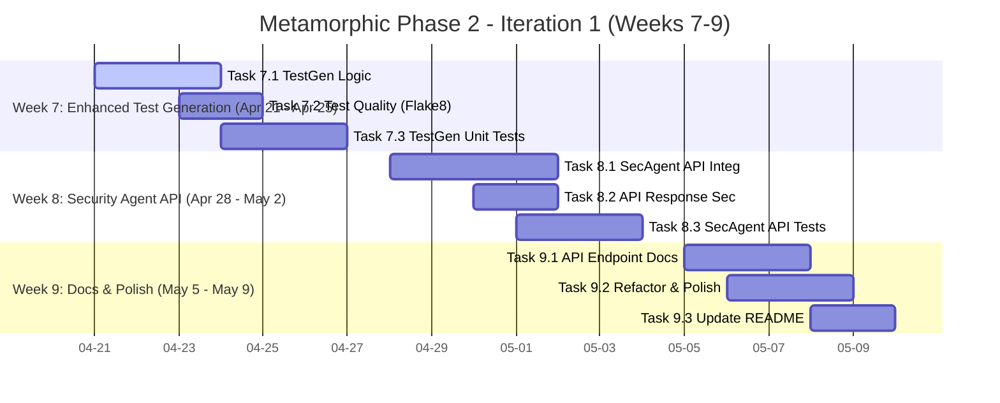

# Development Roadmap

This document outlines the development roadmap for the Metamorphic Software Genesis Ecosystem, focusing on the Phase 1 MVP and future iterations.

**🎯 CURRENT FOCUS (Week 7 - Start of Phase 2): Transition to Phase 2 - Planning & Initial Feature Enhancements - MVP RELEASED INTERNALLY ✅ - Date: April 21, 2025**

---

## Roadmap: Phase 1 MVP (Optimized for ASAP Completion)  🚧

**Goal:** Complete the defined Phase 1 MVP (`/genesis/analyze-ethical` endpoint with a **fully JSON-configurable** Ethical Policy Engine, **Flake8 code quality**, and placeholder test generation) **this week** (by end of Week 6 - Mid-April 2025).

#### Phase 1 MVP Definition 

A functional API endpoint (`/genesis/analyze-ethical`) capable of:
1.  Analyzing Python code for ethical concerns using a **dynamically configurable JSON policy engine** (`EthicalGovernanceEngine`).
2.  Providing **Flake8 code quality assessment** (`CodeReviewAgent`).
3.  Generating placeholder pytest tests (`TestGenAgent`).
4.  Exposing this functionality via the API.

#### Phase 1 Deliverables 

1.  Functional `/genesis/analyze-ethical` API endpoint with **dynamically configurable ethical analysis** and **Flake8 code quality checks**.
2.  **Fully JSON-Configurable** `EthicalGovernanceEngine` loading policies and dynamically enforcing constraints (BiasRisk, TransparencyScore, Safety Boundary).
3.  Integrated `CodeReviewAgent` providing Flake8 results within the API response.

#### Phase 1 MVP - Optimized Roadmap (Weeks 4-6) 

*(Weeks 1-4 Complete - See commit history or previous README versions for details)*

##### Strategy Notes (MVP Focus) 
*   **Laser Focus:** Only the **JSON-configurable `EthicalGovernanceEngine`** integration, **`CodeReviewAgent` (Flake8) integration**, and testing are blocking the MVP. Defer everything else (Bandit, SpecAnalyzer, Bias Detection).
*   **Leverage Foundations:** Build on Week 1-4 work. Avoid unnecessary refactoring.
*   **Self-Bootstrapping:** Use `TestGenAgent` for engine test skeletons; use `CodeReviewAgent` for code quality.
*   **Parallelize:** Update docs concurrently (Week 5). Develop integration tests incrementally.
*   **TDD Mindset:** Write tests early (Unit Wk4, Integration Wk5/6).
*   **"Good Enough" MVP:** Focus on *correct* dynamic enforcement based on JSON and basic Flake8 reporting; sophistication can come later.

##### Week 4: Configurable Ethical Engine Core - *Dynamic Policy Enforcement*  - **COMPLETE ✅** (Completed: 2025-04-04)
*   [✅] Task 4.1 (P1 - Engine): Implement Robust JSON Policy Loading & Validation
*   [✅] Task 4.2 (P1 - Engine): Implement Dynamic Enforcement Logic
*   [✅] Task 4.3 (P2 - Testing): Write Comprehensive Engine Unit Tests
*   [✅] Task 4.4 (P2 - API): Update API Endpoint for Dynamic Policy Usage

##### Week 5: API Integration & Testing - *Verify Dynamic Behavior*  - **COMPLETE ✅** (Completed: 2025-04-11)
*   [✅] Task 5.1 (P1 - Testing): Write Comprehensive API Integration Tests (Ethics)
*   [✅] Task 5.2 (P2 - API): Refine API Error Handling & Response (Ethics)
*   [✅] Task 5.3 (P3 - Docs - Concurrent): Update README & Create Separate Docs

##### Week 6: MVP Polish & Internal Release - *Deliver & Iterate*  - **COMPLETE ✅** (Completed: 2025-04-18)
*   **(✅) Task 6.1 (P1 - Quality): Final Code Review & Cleanup:** **COMPLETE ✅**  (Flake8 Integration Done). Review all MVP code. *(Self-Bootstrapping: Run `CodeReviewAgent` (Flake8) and address issues). *
*   **(✅) Task 6.2 (P1 - Release): Prepare MVP Internal Release Package:** Tag code, verify Docker build, write internal release notes. **COMPLETE ✅**
*   **(✅) Task 6.3 (P2 - Testing): Conduct Internal MVP Testing:** Distribute MVP package internally, gather feedback. **Update/Fix integration tests for Flake8 output.** **COMPLETE ✅**
*   **(✅) Task 6.4 (P2 - Polish): Address Critical MVP Feedback:** Fix critical bugs/usability issues found in internal testing (e.g., test failures, logic errors). **COMPLETE ✅**

## Roadmap: Phase 2 - Iteration 1 (Weeks 7-9)  🚀

**Goal:** Begin Phase 2 by focusing on initial enhancements and feature expansion based on core MVP capabilities and anticipated internal feedback.  Prioritize self-bootstrapping where possible.

#### Phase 2 - Iteration 1 Focus 

The focus for Phase 2 - Iteration 1 is to build upon the core MVP functionality and start expanding the system's capabilities in key areas. We are prioritizing features that:

*   **Enhance Core Functionality:** Improve existing MVP features (like test generation) to be more valuable.
*   **Expand Analysis Capabilities:** Integrate the Security Agent to broaden the types of code analysis offered.
*   **Prioritize Self-Bootstrapping:** Utilize existing agents and tools (like `CodeReviewAgent`) to help build and improve new features, accelerating development.

1.  **Enhanced Test Generation (`TestGenAgent` - Iteration 1):** Move beyond placeholder tests. Implement basic intelligent test generation for Python functions, leveraging `CodeReviewAgent` (Flake8) for initial test quality and the existing ethical engine to ensure generated tests themselves adhere to basic policies (e.g., avoid overly biased test names).
    *   **Self-Bootstrapping Note:** We will leverage `CodeReviewAgent` to ensure the *generated tests themselves* are of good code quality (following Flake8 guidelines), demonstrating self-bootstrapping by using an existing agent to improve a new feature.
2.  **Basic Security Agent API Integration:**  Integrate the `SecurityAgent` (ZAP Baseline Scan) into the `/genesis/analyze-ethical` endpoint.  Initially, this can be a *synchronous* scan (blocking the API response), but focus on making it functional and reporting basic ZAP findings in the API response (in a new `"security_analysis"` section, alongside `code_quality` and `ethical_analysis`).
3.  **Documentation - API Endpoint Details:** Begin creating more detailed API documentation (initially in markdown files within `docs/api/`). Start by documenting the `/genesis/analyze-ethical` endpoint in detail (request/response schemas, parameters, example usage, error codes).

#### Phase 2 - Iteration 1 - Roadmap (Weeks 7-9) 

##### Week 7: Enhanced Test Generation (TestGenAgent v1)  (Start Date: 2025-04-21)
*   [ ] Task 7.1 (P1 - TestGen): Implement Basic Test Generation Logic:**  Modify `TestGenAgent` to generate *non-placeholder* tests. Start with simple function analysis (parse function signature) and generate basic positive/negative tests (still using `pytest.skip()` for complex logic, but moving beyond pure placeholders).
    *   *Details:* Focus on generating tests that at least check if the function runs without errors for typical inputs (positive tests) and edge cases (negative tests). (Target End: 2025-04-23)
*   [ ] Task 7.2 (P2 - TestGen): Integrate CodeReviewAgent (Flake8) for Test Quality:** Use `CodeReviewAgent` to analyze the *generated tests themselves* for code quality issues. Address any Flake8 findings in the generated test code.
    *   *Self-Bootstrapping Implementation:*  Within `TestGenAgent`, after generating test code, instantiate `CodeReviewAgent` and run `analyze_python()` on the generated test code string. Report any Flake8 issues found in the generated tests (initially just log warnings, more sophisticated handling can come later). (Target End: 2025-04-25)
*   [ ] Task 7.3 (P2 - Testing): Unit Tests for `TestGenAgent`:** Write unit tests specifically for the `TestGenAgent` to ensure its test generation logic is working correctly.
     *   *Focus:* Test different scenarios: functions with parameters, functions with return values, functions with different docstring styles, etc. (Target End: 2025-04-25)

##### Week 8: Security Agent API Integration (Basic)  (Start Date: 2025-04-28)
*   [ ] Task 8.1 (P1 - Security): Integrate SecurityAgent into `/genesis/analyze-ethical`:** Modify the `/genesis/analyze-ethical` endpoint to call `SecurityAgent.run_zap_baseline_scan()` after the ethical and code quality checks.  Initially, make this a synchronous call.
    *   *Implementation Note:*  Instantiate `SecurityAgent` in `ethical_endpoints.py`.  In the `/analyze-ethical` route, after `code_quality_results` are obtained, call `SecurityAgent.run_zap_baseline_scan()` with a target URL (initially, you can use a fixed test URL like "http://localhost:5000/genesis/health" for testing, and make it dynamic later). (Target End: 2025-05-01)
*   [ ] Task 8.2 (P1 - API): Add `"security_analysis"` Section to API Response:**  Structure the API response to include a new `"security_analysis"` section that contains the basic ZAP scan results (e.g., alert counts, maybe a summary of high-risk alerts).
    *   *Response Structure:* Add a new top-level key `"security_analysis"` in the JSON response of `/genesis/analyze-ethical`.  Initially, just include a basic summary like `{"alerts_count": <number_of_alerts>, "high_risk_alerts_count": <number_of_high_risk_alerts>}`.  You can expand the details in future iterations. (Target End: 2025-05-02)
*   [ ] Task 8.3 (P2 - Testing): Integration Tests for Security Agent API:** Write integration tests to verify that the `security_analysis` section is correctly populated in the `/genesis/analyze-ethical` API response when ZAP scans are run.
    *   *Test Approach:*  Mock the `SecurityAgent.run_zap_baseline_scan()` method in your integration tests to return a predefined set of ZAP alerts (some high-risk, some low-risk, some none). Assert that the `"security_analysis"` section in the API response is correctly populated based on your mock ZAP results. (Target End: 2025-05-02)

##### Week 9: Documentation & Refinement - Phase 2 Iteration 1 Polish  (Start Date: 2025-05-05)
*   [ ] Task 9.1 (P1 - Docs): Document `/genesis/analyze-ethical` API Endpoint:** Create a markdown file in `docs/api/` (e.g., `analyze-ethical-endpoint.md`) documenting the `/genesis/analyze-ethical` endpoint in detail (request/response schemas, parameters, examples, error codes).
    *   *Content to Include:*  Document the request body schema (JSON format, `code` field, `policy_name` field), the full response body schema (JSON format, including `status`, `code_quality`, `ethical_analysis`, `security_analysis`, `generated_tests_placeholder` sections), explain each field, provide example requests and responses (both success and error cases), and list possible HTTP error codes and their meanings. (Target End: 2025-05-07)
*   [ ] Task 9.2 (P2 - Refinement): Refactor & Code Quality Polish (Phase 2 Iteration 1 Code):**  Review the code implemented in Weeks 7 & 8 (TestGenAgent enhancements, SecurityAgent integration).  Run `CodeReviewAgent` (Flake8) on this new code and address any code quality issues. Refactor for clarity and maintainability.
    *   *Code Areas to Review:* Focus on the code you wrote in `src/core/agents/test_generator.py` (TestGenAgent enhancements), `src/api/routes/ethical_endpoints.py` (SecurityAgent integration in `/genesis/analyze-ethical`), and potentially `src/core/agents/security_agent.py` if you made any changes there. (Target End: 2025-05-08)
*   [ ] Task 9.3 (P3 - Docs): Update `README.md` for Phase 2 Iteration 1:** Briefly update the `README.md` to reflect the new capabilities added in Phase 2 - Iteration 1 (enhanced test generation, basic security scan integration).
    *   *README Sections to Update:*  Update the "Key Highlights of Current Capabilities" section in `README.md` to briefly mention the enhanced test generation and basic security scanning integration.  You can also add a sentence or two to the "Core API Endpoints" table to reflect the new `"security_analysis"` section in the `/genesis/analyze-ethical` response (though detailed API docs will be in `docs/api/`). (Target End: 2025-05-09)

#### Gantt Chart: Phase 2 - Iteration 1 (Weeks 7-9) 

## Beyond MVP (Future Iterations) 

*(High-level goals, detailed planning post-MVP)*

*   Iterate on MVP feedback.
*   Enhance Ethical Engine (sophistication, more constraints, bias detection).
*   Activate Deferred Features (Bandit SAST, `SpecificationAnalysisAgent`).
*   Improve Test Generation (`TestGenAgent` beyond placeholders, HIL support).
*   Expand Formal Verification (Coq/Z3 integration for generated code).
*   Enhance Knowledge Graph usage and reasoning capabilities.
*   Develop `CodeGenerationAgent` for Python, Go, Rust, JS/TS, C++.
*   Implement `ContinuousLearningCore` feedback loops.
*   Build user interfaces (spec input, monitoring).
*   Expand language support.
*   Refer to the detailed phases outlined in [**SPECIFICATION.md**](SPECIFICATION.md).
