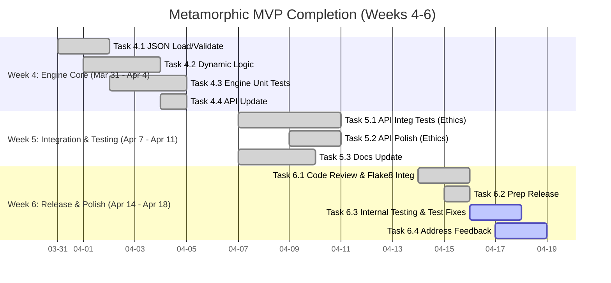

# Development Roadmap

This document outlines the development roadmap for the Metamorphic Software Genesis Ecosystem, focusing on the Phase 1 MVP and future iterations.

**🎯 CURRENT FOCUS (Week 6 of Phase 1 MVP): MVP Polish & Internal Release - PACKAGING COMPLETE, TESTING ACTIVE**

---

## Roadmap: Phase 1 MVP (Optimized for ASAP Completion)  🚧

**Goal:** Complete the defined Phase 1 MVP (`/genesis/analyze-ethical` endpoint with a **fully JSON-configurable** Ethical Policy Engine, **Flake8 code quality**, and placeholder test generation) **this week** (by end of Week 6 - Mid-April 2025).

#### Phase 1 MVP Definition 

A functional API endpoint (`/genesis/analyze-ethical`) capable of:
1.  Analyzing Python code for ethical concerns using a **dynamically configurable JSON policy engine** (`EthicalGovernanceEngine`).
2.  Providing **Flake8 code quality assessment** (`CodeReviewAgent`).
3.  Generating placeholder pytest tests (`TestGenAgent`).
4.  Exposing this functionality via the API.

#### Phase 1 Deliverables 

1.  Functional `/genesis/analyze-ethical` API endpoint with **dynamically configurable ethical analysis** and **Flake8 code quality checks**.
2.  **Fully JSON-Configurable** `EthicalGovernanceEngine` loading policies and dynamically enforcing constraints (BiasRisk, TransparencyScore, Safety Boundary).
3.  Integrated `CodeReviewAgent` providing Flake8 results within the API response.

#### Phase 1 MVP - Optimized Roadmap (Weeks 4-6) 

*(Weeks 1-4 Complete - See commit history or previous README versions for details)*

##### Strategy Notes (MVP Focus) 
*   **Laser Focus:** Only the **JSON-configurable `EthicalGovernanceEngine`** integration, **`CodeReviewAgent` (Flake8) integration**, and testing are blocking the MVP. Defer everything else (Bandit, SpecAnalyzer, Bias Detection).
*   **Leverage Foundations:** Build on Week 1-4 work. Avoid unnecessary refactoring.
*   **Self-Bootstrapping:** Use `TestGenAgent` for engine test skeletons; use `CodeReviewAgent` for code quality.
*   **Parallelize:** Update docs concurrently (Week 5). Develop integration tests incrementally.
*   **TDD Mindset:** Write tests early (Unit Wk4, Integration Wk5/6).
*   **"Good Enough" MVP:** Focus on *correct* dynamic enforcement based on JSON and basic Flake8 reporting; sophistication can come later.

##### Week 4: Configurable Ethical Engine Core - *Dynamic Policy Enforcement*  - **COMPLETE ✅** (Completed: 2025-04-04)
*   **[✅] Task 4.1 (P1 - Engine): Implement Robust JSON Policy Loading & Validation**
*   **[✅] Task 4.2 (P1 - Engine): Implement Dynamic Enforcement Logic**
*   **[✅] Task 4.3 (P2 - Testing): Write Comprehensive Engine Unit Tests**
*   **[✅] Task 4.4 (P2 - API): Update API Endpoint for Dynamic Policy Usage**

##### Week 5: API Integration & Testing - *Verify Dynamic Behavior*  - **COMPLETE ✅** (Completed: 2025-04-11)
*   **[✅] Task 5.1 (P1 - Testing): Write Comprehensive API Integration Tests (Ethics)**
*   **[✅] Task 5.2 (P2 - API): Refine API Error Handling & Response (Ethics)**
*   **[✅] Task 5.3 (P3 - Docs - Concurrent): Update README & Create Separate Docs**

##### Week 6: MVP Polish & Internal Release - *Deliver & Iterate*  - **PACKAGING COMPLETE, TESTING ACTIVE**
*   **(✅) Task 6.1 (P1 - Quality): Final Code Review & Cleanup: **COMPLETE ✅**  (Flake8 Integration Done). Review all MVP code. *(Self-Bootstrapping: Run `CodeReviewAgent` (Flake8) and address issues). *
*   **(✅) Task 6.2 (P1 - Release): Prepare MVP Internal Release Package:** Tag code, verify Docker build, write internal release notes. **COMPLETE ✅**
*   **(Active) Task 6.3 (P2 - Testing): Conduct Internal MVP Testing:** Distribute MVP package internally, gather feedback. **Update/Fix integration tests for Flake8 output.**
*   **(Active) Task 6.4 (P2 - Polish): Address Critical MVP Feedback:** Fix critical bugs/usability issues found in internal testing (e.g., test failures, logic errors).

#### Gantt Chart: Phase 1 MVP (Weeks 4-6) 
*(Week 4 started March 31, 2025)*

---

## Beyond MVP (Future Iterations) 

*(High-level goals, detailed planning post-MVP)*

*   Iterate on MVP feedback.
*   Enhance Ethical Engine (sophistication, more constraints, bias detection).
*   Activate Deferred Features (Bandit SAST, `SpecificationAnalysisAgent`).
*   Improve Test Generation (`TestGenAgent` beyond placeholders, HIL support).
*   Expand Formal Verification (Coq/Z3 integration for generated code).
*   Enhance Knowledge Graph usage and reasoning capabilities.
*   Develop `CodeGenerationAgent` for Python, Go, Rust, JS/TS, C++.
*   Implement `ContinuousLearningCore` feedback loops.
*   Build user interfaces (spec input, monitoring).
*   Expand language support.
*   Refer to the detailed phases outlined in [**SPECIFICATION.md**](SPECIFICATION.md).
