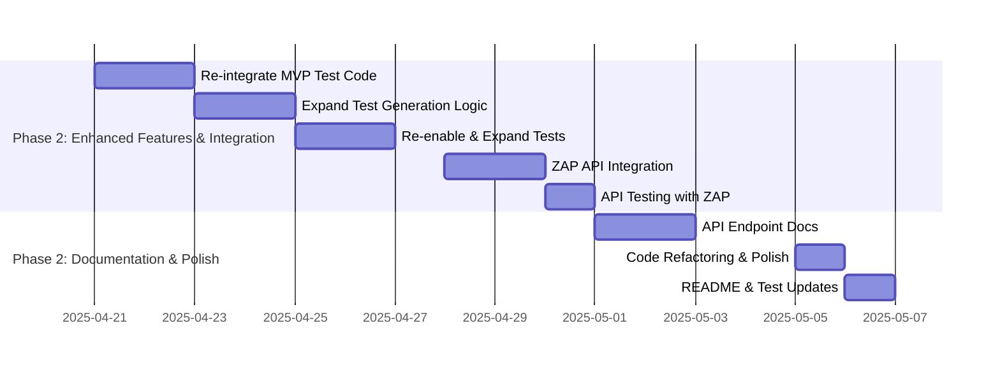

# Development Roadmap

This document outlines the development roadmap for the Metamorphic Software Genesis Ecosystem, focusing on the Phase 1 MVP and future iterations.

**🎯 CURRENT FOCUS (Week 7 - Start of Phase 2): Transition to Phase 2 - Planning & Initial Feature Enhancements - MVP RELEASED INTERNALLY ✅**

---

## Roadmap: Phase 2 - Iteration 1 (Weeks 7-9)  🚀

**Goal:** Enhance MVP capabilities through iterative improvements while establishing self-bootstrapping processes.

**Iteration Goal:** Deliver Enhanced Test Generation and Security Integration into the `/genesis/analyze-ethical` API, with detailed API documentation, by the end of Week 9.

**Potential Risks & Mitigation (Iteration 1):**
* **Risk 1: Re-integration of MVP Test Code Complexity:**  Uncommenting and expanding MVP test code might reveal unexpected complexities or integration issues.
    * **Mitigation:** Start with a thorough code review of the commented-out sections. Re-integrate incrementally, testing each part before moving to the next. Allocate extra time in Week 7 for initial re-integration and debugging.
* **Risk 2: Security Agent API Integration Challenges:**  Integrating ZAP security scans into the API might encounter API compatibility issues or unexpected ZAP behavior within the Flask app context.
    * **Mitigation:** Start security integration early in Week 8. Prioritize synchronous implementation first to simplify initial integration.  Thoroughly test the API endpoint with ZAP integration in a dedicated testing environment before merging to `main`.
* **Risk 3: Documentation Delays:** API documentation can be time-consuming and might get delayed.
    * **Mitigation:** Start documentation in parallel with feature development in Week 7.  Assign documentation tasks to team members specifically. Use a documentation-generation tool (if applicable) to streamline the process.

**Phase 2 - Iteration 1 Focus:**

1. **Enhanced Test Generation (Week 7-8):**
   * **Task 1.1 (Week 7 - 1 day):** Code Review & Re-integrate MVP Test Code
   * **Task 1.2 (Week 7 - 2 days):** Basic Expansion of Test Generation Logic
   * **Task 1.3 (Week 8 - 2 days):** Re-enable & Expand Unit/Integration Tests
   * **Target Deliverable:** Basic intelligent test generation for Python functions, re-integrated and tested.

2. **Security Integration (Week 8-9):**
   * **Task 2.1 (Week 8 - 2 days):** ZAP Security Agent API Integration (Synchronous)
   * **Task 2.2 (Week 9 - 1 day):** API Endpoint Testing with ZAP Integration
   * **CI Pipeline Integration Check (Throughout Week 8-9):** Continuously monitor and ensure the CI pipeline (ZAP Baseline Scan) remains functional and integrates with the new API changes.
   * **Target Deliverable:** Security Integration into `/genesis/analyze-ethical` API with synchronous ZAP baseline scans and basic reporting in API response.

3. **Documentation & Refactoring (Week 9):**
   * **Task 3.1 (Week 9 - 2 days):** Detailed `/genesis/analyze-ethical` API Documentation
   * **Task 3.2 (Week 9 - 1 day):** Code Refactoring & Flake8 Polish
   * **Task 3.3 (Week 9 - 1 day):** README & Integration Test Updates
   * **Target Deliverable:** Detailed API documentation, code refactoring, updated README and integration tests.

#### Implementation Details

- **Test Repurposing**: Use `CodeReviewAgent` (Flake8) to validate generated test quality (ongoing).
- **Self-Bootstrapping**: Use existing agents to improve new features (ongoing).
- **Resource Allocation**: Dev 1 (Person A) for Test Generation and Documentation (Tasks 1 & 3). Dev 2 (Person B) for Security Integration (Task 2).
- **Mid-Week Progress Review:** Schedule a brief progress review meeting mid-week (e.g., Wednesday afternoon) to check progress against tasks, identify any roadblocks, and make necessary adjustments to the plan for the rest of the week.

##### Week 9 Gantt Tasks

